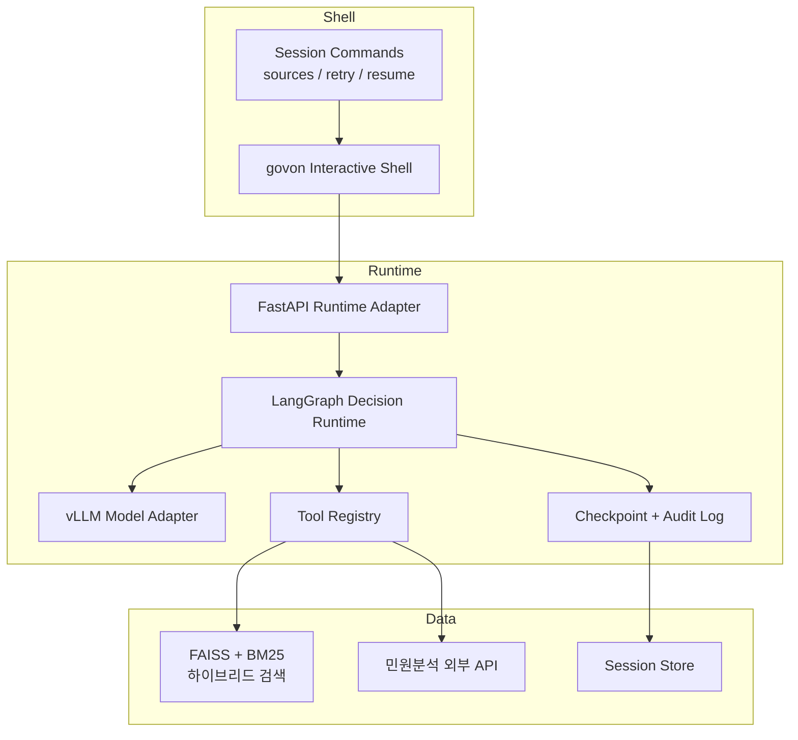

# GovOn - 온프레미스 AI 기반 민원 처리 인프라

> 일선 공무원의 업무 부담 최소화 및 국가 정보 보안의 완벽한 보장

[](https://umyunsang.grafana.net/public-dashboards/a7672d6682fb498eb4578a8634262280)
[](https://wandb.ai/umyun3/projects)
[](https://wandb.ai/umyun3/reports)
[](https://govon-org.github.io/GovOn/)
[](https://github.com/GovOn-Org/GovOn/issues?q=label%3A%22🎯+Initiative%22+sort%3Aupdated-desc)

폐쇄망 환경에서 클라우드 없이 민원을 분석하고 처리하는 온프레미스 AI 런타임이다.

---

## 📍 Public Roadmap

GovOn의 개발 방향을 공개적으로 공유합니다. **[🎯 모든 Initiative 보기](https://github.com/GovOn-Org/GovOn/issues?q=label%3A%22🎯+Initiative%22+sort%3Aupdated-desc)**

### 🎬 First Release Focus: GovOn Shell (마감 목표: 2026-05-22)

첫 공개 릴리즈는 웹 UI보다 **터미널에서 설치하고 shell/bash에서 바로 사용하는 대화형 에이전트 셸**을 우선하며, 이 릴리즈 안에 **graph-based agentic decision framework**를 포함한다.

Roadmap는 **Initiative 계층만** 표시한다. 세부 task는 각 initiative 본문과 [tasklist](/Users/yujeong/Desktop/26실증적/ondevice-ai-civil-complaint/GovOn/docs/GovOn-orchestrator-tasklist.md) 기준 canonical set을 따른다.

| Track | 상태 | 관련 Initiative | 설명 |
|---|---|---|---|
| Runtime Foundation | 🛠️ In Progress | [#367](https://github.com/GovOn-Org/GovOn/issues/367), [#368](https://github.com/GovOn-Org/GovOn/issues/368) | runtime orchestration, tooling layer, session-connected backend foundation |
| Agentic Decision Framework | 🎨 In Design | [#406](https://github.com/GovOn-Org/GovOn/issues/406), [#407](https://github.com/GovOn-Org/GovOn/issues/407) | state graph, tool selection guardrail, checkpoint, recovery, architecture sync |
| Interactive Shell Client | 🎨 In Design | [#369](https://github.com/GovOn-Org/GovOn/issues/369) | `govon` 대화형 셸, 스트리밍 출력, 세션 UX, 복사/내보내기 |
| Install & Offline Package | 🛠️ In Progress | [#372](https://github.com/GovOn-Org/GovOn/issues/372) | 패키지 배포, 오프라인 번들, 운영 명령, 폐쇄망 설치 경로 |
| Release QA & Docs | 🎨 In Design | [#373](https://github.com/GovOn-Org/GovOn/issues/373), [#374](https://github.com/GovOn-Org/GovOn/issues/374), [#375](https://github.com/GovOn-Org/GovOn/issues/375) | shell 기준 E2E 테스트, agentic runtime 검증, 설치 가이드, 최종 납품 문서 |

### ⏭️ Deferred After First Release

| Track | 관련 이슈 | 설명 |
|---|---|---|
| Web / App UI Surface | [#370](https://github.com/GovOn-Org/GovOn/issues/370), [#371](https://github.com/GovOn-Org/GovOn/issues/371) | 동일한 agentic runtime 위에 웹/앱 UX를 얹는 고도화는 R2로 이월 |

### 📋 Milestone 4: 테스트 및 문서화 (마감: 2026-06-19)

| # | Initiative | 상태 | 설명 |
|---|-----------|------|------|
| I-8 | [테스트 및 품질 보증](https://github.com/GovOn-Org/GovOn/issues/373) | 🎨 In Design | shell 기준 E2E, 설치/운영 smoke test, 실사용 검증 |
| I-9 | [프로젝트 문서화 및 마무리](https://github.com/GovOn-Org/GovOn/issues/374) | 🎨 In Design | shell 사용자 가이드, 운영 문서, 최종 회고 |

### 🏁 Milestone 5: AIOSS CI/CD 및 품질 고도화 (마감: 2026-06-19)

| # | Initiative | 상태 | 설명 |
|---|-----------|------|------|
| I-10 | [AIOSS 최종 납품](https://github.com/GovOn-Org/GovOn/issues/375) | 🛠️ In Progress | GovOn Shell + Runtime + 오프라인 배포 패키지 최종 납품 |

### 범례
- 🎨 **In Design** — 설계/기획 단계
- 🛠️ **In Progress** — 진행 중
- 🚀 **Launched** — 완료

---

## 핵심 기능

- **온디바이스 LLM 추론** -- 단일 GPU 환경에서 vLLM 기반 실시간 서빙
- **RAG 하이브리드 검색** -- FAISS + BM25로 유사 민원(판례/법령/매뉴얼/공지) 검색 후 컨텍스트 기반 응답 생성
- **보안 설계** -- API Key 인증, Rate Limiting, Prompt Injection 방어, CORS 제어
- **CI/CD 자동화** -- GitHub Actions 4단계 파이프라인, DORA 메트릭 대시보드, 보안 스캔

## 시스템 아키텍처



## 기술 스택

| 영역 | 기술 |
|------|------|
| **AI 모델** | EXAONE 계열 추론 모델 |
| **LLM 서빙** | vLLM (PagedAttention) |
| **오케스트레이션** | LangGraph 기반 decision runtime |
| **임베딩** | multilingual-e5-large (1024차원) |
| **벡터 검색** | FAISS (IndexFlatIP) + BM25 하이브리드 |
| **백엔드** | FastAPI + Pydantic + SQLAlchemy |
| **클라이언트** | Python package entrypoint + interactive shell |
| **컨테이너** | Docker Compose + NVIDIA Container Toolkit |
| **CI/CD** | GitHub Actions (CI, Docker Publish, Offline Package) |
| **모니터링** | DORA Metrics + Grafana Cloud |

## Quick Start

### Docker 배포 (권장)

```bash
# 실행 템플릿 준비
cp .env.example .env

# 볼륨 디렉토리 생성
mkdir -p models/faiss_index models/bm25_index agents configs logs .cache

# 로컬 소스에서 이미지 빌드 후 실행
docker compose up -d --build

# 또는 GHCR 이미지를 직접 실행
docker pull ghcr.io/govon-org/govon:latest
GOVON_IMAGE=ghcr.io/govon-org/govon:latest docker compose up -d

# 헬스체크
curl http://localhost:8000/health
```

GovOn 컨테이너 이미지는 Docker/Cloud Run/오프라인 패키지 경로를 공통으로 쓰기 위해 기본적으로 `SERVING_PROFILE=container`를 사용한다.

### 개발 환경

```bash
git clone https://github.com/GovOn-org/GovOn.git
cd GovOn

python -m venv venv
source venv/bin/activate

pip install -r requirements.txt
pip install -e ".[dev]"

# 추론 서버 실행
uvicorn src.inference.api_server:app --host 0.0.0.0 --port 8000 --reload

# 테스트
pytest tests/ -v --cov=src --cov-report=term-missing
```

## 프로젝트 구조

```
GovOn/
├── src/
│   ├── inference/                       # FastAPI 서빙 (핵심 모듈)
│   │   ├── api_server.py               # vLLMEngineManager, 엔드포인트, 보안 미들웨어
│   │   ├── retriever.py                # FAISS IndexFlatIP + multilingual-e5-large 임베딩
│   │   ├── index_manager.py            # MultiIndexManager (CASE/LAW/MANUAL/NOTICE)
│   │   ├── schemas.py                  # Pydantic 요청/응답 모델
│   │   ├── vllm_stabilizer.py          # EXAONE용 transformers 런타임 패치
│   │   └── db/                         # SQLAlchemy ORM, Alembic 마이그레이션
├── agents/                              # 에이전트 설정
├── configs/                             # 시스템 설정 파일
├── tests/                               # 테스트 코드
├── site/                                # 문서 포털 (MkDocs)
├── docs/                                # 프로젝트 문서 (PRD, WBS, 공식 문서)
├── Dockerfile                           # CUDA 12.1 + Python 3.10
├── docker-compose.yml                   # 온라인 빌드/실행
└── docker-compose.offline.yml           # 오프라인 GHCR 이미지 실행
```

## DORA Metrics 대시보드

프로젝트의 DevOps 성숙도를 DORA 4대 지표로 측정하고 Grafana Cloud에서 실시간 모니터링한다.

**[DORA Metrics Dashboard (공개 링크)](https://umyunsang.grafana.net/public-dashboards/a7672d6682fb498eb4578a8634262280)**

| 지표 | 설명 |
|------|------|
| 배포 빈도 | main 브랜치 머지 PR 수 / 주 |
| 리드 타임 | PR 생성 → 머지 평균 시간 |
| 변경 실패율 | hotfix/revert 커밋 비율 |
| MTTR | bug 이슈 open → close 평균 시간 |

> 데이터 수집: GitHub Actions 자동 실행 (매주 월요일 + main push)

## 팀

**동아대학교 AI학과** | 2026 현장미러형 연계 프로젝트

| 역할 | 이름 | 학번 | 학과 | GitHub |
|------|------|------|------|--------|
| 팀장 | 엄윤상 | 1705817 | AI학과 | [@umyunsang](https://github.com/umyunsang) |
| 팀원 | 장시우 | 2143655 | AI학과 | [@siuJang](https://github.com/siuJang) |
| 팀원 | 이유정 | 2243951 | AI학과 | [@yuujjjj](https://github.com/yuujjjj) |

**멘토**: 전동산 교수 (동아대학교)

## 문서

프로젝트 문서 사이트: **[https://govon-org.github.io/GovOn/](https://govon-org.github.io/GovOn/)**

### 공식 문서

| 문서명 | 설명 | 파일 |
|--------|------|------|
| 문제정의서 | On-Device AI 민원분석 및 처리시스템 문제정의서 | [PDF](docs/official/U20260304_164737858_2026-32.On-DeviceAI민원분석및처리시스템.pdf) |
| 신청서/계획서 | 2026 현장미러형연계프로젝트 서식일체 | [PDF](docs/official/1705817_ai학과_엄윤상_2026%20현장미러형연계프로젝트%20서식일체.pdf) |

## 기여하기

프로젝트에 기여하고 싶다면 아래 문서를 참고한다.

- [기여 가이드](CONTRIBUTING.md) -- 기여 방법, 커밋 컨벤션, PR 규칙
- [행동 강령](CODE_OF_CONDUCT.md) -- 커뮤니티 행동 강령
- [보안 정책](SECURITY.md) -- 보안 취약점 신고 방법

## 라이선스

이 프로젝트는 [MIT License](LICENSE)로 배포된다.

> **참고**: 이 프로젝트에서 사용하는 EXAONE 모델은 [LGAI EXAONE License](https://huggingface.co/LGAI-EXAONE/EXAONE-Deep-7.8B)의 적용을 받는다. 모델 사용 시 해당 라이선스를 확인한다.
