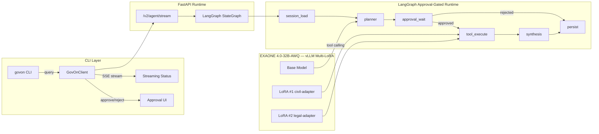
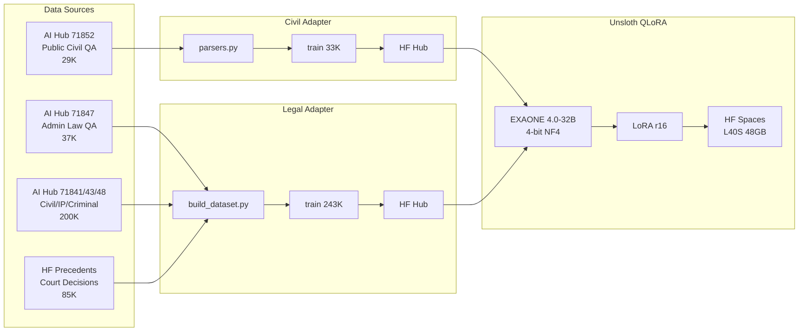
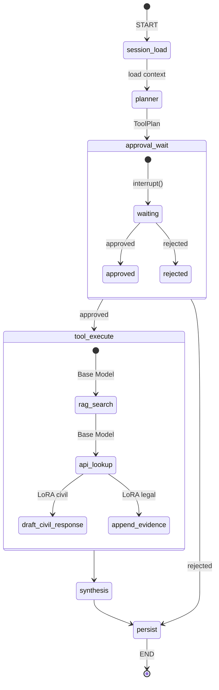

# GovOn

GovOn은 행정 업무를 보조하는 **에이전틱 CLI 셸**이다. 사용자는 `govon`을 실행한 뒤 자연어로 요청하고, 셸은 로컬 daemon runtime과 연결되어 검색·조회·작성 도구를 승인 기반으로 사용한다.

## 아키텍처

### 모델 구성

| 역할 | 모델 | LoRA | 용도 |
|---|---|---|---|
| Planner | EXAONE 4.0-32B-AWQ | 없음 (베이스) | 도구 선택, 실행 계획 (네이티브 tool calling) |
| 민원답변 초안 | EXAONE 4.0-32B-AWQ | **civil-adapter** (r16) | `draft_civil_response` capability |
| 법률 근거 인용 | EXAONE 4.0-32B-AWQ | **legal-adapter** (r16) | `append_evidence` capability |
| 검색/조회 | EXAONE 4.0-32B-AWQ | 없음 | `rag_search`, `api_lookup` |

## 데이터 파이프라인

| 데이터셋 | 건수 | HuggingFace Hub |
|---|---|---|
| Civil Response | 33K (train) | [umyunsang/govon-civil-response-data](https://huggingface.co/datasets/umyunsang/govon-civil-response-data) |
| Legal Citation | 243K (train) | [umyunsang/govon-legal-response-data](https://huggingface.co/datasets/umyunsang/govon-legal-response-data) |

## LangGraph Agent Flow

## 현재 제품 기준

- 진입점은 웹이 아니라 `govon` 대화형 CLI 셸
- 내부 runtime은 로컬 FastAPI daemon 또는 원격 서버 (`GOVON_RUNTIME_URL`)
- LangGraph state graph 안에서 planner LLM이 의도 파악, 작업 계획, tool 선택 담당
- 도구 선택은 EXAONE 4.0의 네이티브 tool calling으로 수행 (CI에서만 regex fallback)
- 민원 답변 작성 시 civil-adapter LoRA, 근거 보강 시 legal-adapter LoRA를 per-request attach
- tool 실행은 작업 단위 승인 후 진행
- 근거/출처는 기본 출력이 아니라 후속 증강 작업으로 처리
- 서빙은 HuggingFace Spaces ZeroGPU 또는 전용 GPU Space

상세 기준 문서는 [docs/architecture/GovOn-shell-mvp-architecture.md](docs/architecture/GovOn-shell-mvp-architecture.md)다.

## MVP 범위

포함:

- 자연어 기반 CLI 셸
- 로컬 daemon 자동 기동 및 재연결
- 원격 서버 연결 (`GOVON_RUNTIME_URL`)
- 민원 답변 작성 (civil-adapter LoRA)
- 법적 근거 인용 (legal-adapter LoRA)
- 외부 API lookup
- 로컬 RAG 검색
- 작업 단위 승인 UI
- SQLite 기반 세션 resume
- 후속 근거/출처 증강

제외:

- 공문서 작성
- 분류 기능
- 웹/앱 제품화

## 사용자 흐름

1. 사용자가 `govon`을 실행한다.
2. CLI가 로컬 daemon을 자동 기동하거나 기존 daemon에 재연결한다.
3. 사용자가 자연어로 업무를 요청한다.
4. LangGraph planner node가 이번 턴의 한 작업과 필요한 tool 조합을 구조화한다.
5. 시스템이 쉬운 설명과 함께 `승인 / 거절` UI를 보여준다.
6. 승인되면 graph executor가 필요한 여러 tool과 adapter를 묶어서 실행한다.
7. 결과는 `근거 요약 -> 최종 초안` 순서로 출력한다.
8. 사용자가 후속으로 근거를 요청하면 RAG/API를 다시 사용해 기존 답변 아래에 근거 섹션을 추가한다.
9. 종료 시 세션 ID를 보여주고, `govon --session <id>`로 재개한다.

## 문서

- 제품 아키텍처: [docs/architecture/GovOn-shell-mvp-architecture.md](docs/architecture/GovOn-shell-mvp-architecture.md)
- 오케스트레이션 워크플로우: [docs/architecture/WORKFLOW-orchestrator-tool-calling.md](docs/architecture/WORKFLOW-orchestrator-tool-calling.md)
- ADR: [docs/adr/README.md](docs/adr/README.md)
- PRD: [docs/prd.md](docs/prd.md)
- WBS: [docs/wbs.md](docs/wbs.md)
- 공식 문서: [docs/official](docs/official)
- 아키텍처 다이어그램: [GitHub Discussion #484](https://github.com/GovOn-Org/GovOn/discussions/484)

## GitHub 이슈 구조

- root roadmap: `#402`
- roadmap의 하위: `workstream`
- workstream의 하위: `task`
- 세부 작업 내용은 `task` 이슈 본문에만 작성한다.

## 개발 규칙

기여 전 아래 문서를 먼저 본다.

- [CONTRIBUTING.md](CONTRIBUTING.md)
- [site/docs/guide/development.md](site/docs/guide/development.md)

브랜치는 GitHub Flow를 사용하고, 기본 대상 브랜치는 항상 `main`이다.
