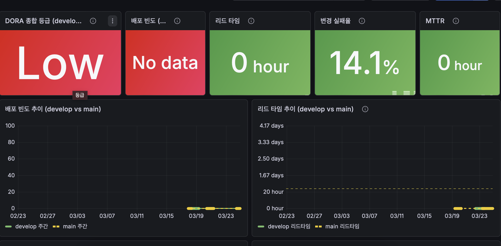

# On-device AI 민원 처리 및 분석 시스템

[](https://yuujjjj.grafana.net/d/govon-dora/govon-dora-metrics-dashboard?orgId=1&from=now-30d&to=now&timezone=Asia%2FSeoul)
[](https://wandb.ai/umyun3/projects)
[](https://wandb.ai/umyun3/reports)

LLM을 경량화하여 온디바이스에서 실행하고, 파인튜닝을 통해 현장 산업체에 최적화된 민원 처리 시스템

## OSS 기본 문서

- 저장소: https://github.com/yuujjjj/AIOSS_GovOn
- 라이선스: [MIT License](LICENSE)
- 라이선스 비교/선택 기준: [docs/oss-license-comparison.md](docs/oss-license-comparison.md)
- 기여 가이드: [CONTRIBUTING.md](CONTRIBUTING.md)
- 행동 강령: [CODE_OF_CONDUCT.md](CODE_OF_CONDUCT.md)
- 거버넌스: [GOVERNANCE.md](GOVERNANCE.md)
- Inner Source 도입 로드맵: [docs/innersource-plan.md](docs/innersource-plan.md)
- 코드 소유권: [.github/CODEOWNERS](.github/CODEOWNERS)
- 보안 정책: [SECURITY.md](SECURITY.md)

## 오픈소스 실습 및 Inner Source 운영

- 공개 저장소(`PUBLIC`) 기반으로 오픈소스 협업 방식을 실습합니다.
- 팀 내부 협업은 Issue, Pull Request, Code Review 중심의 `Inner Source` 방식으로 운영합니다.
- 라이선스 선택 기준은 [docs/oss-license-comparison.md](docs/oss-license-comparison.md), 운영 원칙은 [GOVERNANCE.md](GOVERNANCE.md), 실행 계획은 [docs/innersource-plan.md](docs/innersource-plan.md) 에 정리되어 있습니다.

## 프로젝트 개요

### 현장미러형 연계 프로젝트

본 프로젝트는 **현장미러형 연계 프로젝트**로, 실제 현장에서 부딪히는 문제를 해결하기 위해 산업체 수요 과제를 기획, 설계, 제작하여 현장 실무 능력 향상을 도모합니다.

### 목표

- 경량화된 LLM 기반 온디바이스 민원 처리 시스템 개발
- 산업체 현장에 최적화된 AI 솔루션 구축

### 핵심 기술

- **LLM 경량화**: Quantization, Pruning, Knowledge Distillation
- **도메인 특화 파인튜닝**: 현장 산업체 맞춤형 답변 생성
- **온디바이스 추론 최적화**: 엣지 디바이스에서의 실시간 처리

## 프로젝트 구조

```text
AIOSS_GovOn/
├── data/                    # 학습 데이터
├── models/                  # 모델 파일
├── src/                     # 소스 코드
│   ├── preprocessing/       # 데이터 전처리
│   ├── training/           # 모델 학습
│   ├── inference/          # 추론 엔진
│   └── utils/              # 유틸리티
├── configs/                 # 설정 파일
├── docs/                    # 프로젝트 문서
│   ├── draft.md            # 문제정의서
│   ├── toc.md              # 제안서 작성 가이드
│   ├── prd.md              # PRD (Product Requirements Document)
│   ├── wbs.md              # WBS (Work Breakdown Structure)
│   ├── wiki/               # 온보딩/개발/문제해결 위키
│   ├── official/           # 공식 문서 (공문)
│   │   ├── 문제정의서.pdf
│   │   └── 서식일체.pdf
│   └── outputs/            # 마일스톤별 산출물
│       ├── M1_Planning/
│       ├── M2_MVP/
│       ├── M3_Optimization/
│       └── M4_Testing/
├── notebooks/              # 실험 노트북
└── tests/                  # 테스트 코드
```

## Wiki

프로젝트 온보딩과 개발 흐름을 빠르게 확인할 수 있도록 저장소 내부 위키 문서를 추가했습니다.

- [Wiki Home](docs/wiki/README.md)
- [Getting Started](docs/wiki/Getting-Started.md)
- [Development Guide](docs/wiki/Development-Guide.md)
- [Troubleshooting](docs/wiki/Troubleshooting.md)

## DORA Metrics 대시보드

GitHub Actions가 DORA 4대 지표를 자동 수집합니다. 제출용 기준 화면은 기존 Grafana 캡처 PNG를 유지하고, 저장소 내부의 Chart.js 대시보드·시계열 JSON·주간 보고서·자동 생성 SVG는 보조 근거 자료로 함께 제공합니다.

- 워크플로우: [.github/workflows/dora-metrics.yml](.github/workflows/dora-metrics.yml)
- 제출용 기준 이미지: [docs/images/dora-dashboard-grafana.png](docs/images/dora-dashboard-grafana.png)
- Chart.js 대시보드: [docs/dora/index.html](docs/dora/index.html)
- 시계열 데이터: [docs/dora/history.json](docs/dora/history.json)
- 주간 보고서: [docs/reports/dora-weekly-report.md](docs/reports/dora-weekly-report.md)
- 자동 생성 보조 이미지: [docs/images/dora-dashboard.svg](docs/images/dora-dashboard.svg)
- Grafana Import JSON: [metrics/grafana-cloud/dora-dashboard.json](metrics/grafana-cloud/dora-dashboard.json)
- Grafana 설정 가이드: [metrics/grafana-cloud/setup-guide.md](metrics/grafana-cloud/setup-guide.md)



위 이미지는 제출용 기준으로 유지하는 Grafana 캡처 PNG입니다. 자동 생성 산출물은 `docs/dora/history.json` 기준으로 갱신되며, 저장소 내부에서는 Chart.js 구현 결과와 주간 보고서를 함께 확인할 수 있습니다.

| 지표 | 설명 |
|------|------|
| 배포 빈도 | 분석 기간 내 merge된 PR 수를 주 단위로 환산 |
| 리드 타임 | PR의 첫 커밋 → 머지 평균 시간 |
| 변경 실패율 | hotfix/revert 계열 커밋 비율 |
| MTTR | bug 이슈 open → close 평균 시간 |

> 데이터 수집: GitHub Actions 자동 실행 (매주 월요일 + main/develop push)

### 실행 방법

이 저장소는 `.github/workflows/dora-metrics.yml`에서 DORA 메트릭을 자동 수집합니다.

#### 자동 실행

- 매주 월요일 09:00 KST
- `main`, `develop` 브랜치 push 시

#### 수동 실행

1. GitHub 저장소의 **Actions** 탭으로 이동
2. **DORA Metrics Collector** 워크플로우 선택
3. **Run workflow** 클릭
4. 아래 입력값 지정
   - `collect_enabled`: 수집 실행 여부 (`true` / `false`)
   - `publish_to_grafana`: Grafana Cloud 전송 여부 (`true` / `false`)
   - `window_days`: 분석 기간 (기본 `30`)

#### 결과 확인

- 수집 JSON: `metrics/dora/dora-YYYYMMDD.json`
- 워크플로우 요약: GitHub Actions Step Summary
- 제출용 시각화: `docs/images/dora-dashboard-grafana.png`
- 보조 시각화: `docs/dora/index.html`, `docs/images/dora-dashboard.svg`
- 주간 보고서: `docs/reports/dora-weekly-report.md`
- 아티팩트 업로드: `metrics/dora/`, `docs/dora/history.json`, `docs/images/dora-dashboard.svg`, `docs/reports/dora-weekly-report.md`

## 개발 환경 설정

```bash
# 저장소 클론
git clone https://github.com/yuujjjj/AIOSS_GovOn.git
cd AIOSS_GovOn

# 가상환경 생성 및 활성화
python -m venv venv
source venv/bin/activate  # Windows: venv\Scripts\activate

# 의존성 설치
pip install -r requirements.txt
```

## 브랜치 전략

- `main`: 프로덕션 브랜치 
- `feature/*`: 기능 개발 브랜치
- `fix/*`: 버그 수정 브랜치

## 기여 방법

1. 이슈 생성 또는 할당된 이슈 확인
2. `main` 브랜치에서 새 브랜치 생성
   ```bash
   git checkout main
   git pull origin main
   git checkout -b feature/기능명
   ```
3. 코드 작성 및 커밋
4. Pull Request 생성
5. 코드 리뷰 후 팀장이 머지

## 팀원

| 역할 | 이름 | 학번 | 학과 | GitHub |
|------|------|------|------|--------|
| 팀장 | 엄윤상 | 1705817 | AI학과 | [@umyunsang](https://github.com/umyunsang) |
| 팀원 | 장시우 | 2143655 | AI학과 | [@siuJang](https://github.com/siuJang) |
| 팀원 | 이유정 | 2243951 | AI학과 | [@yuujjjj](https://github.com/yuujjjj) |

## 공식 문서

| 문서명 | 설명 | 파일 |
|--------|------|------|
| 문제정의서 | On-Device AI 민원분석 및 처리시스템 문제정의서 | [PDF](docs/official/U20260304_164737858_2026-32.On-DeviceAI민원분석및처리시스템.pdf) |
| 신청서/계획서 | 2026 현장미러형연계프로젝트 서식일체 | [PDF](docs/official/1705817_ai학과_엄윤상_2026%20현장미러형연계프로젝트%20서식일체.pdf) |

## 기여하기

프로젝트에 기여하고 싶으시다면 [기여 가이드](CONTRIBUTING.md)를 참고해 주세요.

- [기여 가이드](CONTRIBUTING.md) - 기여 방법, 커밋 컨벤션, PR 규칙
- [행동 강령](CODE_OF_CONDUCT.md) - 커뮤니티 행동 강령
- [보안 정책](SECURITY.md) - 보안 취약점 신고 방법

## 라이선스

이 프로젝트는 [MIT License](LICENSE)로 배포됩니다.

> **참고**: 이 프로젝트에서 사용하는 EXAONE 모델은 [LGAI EXAONE License](https://huggingface.co/LGAI-EXAONE/EXAONE-Deep-7.8B)의 적용을 받습니다. 모델 사용 시 해당 라이선스를 확인해 주세요.
