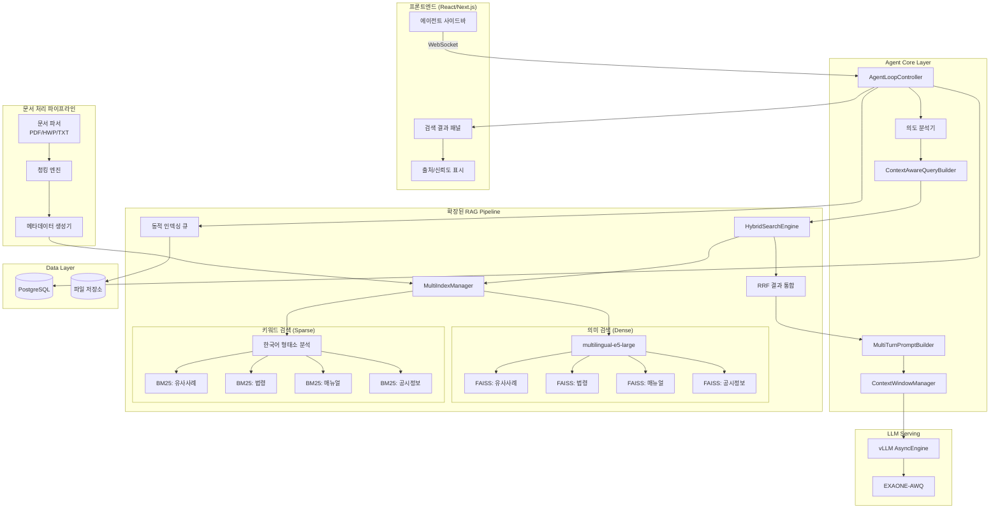
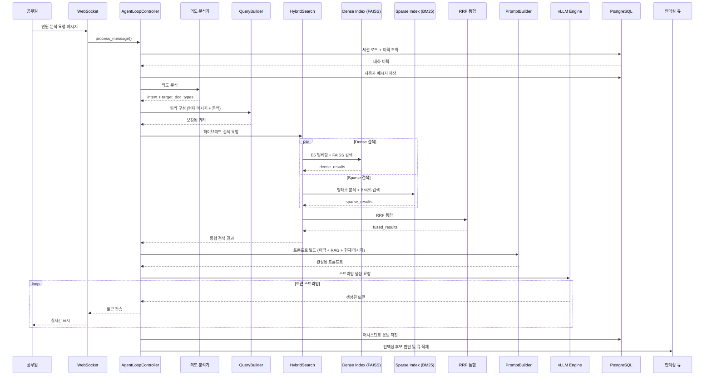
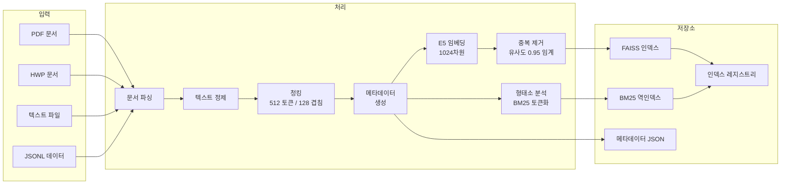

# ADR-004: 확장된 RAG 아키텍처 설계

**문서 ID**: ADR-004
**작성일**: 2026-03-22
**상태**: Proposed
**선행 문서**: ADR-003 (Agent 시스템 아키텍처 설계)
**마일스톤**: M3 고도화 및 최적화 / M4 확장

---

## 목차

1. [Status](#status)
2. [Context](#context)
3. [Decision](#decision)
4. [현재 시스템 분석 및 갭 분석](#a-현재-시스템-분석-및-갭-분석)
5. [확장된 RAG 아키텍처 설계](#b-확장된-rag-아키텍처-설계)
6. [아키텍처 다이어그램](#c-아키텍처-다이어그램)
7. [데이터 모델 설계](#d-데이터-모델-설계)
8. [RAG 파이프라인 상세 설계](#e-rag-파이프라인-상세-설계)
9. [구현 로드맵](#f-구현-로드맵)
10. [마이그레이션 전략](#g-마이그레이션-전략)
11. [Consequences](#consequences)

---

## Status

Proposed

---

## Context

GovOn 시스템의 현재 RAG 파이프라인(`src/inference/retriever.py`)은 단일 FAISS 인덱스에 유사 민원 사례만 저장하는 구조다. 공무원이 민원을 처리할 때 실제로 필요한 정보는 유사 사례뿐만 아니라 관련 법령, 업무 매뉴얼, 기관 공시 정보 등 다양한 출처에 걸쳐 있다. 현재 구조에서는 다음 한계가 존재한다:

1. **단일 데이터 소스**: 유사 민원-답변 쌍만 검색 가능하며, 법령/매뉴얼/공시 정보 참조 불가
2. **메타데이터 부재**: 검색 결과에 출처, 신뢰도, 유효기간 등의 메타데이터가 없어 법적 책임 소재가 불명확
3. **단일 검색 전략**: 의미 검색(코사인 유사도)만 사용하며, 법령 조항 번호나 기관명 같은 키워드 정확 매칭 불가
4. **정적 인덱스**: 대화 중 축적되는 새로운 민원-답변 쌍을 인덱스에 반영하는 메커니즘 없음
5. **Agent 통합 미흡**: ADR-003에서 설계한 멀티턴 Agent 루프와 RAG 검색의 연결 지점이 명확하지 않음

폐쇄망 환경에서 외부 검색이 불가능하고 모델 재학습 비용이 높기 때문에, 내부 벡터 저장소를 통한 RAG가 최신 정보 반영의 유일한 수단이다. 이 인프라를 확장하여 다중 출처 검색과 하이브리드 검색을 지원해야 한다.

---

## Decision

현재 단일 인덱스 기반 RAG를 **다중 인덱스 + 하이브리드 검색 + 동적 인덱싱** 구조로 확장한다. 구체적으로:

1. 데이터 타입별(유사사례, 법령, 매뉴얼, 공시정보) 독립 FAISS 인덱스를 운영한다
2. 의미 검색(FAISS)과 키워드 검색(BM25)을 결합한 하이브리드 검색을 도입한다
3. Reciprocal Rank Fusion(RRF)으로 다중 인덱스 검색 결과를 통합 순위 매김한다
4. 대화 중 확정된 민원-답변 쌍을 배치 큐에 적재하여 주기적으로 인덱스에 반영한다
5. 모든 검색 결과에 출처/신뢰도/유효기간 메타데이터를 부착하여 프론트엔드에 표시한다

---

## A. 현재 시스템 분석 및 갭 분석

### A.1 현재 구현 분석

현재 RAG 시스템은 `src/inference/retriever.py`의 `CivilComplaintRetriever` 클래스로 구현되어 있다.

| 구성요소 | 현재 구현 | 파일 위치 |
|---------|----------|----------|
| 임베딩 모델 | `intfloat/multilingual-e5-large` (1024차원) | `retriever.py:17` |
| 벡터 인덱스 | `faiss.IndexFlatIP` (정규화된 코사인 유사도) | `retriever.py:86` |
| 데이터 소스 | `data/processed/v2_train.jsonl` (단일 JSONL) | `api_server.py:18` |
| 검색 API | `search(query, top_k=5)` | `retriever.py:119` |
| 메타데이터 | `id`, `category`, `complaint`, `answer`, `score` | `retriever.py:68-73` |
| 프롬프트 통합 | `_augment_prompt()` - RAG 결과를 프롬프트에 삽입 | `api_server.py:67-83` |
| 쿼리 추출 | 정적 문자열 파싱 (`민원 내용:`, `[|user|]` 기반) | `api_server.py:92-96` |
| 스키마 | `RetrievedCase` (Pydantic) | `schemas.py:4-9` |

**현재 동작 흐름**:
1. 사용자 요청에서 `use_rag=True`이면 쿼리 텍스트 추출
2. `CivilComplaintRetriever.search()` 호출 (E5 `query:` prefix 사용)
3. FAISS IndexFlatIP에서 Top-K 검색
4. 검색 결과를 `_augment_prompt()`로 프롬프트에 삽입
5. 증강된 프롬프트를 vLLM에 전달

### A.2 갭 분석

| 영역 | 현재 상태 | 목표 상태 | 갭 |
|------|----------|----------|-----|
| **데이터 소스** | 유사 민원 1종 (JSONL) | 유사사례 + 법령 + 매뉴얼 + 공시정보 4종 | 3종 데이터 소스 추가 필요 |
| **메타데이터** | `id`, `category`만 존재 | 출처, 신뢰도, 유효기간, 갱신일, 문서타입 | 메타데이터 스키마 확장 필요 |
| **검색 전략** | 의미 검색(코사인)만 사용 | 의미 + 키워드(BM25) 하이브리드 | BM25 인덱스 구축 및 RRF 통합 필요 |
| **인덱스 구조** | 단일 FAISS 인덱스 | 데이터 타입별 독립 인덱스 | 멀티인덱스 매니저 필요 |
| **인덱스 갱신** | 정적 (서버 시작 시 1회) | 배치 인덱싱 + 대화 중 캡처 | 동적 인덱싱 메커니즘 필요 |
| **결과 통합** | 단순 Top-K 반환 | RRF 기반 다중 인덱스 결과 통합 | 결과 통합 엔진 필요 |
| **출처 표시** | 없음 | 법적 책임을 위한 출처/신뢰도 표시 | API 응답 스키마 확장 필요 |
| **Agent 통합** | 단일턴 RAG 주입 | 멀티턴 문맥 기반 동적 RAG 쿼리 | Agent Loop 내 RAG 연결 지점 명확화 필요 |
| **문서 처리** | 없음 (JSONL 직접 로드) | PDF/HWP 파싱, 텍스트 추출, 청킹 | 문서 처리 파이프라인 필요 |
| **인덱스 타입** | `IndexFlatIP` (정확 검색) | `IndexIVFFlat` (근사 검색) 전환 | 10만건+ 확장 시 성능 최적화 필요 |

### A.3 제약 조건 재확인

| 제약 | 상세 |
|------|------|
| **폐쇄망** | 외부 API 호출 불가, 모든 모델/데이터 로컬 배포 |
| **비용** | `multilingual-e5-large` 로컬 배포, 추가 임베딩 모델 도입 지양 |
| **성능** | RAG 검색 전체 레이턴시 < 500ms (현재 p95 39.76ms) |
| **확장성** | 유사사례 10만건+ / 법령 수천건 / 매뉴얼 수백건 |
| **규정** | 법령/공시 정보 출처 명시 필수 (법적 책임) |
| **VRAM** | 16GB 기준, 임베딩 모델 + LLM 동시 로드 |

---

## B. 확장된 RAG 아키텍처 설계

### B.1 데이터 저장소 아키텍처

#### 다중 출처 데이터 모델

4가지 데이터 타입을 정의하고, 각각 독립 인덱스로 관리한다.

| 데이터 타입 | 코드명 | 설명 | 예시 |
|------------|--------|------|------|
| **유사사례** | `CASE` | 과거 민원-답변 쌍 | AI Hub 민원 데이터, 대화 중 확정된 답변 |
| **법령** | `LAW` | 법률, 시행령, 조례, 규칙 | 개인정보보호법, 지자체 조례 |
| **매뉴얼** | `MANUAL` | 업무 처리 지침, 표준 서식 | 민원 처리 매뉴얼, 답변 작성 가이드 |
| **공시정보** | `NOTICE` | 기관 공시, 고시, 안내문 | 수도 요금 안내, 쓰레기 수거 일정 |

#### 메타데이터 스키마

모든 데이터 타입에 공통으로 적용되는 메타데이터 구조:

```python
@dataclass
class DocumentMetadata:
    # 공통 필드
    doc_id: str              # 문서 고유 식별자
    doc_type: str            # CASE | LAW | MANUAL | NOTICE
    source: str              # 출처 (예: "AI Hub", "법제처", "기관 내부")
    title: str               # 문서 제목
    category: str            # 민원 카테고리 (도로/교통, 환경/위생 등)
    reliability_score: float # 신뢰도 (0.0 ~ 1.0)
    created_at: datetime     # 생성일
    updated_at: datetime     # 최종 갱신일
    valid_from: Optional[datetime]  # 유효 시작일 (법령 시행일)
    valid_until: Optional[datetime] # 유효 종료일 (폐지/개정 시)
    chunk_index: int         # 청크 인덱스 (긴 문서 분할 시)
    chunk_total: int         # 전체 청크 수

    # 타입별 추가 필드
    # CASE: complaint_text, answer_text
    # LAW: law_number, article_number, enforcement_date
    # MANUAL: version, department
    # NOTICE: notice_number, effective_date
```

**신뢰도 산정 기준**:

| 데이터 타입 | 기본 신뢰도 | 감쇠 조건 |
|------------|------------|----------|
| 법령 | 1.0 | 개정/폐지 시 0.0으로 전환 |
| 매뉴얼 | 0.9 | 버전 업데이트 시 이전 버전 0.3으로 감쇠 |
| 유사사례 (피드백 있음) | 0.8 | 부정 피드백 누적 시 0.1씩 감쇠 |
| 유사사례 (피드백 없음) | 0.6 | 1년 경과 시 0.1씩 감쇠 |
| 공시정보 | 0.7 | 유효기간 만료 시 0.2로 감쇠 |

#### 벡터 저장소 확장 설계

```
models/faiss_index/
├── case/
│   ├── complaints.index          # FAISS IVFFlat 인덱스
│   ├── complaints.index.meta.json # 메타데이터
│   └── complaints.index.bm25.pkl # BM25 역인덱스
├── law/
│   ├── laws.index
│   ├── laws.index.meta.json
│   └── laws.index.bm25.pkl
├── manual/
│   ├── manuals.index
│   ├── manuals.index.meta.json
│   └── manuals.index.bm25.pkl
├── notice/
│   ├── notices.index
│   ├── notices.index.meta.json
│   └── notices.index.bm25.pkl
├── index_registry.json           # 인덱스 레지스트리 (버전, 문서 수, 마지막 갱신)
└── pending_queue/                # 동적 인덱싱 대기열
    └── batch_*.jsonl
```

### B.2 RAG 파이프라인 확장

#### 다중 인덱스 관리

```python
class MultiIndexManager:
    """데이터 타입별 독립 FAISS 인덱스를 관리한다."""

    def __init__(self, base_path: str, embedding_model: SentenceTransformer):
        self.indexes: Dict[str, faiss.Index] = {}
        self.metadata: Dict[str, List[DocumentMetadata]] = {}
        self.bm25_indexes: Dict[str, BM25Okapi] = {}
        self.embedding_model = embedding_model

        # 인덱스 타입별 로드
        for doc_type in ["case", "law", "manual", "notice"]:
            index_dir = os.path.join(base_path, doc_type)
            if os.path.exists(index_dir):
                self._load_index(doc_type, index_dir)

    def search(
        self,
        query: str,
        doc_types: List[str] = None,  # None이면 전체 검색
        top_k: int = 5,
        use_hybrid: bool = True
    ) -> List[SearchResult]:
        """다중 인덱스에서 검색하고 RRF로 통합한다."""
        ...
```

#### 문서 처리 파이프라인

신규 문서(PDF, HWP, TXT)를 벡터 인덱스에 추가하기 위한 처리 흐름:

```
원본 문서 (PDF/HWP/TXT)
    │
    ▼
[문서 파싱] ── PyMuPDF(PDF), python-hwp(HWP), 직접 로드(TXT)
    │
    ▼
[텍스트 추출 및 정제] ── 헤더/푸터 제거, 표 구조화
    │
    ▼
[청킹] ── 겹침 있는 고정 크기 분할 (512 토큰, 128 토큰 겹침)
    │
    ▼
[메타데이터 생성] ── 출처, 타입, 유효기간 등 부착
    │
    ▼
[임베딩] ── multilingual-e5-large (passage: prefix)
    │
    ▼
[인덱스 추가] ── 해당 타입의 FAISS 인덱스에 추가
    │
    ▼
[BM25 갱신] ── 형태소 분석 후 역인덱스 갱신
```

**청킹 전략**:

| 파라미터 | 값 | 근거 |
|---------|-----|------|
| 청크 크기 | 512 토큰 | E5 모델 최대 입력 512 토큰, 의미 단위 보존 |
| 겹침 크기 | 128 토큰 | 경계 부근 문맥 손실 방지 (25% 겹침) |
| 최소 청크 | 50 토큰 | 너무 짧은 청크는 검색 품질 저하 |
| 분할 기준 | 문단 > 문장 > 토큰 | 자연스러운 의미 단위 우선 |

#### 하이브리드 검색 전략

의미 검색(Dense)과 키워드 검색(Sparse)을 결합하여 양쪽의 장점을 취한다.

**의미 검색이 강한 경우**: "도로가 울퉁불퉁해서 차가 흔들려요" -> "도로 파손 민원"
**키워드 검색이 강한 경우**: "개인정보보호법 제17조" -> 정확한 법조항 매칭

```python
class HybridSearchEngine:
    """의미 검색(FAISS) + 키워드 검색(BM25) 결합"""

    def search(self, query: str, doc_type: str, top_k: int = 10) -> List[SearchResult]:
        # 1. 의미 검색 (Dense Retrieval)
        dense_results = self._dense_search(query, doc_type, top_k=top_k * 2)

        # 2. 키워드 검색 (Sparse Retrieval)
        tokenized_query = self._tokenize_korean(query)  # 형태소 분석
        sparse_results = self._sparse_search(tokenized_query, doc_type, top_k=top_k * 2)

        # 3. RRF 통합
        fused = self._reciprocal_rank_fusion(dense_results, sparse_results, k=60)

        return fused[:top_k]
```

#### 결과 통합 및 순위 매김 (Reciprocal Rank Fusion)

다중 인덱스와 다중 검색 방법의 결과를 단일 순위 목록으로 통합한다.

```python
def reciprocal_rank_fusion(
    result_lists: List[List[SearchResult]],
    k: int = 60,
    weights: Optional[List[float]] = None
) -> List[SearchResult]:
    """
    RRF 알고리즘으로 다중 결과 목록을 통합한다.

    score(d) = sum( w_i / (k + rank_i(d)) ) for each result list i

    Args:
        result_lists: 각 검색 방법/인덱스별 결과 목록
        k: RRF 상수 (기본 60, 논문 권장값)
        weights: 각 결과 목록의 가중치 (기본 균등)
    """
    if weights is None:
        weights = [1.0] * len(result_lists)

    scores: Dict[str, float] = {}
    doc_map: Dict[str, SearchResult] = {}

    for weight, results in zip(weights, result_lists):
        for rank, result in enumerate(results, start=1):
            doc_id = result.doc_id
            scores[doc_id] = scores.get(doc_id, 0.0) + weight / (k + rank)
            if doc_id not in doc_map:
                doc_map[doc_id] = result

    sorted_ids = sorted(scores, key=lambda x: scores[x], reverse=True)
    return [doc_map[doc_id] for doc_id in sorted_ids]
```

**RRF 가중치 설정**:

| 검색 소스 | 가중치 | 근거 |
|----------|--------|------|
| 유사사례 의미 검색 | 1.0 | 기본 검색 (현재 시스템 기준선) |
| 유사사례 키워드 검색 | 0.7 | 보조 검색 |
| 법령 의미 검색 | 0.9 | 법적 근거 중요도 높음 |
| 법령 키워드 검색 | 1.2 | 법령 조항 정확 매칭이 매우 중요 |
| 매뉴얼 의미 검색 | 0.8 | 절차 참고용 |
| 공시정보 의미 검색 | 0.6 | 보조 정보 |

### B.3 동적 인덱싱 메커니즘

#### 대화 중 새 민원/답변 캡처

공무원이 Agent와 대화하며 생성한 답변이 최종 확정(피드백 평점 4 이상 또는 복사 사용)되면, 해당 민원-답변 쌍을 인덱싱 후보로 큐에 적재한다.

```
[Agent 대화]
    │
    ▼
[답변 생성 + 공무원 확정]
    │
    ├─ 복사 버튼 클릭 → 확정으로 간주
    │  또는
    ├─ 피드백 평점 4+ → 확정으로 간주
    │
    ▼
[인덱싱 후보 큐 적재]
    │  pending_queue/batch_YYYYMMDD.jsonl에 추가
    │
    ▼
[배치 인덱싱] ← 야간 또는 주기적(1시간) 실행
    │
    ├─ 중복 제거 (기존 인덱스와 코사인 유사도 > 0.95이면 스킵)
    ├─ 임베딩 생성
    ├─ FAISS 인덱스 추가
    └─ BM25 역인덱스 갱신
```

#### 실시간 vs 배치 인덱싱 트레이드오프

| 방식 | 장점 | 단점 | 채택 |
|------|------|------|------|
| **실시간 인덱싱** | 즉시 검색 가능 | 임베딩 연산으로 응답 지연, 인덱스 일관성 리스크 | 미채택 |
| **배치 인덱싱** (1시간/야간) | 서비스 영향 없음, 중복 제거 용이 | 최대 1시간 지연 | **채택** |
| **마이크로 배치** (10건 누적 시) | 적절한 반영 속도 | 구현 복잡도 중간 | Phase 2 고려 |

**결정**: 배치 인덱싱을 기본으로 채택한다. 폐쇄망 환경에서 민원 처리 업무는 주간 근무 시간에 집중되므로, 야간 배치로 충분하다. 인덱싱 지연이 업무에 미치는 영향은 미미하다 -- 동일 민원이 하루 안에 반복 접수될 확률이 낮고, 유사 사례는 이미 기존 인덱스에 풍부하게 존재한다.

#### 중복 제거 전략

```python
class DeduplicationChecker:
    SIMILARITY_THRESHOLD = 0.95  # 이 이상이면 중복으로 간주

    def is_duplicate(self, new_embedding: np.ndarray, index: faiss.Index) -> bool:
        """기존 인덱스에서 유사한 문서가 있는지 확인한다."""
        if index is None or index.ntotal == 0:
            return False

        distances, _ = index.search(
            new_embedding.reshape(1, -1).astype('float32'), 1
        )
        return float(distances[0][0]) > self.SIMILARITY_THRESHOLD
```

#### 인덱스 버전 관리

```json
// index_registry.json
{
  "version": "2.1.0",
  "last_updated": "2026-03-22T03:00:00+09:00",
  "indexes": {
    "case": {
      "total_documents": 102450,
      "index_type": "IVFFlat",
      "nlist": 256,
      "dimension": 1024,
      "last_rebuild": "2026-03-20T03:00:00+09:00",
      "pending_additions": 47
    },
    "law": {
      "total_documents": 3200,
      "index_type": "FlatIP",
      "dimension": 1024,
      "last_rebuild": "2026-03-15T03:00:00+09:00",
      "pending_additions": 0
    },
    "manual": {
      "total_documents": 450,
      "index_type": "FlatIP",
      "dimension": 1024,
      "last_rebuild": "2026-03-10T03:00:00+09:00",
      "pending_additions": 5
    },
    "notice": {
      "total_documents": 1800,
      "index_type": "FlatIP",
      "dimension": 1024,
      "last_rebuild": "2026-03-18T03:00:00+09:00",
      "pending_additions": 12
    }
  }
}
```

### B.4 Agent 시스템 통합

#### Agent Loop에서 RAG 검색 실행 위치

ADR-003의 `AgentLoopController.process_message()` 흐름에서 RAG 검색이 실행되는 위치를 명확히 한다.

```
[사용자 메시지 수신]
    │
    ▼
[1. 세션 로드 및 대화 이력 가져오기]
    │
    ▼
[2. 사용자 메시지 저장 (DB)]
    │
    ▼
[3. 의도 분석] ── 사용자 메시지의 의도를 판단
    │                ├─ 민원 분류 요청 → doc_types = ["case"]
    │                ├─ 법적 근거 질문 → doc_types = ["law", "manual"]
    │                ├─ 답변 생성 요청 → doc_types = ["case", "law", "notice"]
    │                └─ 일반 대화      → RAG 스킵
    │
    ▼
[4. RAG 검색] ◀── 확장 지점
    │  ├─ 쿼리 구성: 현재 메시지 + 대화 문맥 요약
    │  ├─ 대상 인덱스: 의도 분석 결과에 따라 선택
    │  ├─ 하이브리드 검색: Dense + Sparse
    │  └─ RRF 통합: 다중 인덱스 결과 병합
    │
    ▼
[5. 멀티턴 프롬프트 빌드]
    │  ├─ 시스템 프롬프트
    │  ├─ RAG 컨텍스트 (출처 태그 포함)
    │  ├─ 대화 이력 (컨텍스트 윈도우 내)
    │  └─ 현재 사용자 메시지
    │
    ▼
[6. vLLM 생성 (스트리밍)]
    │
    ▼
[7. 응답 저장 + 인덱싱 후보 판단]
```

#### 멀티턴 대화 문맥을 RAG 쿼리에 포함하는 방법

단일턴에서는 사용자 메시지를 그대로 쿼리로 사용했으나, 멀티턴에서는 이전 대화의 문맥이 쿼리에 반영되어야 한다.

```python
class ContextAwareQueryBuilder:
    """멀티턴 대화 문맥을 RAG 검색 쿼리에 반영한다."""

    def build_query(
        self,
        current_message: str,
        history: List[Message],
        max_context_tokens: int = 256
    ) -> str:
        """
        쿼리 구성 전략:
        1. 현재 메시지가 충분히 구체적이면 그대로 사용
        2. 대명사/생략이 있으면 이전 턴에서 주제어 추출하여 보강
        3. 최대 256 토큰으로 제한 (E5 입력 효율)
        """
        # 현재 메시지가 자체적으로 완전한 쿼리인지 판단
        if self._is_self_contained(current_message):
            return current_message

        # 이전 턴에서 핵심 주제어 추출
        topic = self._extract_topic_from_history(history)
        if topic:
            return f"{topic} {current_message}"

        return current_message

    def _is_self_contained(self, message: str) -> bool:
        """메시지가 지시대명사/생략 없이 완전한지 판단한다."""
        incomplete_indicators = ["그것", "이것", "그 민원", "위 내용", "아까"]
        return not any(ind in message for ind in incomplete_indicators)

    def _extract_topic_from_history(self, history: List[Message]) -> Optional[str]:
        """최근 대화에서 민원 주제어를 추출한다."""
        for msg in reversed(history):
            if msg.role == "user" and len(msg.content) > 30:
                # 가장 최근의 긴 사용자 메시지에서 핵심 추출
                return msg.content[:200]
        return None
```

#### 검색 결과의 프롬프트 주입 방식 개선

현재 `_augment_prompt()`의 단순 텍스트 삽입을 구조화된 출처 표기 방식으로 변경한다.

```python
def _format_rag_context(self, results: List[SearchResult]) -> str:
    """검색 결과를 출처 태그와 함께 프롬프트에 삽입한다."""
    context = "\n### 참고 자료:\n"

    for i, result in enumerate(results):
        type_label = {
            "CASE": "유사 사례",
            "LAW": "관련 법령",
            "MANUAL": "업무 매뉴얼",
            "NOTICE": "공시 정보"
        }.get(result.doc_type, "참고")

        context += f"\n**[{type_label} {i+1}]** (출처: {result.source}"
        context += f", 신뢰도: {result.reliability_score:.0%})\n"
        context += f"{result.content}\n"

    context += "\n위 참고 자료를 바탕으로 답변해 주세요. "
    context += "답변 시 참고한 자료의 출처를 명시하세요.\n"

    return context
```

### B.5 프론트엔드 통합

#### 참고자료 출처 표시 API 스펙

기존 `RetrievedCase` 스키마를 확장하여 다중 출처와 메타데이터를 지원한다.

```python
class RetrievedDocument(BaseModel):
    """확장된 검색 결과 스키마 (기존 RetrievedCase 대체)"""
    doc_id: str
    doc_type: str                          # CASE | LAW | MANUAL | NOTICE
    source: str                            # 출처명
    title: str                             # 문서 제목
    content: str                           # 본문 (또는 요약)
    category: Optional[str] = None         # 민원 카테고리
    score: float                           # RRF 통합 점수
    reliability_score: float               # 신뢰도
    valid_until: Optional[str] = None      # 유효기간 (ISO 8601)
    highlight_keywords: List[str] = []     # 매칭된 키워드 (BM25)

    # CASE 타입 전용
    complaint: Optional[str] = None        # 민원 원문
    answer: Optional[str] = None           # 답변 원문

    # LAW 타입 전용
    law_number: Optional[str] = None       # 법령 번호
    article_number: Optional[str] = None   # 조항 번호

class EnhancedGenerateResponse(BaseModel):
    request_id: str
    text: str
    prompt_tokens: int
    completion_tokens: int
    retrieved_documents: List[RetrievedDocument] = []
    search_metadata: SearchMetadata = None

class SearchMetadata(BaseModel):
    total_searched: int                     # 검색된 전체 문서 수
    search_time_ms: float                   # 검색 소요 시간
    indexes_searched: List[str]             # 검색된 인덱스 목록
    hybrid_mode: bool                       # 하이브리드 검색 사용 여부
```

#### 신뢰도/관련성 점수 응답 구조

프론트엔드에서 출처별 시각적 구분을 위한 응답 예시:

```json
{
  "request_id": "abc-123",
  "text": "안녕하십니까. 해당 민원은...",
  "retrieved_documents": [
    {
      "doc_id": "case-00142",
      "doc_type": "CASE",
      "source": "AI Hub 공개데이터",
      "title": "OO동 도로 파손 민원",
      "content": "...",
      "category": "도로/교통",
      "score": 0.92,
      "reliability_score": 0.8,
      "complaint": "OO동 앞 도로가 심하게 파손...",
      "answer": "안녕하십니까. 해당 구간의 도로 보수 공사를..."
    },
    {
      "doc_id": "law-00058",
      "doc_type": "LAW",
      "source": "법제처",
      "title": "도로법 제66조",
      "content": "도로관리청은 도로의 파손...",
      "score": 0.85,
      "reliability_score": 1.0,
      "law_number": "법률 제18455호",
      "article_number": "제66조"
    }
  ],
  "search_metadata": {
    "total_searched": 24,
    "search_time_ms": 87.3,
    "indexes_searched": ["case", "law"],
    "hybrid_mode": true
  }
}
```

---

## C. 아키텍처 다이어그램

### C.1 확장된 RAG 시스템 구성도



### C.2 데이터 흐름도



### C.3 문서 처리 파이프라인 흐름도



---

## D. 데이터 모델 설계

### D.1 PostgreSQL 스키마 확장

기존 ADR-003의 테이블 구조에 추가되는 새로운 테이블과 컬럼이다.

#### 신규 테이블: `document_source` -- 문서 출처 관리

```sql
CREATE TABLE document_source (
    id UUID PRIMARY KEY DEFAULT gen_random_uuid(),
    doc_type VARCHAR(20) NOT NULL CHECK (doc_type IN ('CASE', 'LAW', 'MANUAL', 'NOTICE')),
    source_name VARCHAR(200) NOT NULL,           -- "AI Hub", "법제처", "기관 내부" 등
    title VARCHAR(500) NOT NULL,
    content TEXT NOT NULL,
    category VARCHAR(50),                         -- 민원 카테고리
    reliability_score FLOAT DEFAULT 0.6,
    valid_from TIMESTAMP,
    valid_until TIMESTAMP,
    status VARCHAR(20) DEFAULT 'active'
        CHECK (status IN ('active', 'expired', 'deprecated')),
    version VARCHAR(20) DEFAULT '1.0',

    -- CASE 타입 전용
    complaint_text TEXT,
    answer_text TEXT,

    -- LAW 타입 전용
    law_number VARCHAR(100),
    article_number VARCHAR(50),
    enforcement_date DATE,

    -- MANUAL 타입 전용
    department VARCHAR(100),

    -- NOTICE 타입 전용
    notice_number VARCHAR(100),
    effective_date DATE,

    -- 벡터 인덱스 연결
    faiss_index_id INTEGER,                       -- FAISS 내부 인덱스 번호
    embedding_version VARCHAR(50) DEFAULT 'e5-large-v1',

    created_at TIMESTAMP DEFAULT NOW(),
    updated_at TIMESTAMP DEFAULT NOW()
);

-- 인덱스
CREATE INDEX idx_docsource_type ON document_source(doc_type);
CREATE INDEX idx_docsource_category ON document_source(category);
CREATE INDEX idx_docsource_status ON document_source(status);
CREATE INDEX idx_docsource_valid ON document_source(valid_from, valid_until);
```

#### 신규 테이블: `indexing_queue` -- 동적 인덱싱 대기열

```sql
CREATE TABLE indexing_queue (
    id UUID PRIMARY KEY DEFAULT gen_random_uuid(),
    session_id UUID REFERENCES agent_session(id),
    message_id UUID REFERENCES message(id),
    doc_type VARCHAR(20) DEFAULT 'CASE',
    complaint_text TEXT NOT NULL,
    answer_text TEXT NOT NULL,
    category VARCHAR(50),
    status VARCHAR(20) DEFAULT 'pending'
        CHECK (status IN ('pending', 'processing', 'completed', 'skipped', 'failed')),
    skip_reason VARCHAR(200),                     -- 스킵 사유 (중복 등)
    created_at TIMESTAMP DEFAULT NOW(),
    processed_at TIMESTAMP
);

CREATE INDEX idx_indexqueue_status ON indexing_queue(status);
CREATE INDEX idx_indexqueue_created ON indexing_queue(created_at);
```

#### 신규 테이블: `index_version` -- 인덱스 버전 이력

```sql
CREATE TABLE index_version (
    id UUID PRIMARY KEY DEFAULT gen_random_uuid(),
    doc_type VARCHAR(20) NOT NULL,
    version VARCHAR(50) NOT NULL,
    total_documents INTEGER NOT NULL,
    index_file_path VARCHAR(500) NOT NULL,
    meta_file_path VARCHAR(500) NOT NULL,
    built_at TIMESTAMP DEFAULT NOW(),
    is_active BOOLEAN DEFAULT TRUE,
    build_duration_seconds FLOAT,
    notes TEXT
);

CREATE INDEX idx_indexversion_active ON index_version(doc_type, is_active);
```

#### 기존 `retrieved_case` 테이블 확장

```sql
-- 기존 컬럼에 추가
ALTER TABLE retrieved_case ADD COLUMN doc_type VARCHAR(20) DEFAULT 'CASE';
ALTER TABLE retrieved_case ADD COLUMN source VARCHAR(200);
ALTER TABLE retrieved_case ADD COLUMN title VARCHAR(500);
ALTER TABLE retrieved_case ADD COLUMN reliability_score FLOAT;
ALTER TABLE retrieved_case ADD COLUMN search_method VARCHAR(20);  -- dense, sparse, hybrid
ALTER TABLE retrieved_case ADD COLUMN law_number VARCHAR(100);
ALTER TABLE retrieved_case ADD COLUMN article_number VARCHAR(50);
```

### D.2 벡터 저장소 설계 (FAISS 멀티인덱스 구조)

#### 인덱스 타입 선택 근거

| 문서 수 | 권장 인덱스 | 근거 |
|---------|------------|------|
| < 10,000건 | `IndexFlatIP` | 정확 검색, 빌드 비용 없음 |
| 10,000 ~ 100,000건 | `IndexIVFFlat` (nlist=256) | 근사 검색, 빌드 필요하나 검색 빠름 |
| > 100,000건 | `IndexIVFFlat` (nlist=1024) + `nprobe=32` | 대규모 근사 검색 |

**현재 적용 계획**:

| 인덱스 | 예상 문서 수 | 인덱스 타입 | 파라미터 |
|--------|------------|------------|---------|
| 유사사례 (`case`) | 100,000+ | `IndexIVFFlat` | nlist=256, nprobe=16 |
| 법령 (`law`) | 3,000~5,000 | `IndexFlatIP` | - |
| 매뉴얼 (`manual`) | 300~500 | `IndexFlatIP` | - |
| 공시정보 (`notice`) | 1,000~3,000 | `IndexFlatIP` | - |

**IVFFlat 전환 시 정확도 영향**:

```
IndexFlatIP (현재): Recall@10 = 100% (정확 검색)
IndexIVFFlat (nlist=256, nprobe=16): Recall@10 >= 95%
IndexIVFFlat (nlist=256, nprobe=32): Recall@10 >= 98%
```

nprobe=16에서도 검색 레이턴시가 목표(< 500ms) 내이므로, 약간의 정확도 손실을 감수하고 확장성을 확보한다. 필요 시 nprobe를 32로 올려 정확도를 보완할 수 있다.

### D.3 문서 타입별 메타데이터 정의

#### CASE (유사사례)

```json
{
  "doc_id": "case-00142",
  "doc_type": "CASE",
  "source": "AI Hub 공개데이터",
  "title": "OO동 도로 파손 민원",
  "category": "도로/교통",
  "reliability_score": 0.8,
  "created_at": "2025-11-03T09:00:00+09:00",
  "updated_at": "2025-11-03T09:00:00+09:00",
  "complaint_text": "OO동 앞 도로가 심하게 파손되어...",
  "answer_text": "안녕하십니까. 해당 구간의 도로 보수 공사를...",
  "feedback_count": 3,
  "avg_rating": 4.2
}
```

#### LAW (법령)

```json
{
  "doc_id": "law-00058",
  "doc_type": "LAW",
  "source": "법제처",
  "title": "도로법",
  "category": "도로/교통",
  "reliability_score": 1.0,
  "valid_from": "2024-01-01T00:00:00+09:00",
  "valid_until": null,
  "law_number": "법률 제18455호",
  "article_number": "제66조",
  "enforcement_date": "2024-01-01",
  "content": "도로관리청은 도로의 파손 그 밖의 사유로 인하여..."
}
```

#### MANUAL (매뉴얼)

```json
{
  "doc_id": "manual-00021",
  "doc_type": "MANUAL",
  "source": "기관 내부",
  "title": "도로 파손 민원 처리 매뉴얼",
  "category": "도로/교통",
  "reliability_score": 0.9,
  "version": "3.2",
  "department": "도시건설과",
  "content": "1. 파손 위치 확인 2. 긴급도 분류 3. 보수 일정 안내..."
}
```

#### NOTICE (공시정보)

```json
{
  "doc_id": "notice-00105",
  "doc_type": "NOTICE",
  "source": "OO시청",
  "title": "2026년 상반기 도로 보수 공사 일정 안내",
  "category": "도로/교통",
  "reliability_score": 0.7,
  "valid_from": "2026-01-01T00:00:00+09:00",
  "valid_until": "2026-06-30T23:59:59+09:00",
  "notice_number": "공시 제2026-042호",
  "effective_date": "2026-01-15",
  "content": "도로 보수 공사 일정을 다음과 같이 안내합니다..."
}
```

---

## E. RAG 파이프라인 상세 설계

### E.1 각 단계별 입/출력

```
단계 1: 쿼리 전처리
  입력: 사용자 메시지(str) + 대화 이력(List[Message])
  처리: ContextAwareQueryBuilder.build_query()
  출력: 보강된 검색 쿼리(str)

단계 2: 의도 기반 인덱스 선택
  입력: 보강된 쿼리(str)
  처리: IntentAnalyzer.analyze() -- 규칙 기반 키워드 매칭
  출력: target_doc_types(List[str]), search_params(dict)

단계 3: Dense 검색 (FAISS)
  입력: 쿼리(str) + target_doc_types
  처리: E5 임베딩 생성 -> 각 인덱스별 Top-K 검색
  출력: dense_results(Dict[str, List[SearchResult]])

단계 4: Sparse 검색 (BM25)
  입력: 쿼리(str) + target_doc_types
  처리: 한국어 형태소 분석 -> BM25 스코어링
  출력: sparse_results(Dict[str, List[SearchResult]])

단계 5: 결과 통합 (RRF)
  입력: dense_results + sparse_results
  처리: 인덱스별 RRF -> 전체 RRF
  출력: fused_results(List[SearchResult]), 최대 Top-K개

단계 6: 후처리
  입력: fused_results
  처리: 유효기간 필터링, 신뢰도 순 재정렬, 메타데이터 부착
  출력: final_results(List[RetrievedDocument])

단계 7: 프롬프트 주입
  입력: final_results + 대화 이력 + 현재 메시지
  처리: MultiTurnPromptBuilder.build()
  출력: 완성된 EXAONE 프롬프트(str)
```

### E.2 알고리즘 선택 근거

| 결정 사항 | 선택 | 대안 | 선택 근거 |
|----------|------|------|----------|
| 임베딩 모델 | multilingual-e5-large (유지) | BGE-M3, KoSimCSE | 이미 검증됨(p95 39.76ms), 한국어 성능 우수, VRAM 추가 부담 없음 |
| Dense 인덱스 | FAISS IVFFlat | HNSW, ScaNN | 폐쇄망 환경에서 C++ 네이티브 라이브러리 의존 최소화, 이미 도입됨 |
| Sparse 검색 | BM25 (rank_bm25) | TF-IDF, Elasticsearch | 외부 서비스 의존 없음, Python 순수 구현으로 폐쇄망 배포 용이 |
| 결과 통합 | RRF (k=60) | Linear combination, Learned fusion | 하이퍼파라미터 튜닝 불필요, 논문으로 검증된 안정적 성능 |
| 형태소 분석 | MeCab (mecab-ko) | Komoran, Kiwi | 속도 최우수, C 바인딩으로 처리량 높음 |
| 문서 파싱 | PyMuPDF (PDF) | pdfplumber, Camelot | 텍스트+표 추출 모두 지원, 속도 빠름 |

### E.3 성능 및 비용 고려사항

#### 레이턴시 예산 분배

```
전체 RAG 검색 목표: < 500ms (현재 p95 39.76ms에서 여유 있음)

├── 쿼리 전처리: ~5ms
├── E5 임베딩 생성: ~30ms (1쿼리, GPU)
├── FAISS 검색 (4 인덱스): ~20ms (IVFFlat, nprobe=16)
├── BM25 검색 (4 인덱스): ~50ms (10만건 기준)
├── RRF 통합: ~5ms
├── 후처리 (필터링/정렬): ~5ms
└── 네트워크/직렬화 오버헤드: ~10ms

예상 총 레이턴시: ~125ms (목표 500ms 대비 여유 375ms)
```

#### VRAM 사용량 분석

```
현재 VRAM 사용:
├── EXAONE-AWQ INT4: ~4.94GB
├── multilingual-e5-large: ~1.3GB (FP16)
└── FAISS 인덱스 (메모리): ~400MB (10만건 x 1024차원 x 4바이트)

확장 후 예상 VRAM:
├── EXAONE-AWQ INT4: ~4.94GB (변경 없음)
├── multilingual-e5-large: ~1.3GB (변경 없음, 공유)
├── FAISS 인덱스 (4종): ~500MB (추가 ~100MB)
└── BM25 역인덱스 (RAM): ~200MB (VRAM 아님, CPU 메모리)

총 VRAM: ~6.74GB (16GB 기준 여유 9.26GB)
총 RAM 추가: ~200MB (BM25)
```

#### 임베딩 연산 비용

| 작업 | 빈도 | 연산량 | 영향 |
|------|------|--------|------|
| 쿼리 임베딩 | 매 검색 요청 | 1벡터 (~30ms) | 무시 가능 |
| 배치 인덱싱 (야간) | 1일 1회 | 50~100벡터 (~3초) | 서비스 비영향 |
| 전체 재인덱싱 | 월 1회 | 10만벡터 (~30분) | 야간 유지보수 시간에 실행 |
| 법령 업데이트 | 분기 1회 | 수백벡터 (~30초) | 서비스 비영향 |

---

## F. 구현 로드맵

### Phase 1: 기반 구축 (2주)

**목표**: 멀티인덱스 구조 전환 및 기존 유사사례 인덱스 마이그레이션

| 작업 | 산출물 | 마일스톤 |
|------|--------|---------|
| `MultiIndexManager` 클래스 구현 | `src/inference/multi_index_manager.py` | 기존 단일 인덱스와 호환되는 래퍼 |
| `DocumentMetadata` 스키마 정의 | `src/inference/schemas.py` 확장 | 메타데이터 Pydantic 모델 |
| 기존 `CivilComplaintRetriever` 리팩토링 | `retriever.py` 수정 | `MultiIndexManager` 위임 패턴 |
| PostgreSQL 신규 테이블 생성 | `migrations/` SQL 파일 | `document_source`, `indexing_queue` |
| 기존 FAISS 인덱스를 `case/` 디렉토리로 이동 | 인덱스 파일 재구성 | 무중단 마이그레이션 |

**위험 요소**: 기존 API 호환성 파손
**완화 방안**: `CivilComplaintRetriever`를 `MultiIndexManager`의 어댑터로 유지하여 기존 `/v1/generate` API 동작 보장

### Phase 2: 하이브리드 검색 도입 (2주)

**목표**: BM25 검색 추가 및 RRF 결과 통합

| 작업 | 산출물 | 마일스톤 |
|------|--------|---------|
| BM25 인덱스 빌더 구현 | `src/inference/bm25_index.py` | 한국어 형태소 분석 + 역인덱스 |
| `HybridSearchEngine` 구현 | `src/inference/hybrid_search.py` | Dense + Sparse 병렬 검색 |
| RRF 통합 함수 구현 | `src/inference/ranking.py` | 가중 RRF |
| API 응답 스키마 확장 | `schemas.py` 수정 | `RetrievedDocument`, `SearchMetadata` |
| 성능 벤치마크 | 벤치마크 리포트 | 레이턴시 < 500ms 검증 |

**위험 요소**: BM25 한국어 형태소 분석 품질
**완화 방안**: MeCab-ko 기반 형태소 분석 사용, 불용어 사전 구축

### Phase 3: 다중 데이터 소스 확장 (3주)

**목표**: 법령, 매뉴얼, 공시정보 인덱스 구축

| 작업 | 산출물 | 마일스톤 |
|------|--------|---------|
| 문서 처리 파이프라인 구현 | `src/data_collection_preprocessing/doc_processor.py` | PDF/HWP/TXT 파싱 |
| 청킹 엔진 구현 | `src/data_collection_preprocessing/chunker.py` | 512 토큰 / 128 겹침 |
| 법령 데이터 수집 및 인덱싱 | `law/` 인덱스 | 주요 법령 3,000건+ |
| 매뉴얼 데이터 수집 및 인덱싱 | `manual/` 인덱스 | 업무 매뉴얼 300건+ |
| 공시정보 수집 및 인덱싱 | `notice/` 인덱스 | 기관 공시 1,000건+ |
| 의도 분석기 구현 | `src/inference/intent_analyzer.py` | 규칙 기반 인덱스 라우팅 |

**위험 요소**: 법령 데이터 확보 (폐쇄망에서 법제처 접근 불가)
**완화 방안**: 설치 전 데이터 패키지로 법령 데이터를 사전 수집하여 Docker 이미지에 포함

### Phase 4: Agent 통합 및 동적 인덱싱 (2주)

**목표**: ADR-003 Agent Loop와 확장 RAG 통합, 동적 인덱싱

| 작업 | 산출물 | 마일스톤 |
|------|--------|---------|
| `ContextAwareQueryBuilder` 구현 | Agent Core 모듈 | 멀티턴 문맥 반영 쿼리 |
| Agent Loop에 확장 RAG 연결 | `api_server.py` 수정 | 의도 분석 -> 인덱스 라우팅 |
| 동적 인덱싱 큐 구현 | `src/inference/indexing_queue.py` | 확정 답변 캡처 + 큐 적재 |
| 배치 인덱싱 스케줄러 | `src/inference/batch_indexer.py` | 야간 배치 실행 |
| 중복 제거 로직 구현 | `src/inference/deduplication.py` | 코사인 유사도 0.95 임계 |
| 프론트엔드 출처 표시 API 연동 | API 응답 확장 | 출처/신뢰도 JSON 응답 |

**위험 요소**: 배치 인덱싱 중 서비스 영향
**완화 방안**: 인덱스 파일을 별도 디렉토리에 빌드 후 atomic swap (심볼릭 링크 전환)

### Phase 5: 안정화 및 최적화 (1주)

| 작업 | 산출물 |
|------|--------|
| 통합 테스트 (E2E) | 테스트 리포트 |
| 레이턴시 최적화 | 프로파일링 결과 |
| 인덱스 갱신 주기 조정 | 운영 가이드 |
| 문서화 | 운영/설치 매뉴얼 업데이트 |

---

## G. 마이그레이션 전략

### G.1 기존 시스템과의 호환성

현재 시스템의 핵심 인터페이스를 보존하면서 내부를 점진적으로 교체한다.

#### 보존할 인터페이스

| 인터페이스 | 파일 | 보존 방법 |
|----------|------|----------|
| `CivilComplaintRetriever.search()` | `retriever.py` | `MultiIndexManager`에 위임하는 어댑터로 전환 |
| `GenerateRequest.use_rag` | `schemas.py` | 하위 호환 유지, 기본값 `True` |
| `RetrievedCase` 스키마 | `schemas.py` | `RetrievedDocument`와 병행 지원, 점진적 전환 |
| `/v1/generate` 엔드포인트 | `api_server.py` | 그대로 유지, 내부적으로 확장 RAG 사용 |
| `/v1/stream` 엔드포인트 | `api_server.py` | 응답에 `retrieved_documents` 필드 추가 (선택적) |

#### 어댑터 패턴

```python
# 기존 CivilComplaintRetriever를 래핑하여 호환성 유지
class CivilComplaintRetriever:
    """기존 인터페이스를 유지하면서 내부적으로 MultiIndexManager 사용"""

    def __init__(self, index_path=None, data_path=None, model_name=None):
        self.multi_index = MultiIndexManager(...)
        # 기존 초기화 로직과 호환

    def search(self, query: str, top_k: int = 5) -> List[Dict[str, Any]]:
        """기존 API 시그니처 유지"""
        results = self.multi_index.search(
            query=query,
            doc_types=["case"],  # 기존 동작: 유사사례만 검색
            top_k=top_k,
            use_hybrid=False     # 기존 동작: Dense만 사용
        )
        # 기존 반환 형식으로 변환
        return [self._to_legacy_format(r) for r in results]

    def search_enhanced(self, query: str, ...) -> List[RetrievedDocument]:
        """신규 확장 API"""
        ...
```

### G.2 점진적 도입 계획

```
Week 0 (현재)
├── 단일 FAISS IndexFlatIP
├── 유사사례만 검색
└── RetrievedCase 스키마

    ▼ Phase 1 (기반 구축)

Week 2
├── MultiIndexManager 래퍼
├── 기존 인덱스를 case/ 디렉토리로 이동
├── CivilComplaintRetriever -> 어댑터 전환
└── 기존 API 100% 호환

    ▼ Phase 2 (하이브리드 검색)

Week 4
├── BM25 인덱스 추가
├── HybridSearchEngine 도입
├── RRF 통합
└── /v1/generate 응답에 search_metadata 추가 (선택 필드)

    ▼ Phase 3 (다중 소스)

Week 7
├── law/, manual/, notice/ 인덱스 구축
├── 문서 처리 파이프라인
├── 의도 기반 인덱스 라우팅
└── RetrievedDocument 스키마 도입 (RetrievedCase 병행)

    ▼ Phase 4 (Agent 통합)

Week 9
├── Agent Loop 내 확장 RAG 통합
├── 동적 인덱싱 큐
├── 프론트엔드 출처 표시
└── RetrievedCase 사용 중단 예고 (Deprecated)

    ▼ Phase 5 (안정화)

Week 10
├── 통합 테스트 완료
├── RetrievedCase 제거 가능
└── 운영 안정화
```

### G.3 롤백 계획

각 Phase에서 문제 발생 시 이전 상태로 복귀할 수 있어야 한다.

| Phase | 롤백 방법 | 예상 소요 시간 |
|-------|----------|--------------|
| Phase 1 | `CivilComplaintRetriever`를 원래 구현으로 복원 (git revert) | 5분 |
| Phase 2 | `HybridSearchEngine`의 `use_hybrid=False` 설정으로 Dense 전용 복귀 | 설정 변경 1분 |
| Phase 3 | `MultiIndexManager`의 `doc_types=["case"]` 고정으로 유사사례 전용 복귀 | 설정 변경 1분 |
| Phase 4 | Agent 코드에서 `use_enhanced_rag=False` 플래그로 기존 RAG 경로 사용 | 설정 변경 1분 |

**롤백 원칙**: 모든 확장 기능은 feature flag로 제어 가능하도록 구현한다.

```python
# 환경 변수 기반 feature flag
ENHANCED_RAG_ENABLED = os.getenv("ENHANCED_RAG_ENABLED", "false").lower() == "true"
HYBRID_SEARCH_ENABLED = os.getenv("HYBRID_SEARCH_ENABLED", "false").lower() == "true"
MULTI_INDEX_ENABLED = os.getenv("MULTI_INDEX_ENABLED", "false").lower() == "true"
DYNAMIC_INDEXING_ENABLED = os.getenv("DYNAMIC_INDEXING_ENABLED", "false").lower() == "true"
```

---

## Consequences

### 이 결정으로 쉬워지는 것

1. **다중 출처 참조**: 공무원이 유사 사례뿐만 아니라 관련 법령, 매뉴얼을 동시에 참고할 수 있다
2. **법적 책임 소재 명확화**: 모든 검색 결과에 출처와 유효기간이 표기되어 답변 근거가 투명해진다
3. **검색 품질 향상**: 하이브리드 검색으로 의미적 유사성과 키워드 정확 매칭을 모두 활용한다
4. **지식 축적**: 대화 중 확정된 답변이 자동으로 인덱스에 반영되어 시스템이 점점 똑똑해진다
5. **점진적 확장**: 새로운 데이터 타입을 추가하려면 인덱스를 하나 더 만들면 된다

### 이 결정으로 어려워지는 것

1. **운영 복잡도 증가**: 4종 인덱스 + BM25 역인덱스 + 배치 인덱싱 스케줄러를 관리해야 한다
2. **인덱스 일관성**: 배치 인덱싱으로 인해 최대 1시간의 데이터 반영 지연이 발생한다
3. **디버깅 난이도**: RRF 통합 결과의 순위가 왜 그렇게 나왔는지 추적하기 어려워진다
4. **데이터 확보**: 법령/매뉴얼 데이터를 폐쇄망 설치 전에 미리 수집해야 하는 운영 부담이 있다
5. **테스트 부담**: 4종 인덱스 x 2종 검색 방법 x RRF 통합의 조합 테스트가 필요하다
6. **형태소 분석 의존**: MeCab-ko 라이브러리의 폐쇄망 설치 및 사전 관리가 추가된다

### 주요 트레이드오프 요약

| 트레이드오프 | 선택 | 포기한 것 |
|------------|------|----------|
| 배치 vs 실시간 인덱싱 | 배치 (서비스 안정성) | 즉시 반영 (최대 1시간 지연) |
| IVFFlat vs FlatIP | IVFFlat (확장성) | 100% 정확 검색 (95%+ 보장) |
| 단일 모델 vs 다중 모델 | 단일 E5 모델 공유 | 타입별 특화 임베딩 (VRAM 절약) |
| RRF vs Learned Ranking | RRF (설정 간단) | 최적 순위 학습 (데이터/연산 절약) |
| 어댑터 호환 vs 클린 리팩토링 | 어댑터 패턴 (안전) | 깔끔한 코드 구조 (리스크 최소화) |
