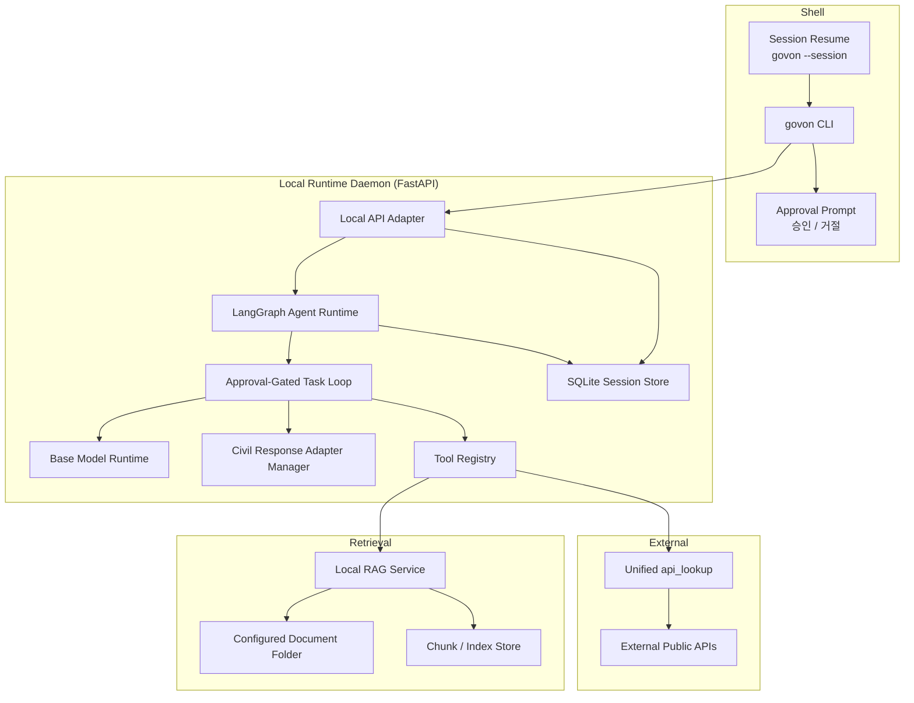

# GovOn Shell MVP Architecture

**Status**: Accepted Target  
**Last Updated**: 2026-04-03  
**Scope**: First public MVP for `govon`

---

## 1. Overview

GovOn MVP is a **shell-first administrative assistant**.

The user does not open a web UI or call a public API directly. The user runs `govon`, talks to the assistant in natural language, and a LangGraph-based agent runtime decides whether it needs retrieval, external APIs, or the civil-response adapter to complete the requested work.

The product is composed of two local processes:

1. **`govon` CLI Shell**
2. **Local FastAPI Runtime Daemon**

The CLI is the user surface. The daemon is the execution engine.

---

## 2. Product Boundary

### Included in MVP

- Natural-language interactive CLI shell
- Local daemon auto-start and reconnect
- LangGraph state graph runtime for planner, approval, execution, synthesis
- LLM-based tool selection via LLMPlannerAdapter (vLLM OpenAI-compatible endpoint)
- Task-scoped approval gate before tool execution
- Local RAG search against a configured folder
- External API lookup through a unified tool surface
- Civil complaint response drafting
- Civil-response LoRA adapter attach on approved drafting tasks
- SQLite-backed session persistence
- Session resume with `govon --session <id>`
- Evidence augmentation after the draft is already produced

### Excluded from MVP

- Public document drafting
- Complaint classification as a first-class feature
- Web UI as a product surface
- Regex/pattern-based business tool routing as the canonical planner
- Separate `/sources` workflow as a primary interaction
- Persistent storage of full draft history
- Distributed graph checkpoint engine as a product feature

---

## 3. Operating Principles

### 3.1 Shell First

The primary entry point is:

```bash
govon
```

All business requests are submitted in natural language through the shell.

### 3.2 Natural Language First

The user does not need to learn workflow commands for business tasks.

Examples:

- "이 민원에 대한 답변 초안 작성해줘"
- "좀 더 정중하게 다시 써줘"
- "근거를 덧붙여줘"
- "통계도 같이 확인해줘"

Slash commands are kept only for shell control:

- `/help`
- `/clear`
- `/exit`

### 3.3 Approval Before Execution

The assistant may not silently execute tools.

Before one task loop starts, it must explain:

- what it wants to do
- why it needs to do it
- what kind of result it expects to obtain

Then it must wait for a simple two-option approval UI:

- `승인`
- `거절`

### 3.4 Model-Driven Tool Choice

Business tool routing is not defined by regex pattern matching.

- shell control commands stay rule-based
- business requests are planned by the LLM inside LangGraph
- the planner reads session context and tool metadata
- the executor can only run the validated approved plan

### 3.5 One Approval Per Task Loop

If a single user request requires multiple tools, the runtime groups them into one task plan and asks for approval once before execution.

Examples:

- retrieve similar cases
- retrieve policy statistics
- search local documents
- attach civil-response adapter and draft a reply

These may be one approved task loop if they belong to one user intent.

### 3.6 Rejection Means Idle

If the user rejects the proposed task:

- the task is interrupted
- no fallback tool is executed automatically
- the assistant returns to a fully idle waiting state

The next move must come from the user.

### 3.7 Evidence Is a Follow-up Capability

The assistant may use retrieval during draft generation, but it does not have to expose evidence immediately.

When the user later asks:

- "근거를 보여줘"
- "왜 이렇게 답했어?"
- "출처를 붙여줘"

the system runs a new approved task that augments the existing answer with an evidence section.

---

## 4. High-Level Topology



---

## 5. Runtime Components

### 5.1 CLI Shell

The shell is responsible for:

- interactive prompt rendering
- connection to the local runtime daemon
- approval prompt rendering
- lightweight progress/status display
- natural-language conversation input
- session selection and resume

The shell is not responsible for:

- model inference
- tool orchestration
- retrieval logic
- session database writes

### 5.2 Local Runtime Daemon

The daemon is a local FastAPI service bound to localhost only.

Responsibilities:

- accept requests from the shell
- host the LangGraph runtime
- own model lifecycle
- own tool registry
- own retrieval/index services
- persist session state in SQLite
- survive shell exit for fast reconnection

The daemon is the single source of truth for runtime state.

### 5.3 LangGraph Agent Runtime

The orchestrator is implemented with LangGraph `StateGraph` and performs one task loop per user request.

Each loop has these phases:

1. read session context
2. planner LLM infers current user intent
3. produce one structured task plan
4. validate plan against registered tools and MVP rules
5. produce a human-readable approval request
6. wait for user approval or rejection
7. execute the approved tools
8. synthesize output
9. persist transcript and tool trace

The graph is deliberately bounded. Approval, interruption, and controlled execution are more important than maximum autonomy.

### 5.4 Base Model Runtime

The base model is responsible for:

- understanding user intent
- shaping the structured task plan
- deciding whether retrieval or external lookup is needed
- drafting responses when no task-specific adapter is needed
- revising existing outputs

The base model is not the public product surface. It is an internal reasoning component.

### 5.5 Civil Response Adapter Manager

The civil-response LoRA adapter is attached only when the user intent reaches an actual drafting step.

Examples:

- "답변 초안 작성해줘"
- "이 답변을 더 공손하게 고쳐줘"

The adapter itself is treated as an approval target because the runtime is changing capability mode for the task.

### 5.6 Tool Registry

The runtime exposes tools through a controlled registry.

MVP registry:

- `api_lookup`
- `rag_search`
- `draft_civil_response`
- `append_evidence`

Each tool carries metadata for:

- planner selection
- approval summary generation
- executor binding
- session logging

The user does not call these names directly in normal operation. They exist as internal capabilities chosen by the orchestrator.

---

## 6. Tool Model

### 6.1 `api_lookup`

`api_lookup` is a unified external capability rather than many unrelated surface tools.

Its internal capabilities may include:

- similar-case lookup
- issue/trend lookup
- statistics lookup
- analysis-report lookup

This keeps the user surface simple and the orchestration layer stable.

### 6.2 `rag_search`

`rag_search` searches local documents from a configured folder.

Document types validated in MVP:

- `pdf`
- `hwp`
- `docx`
- `txt`
- `html`

MVP provenance output from RAG:

- file path
- page number

Line-level provenance is deferred.

### 6.3 `draft_civil_response`

This capability uses:

- session context
- current user request
- retrieved references when available
- the civil-response adapter when approved

The output format is:

1. evidence summary
2. final draft

### 6.4 `append_evidence`

This capability is used only after a draft already exists.

It uses:

- the original user question
- the generated answer
- RAG and/or API evidence

It appends a new section below the existing answer rather than regenerating the whole response.

---

## 7. Approval Contract

The approval request is written in plain language.

It should not say:

- "rag_search 호출"
- "api_lookup.minSimilarInfo5 실행"

It should say something like:

```text
이 요청에 더 정확하게 답변하려면 먼저 비슷한 민원 사례와 참고 자료를 확인하는 작업이 필요합니다.
이 작업을 진행하면 답변 초안의 정확도를 높일 수 있습니다.

[ 승인 ]
[ 거절 ]
```

### Approval Scope

- one approval per task loop
- multiple tools may execute inside the approved loop
- adapter activation may be part of the same approval if drafting is included

### Rejection Behavior

- stop the proposed task
- print nothing else for the business workflow
- wait for the next user message

---

## 8. Session Model

Sessions are persisted in SQLite.

Stored entities:

- session metadata
- user/assistant message transcript
- tool execution log

Not stored in MVP:

- full draft version history as a primary product feature
- distributed or user-visible graph checkpoint snapshots
- long-lived evidence cache as user-visible history

### Resume Behavior

- `Ctrl+C` or normal shell exit prints the current `session_id`
- the user can later run:

```bash
govon --session <id>
```

and continue from the same conversation and tool history.

---

## 9. Storage and Retrieval Layout

### 9.1 SQLite

SQLite is the default persistence backend for MVP because it is:

- local
- simple to back up
- fast enough for a single-user or light multi-session daemon
- easy to inspect during development

Suggested stored tables:

- `sessions`
- `messages`
- `tool_runs`

### 9.2 RAG Document Folder

The daemon reads documents from a configured folder path.

Recommended default:

- `~/.govon/rag-docs`

Override should be possible through runtime configuration.

### 9.3 Index Build Strategy

For MVP:

- index build happens locally
- sample documents are enough for development validation
- production-grade corpus management is deferred

The core requirement is not corpus scale, but whether the system can correctly ingest, chunk, retrieve, and cite mixed-format documents.

---

## 10. Request Flows

### 10.1 Draft Generation

```text
User request
-> planner node
-> plan validation
-> approval prompt
-> approved retrieval/api work
-> optional adapter attach
-> evidence summary
-> final draft
-> persist transcript/tool log
```

### 10.2 Revision

```text
User asks for rewrite
-> planner node for revision
-> approval prompt
-> optional re-search
-> revised evidence summary
-> revised final draft
-> persist
```

### 10.3 Evidence Augmentation

```text
User asks for evidence
-> planner node for evidence augmentation
-> approval prompt
-> run rag/api lookup against original question + generated answer
-> append "근거/출처" section under existing answer
-> persist
```

---

## 11. User-Facing Behavior

### MVP Shell Output

The shell should show simple runtime states only.

Examples:

- `작업 계획 생성 중`
- `승인 대기 중`
- `자료 검색 중`
- `답변 작성 중`
- `완료`

It should not expose verbose internal traces by default.

### Commands

MVP control commands:

- `/help`
- `/clear`
- `/exit`

Business actions remain natural-language only.

---

## 12. MVP Boundaries and Deferred Scope

### Deferred After MVP

- public document drafting
- complaint classification workflow
- explicit web UI product surface
- line-level provenance
- distributed checkpoint/recovery engine
- broad multi-adapter hosting beyond civil-response drafting

### Why These Are Deferred

MVP should validate the smallest end-to-end loop that proves product value:

- shell interaction
- approval-gated execution
- retrieval-backed civil response drafting
- evidence augmentation
- session resume

Everything else increases scope without improving that core proof.
