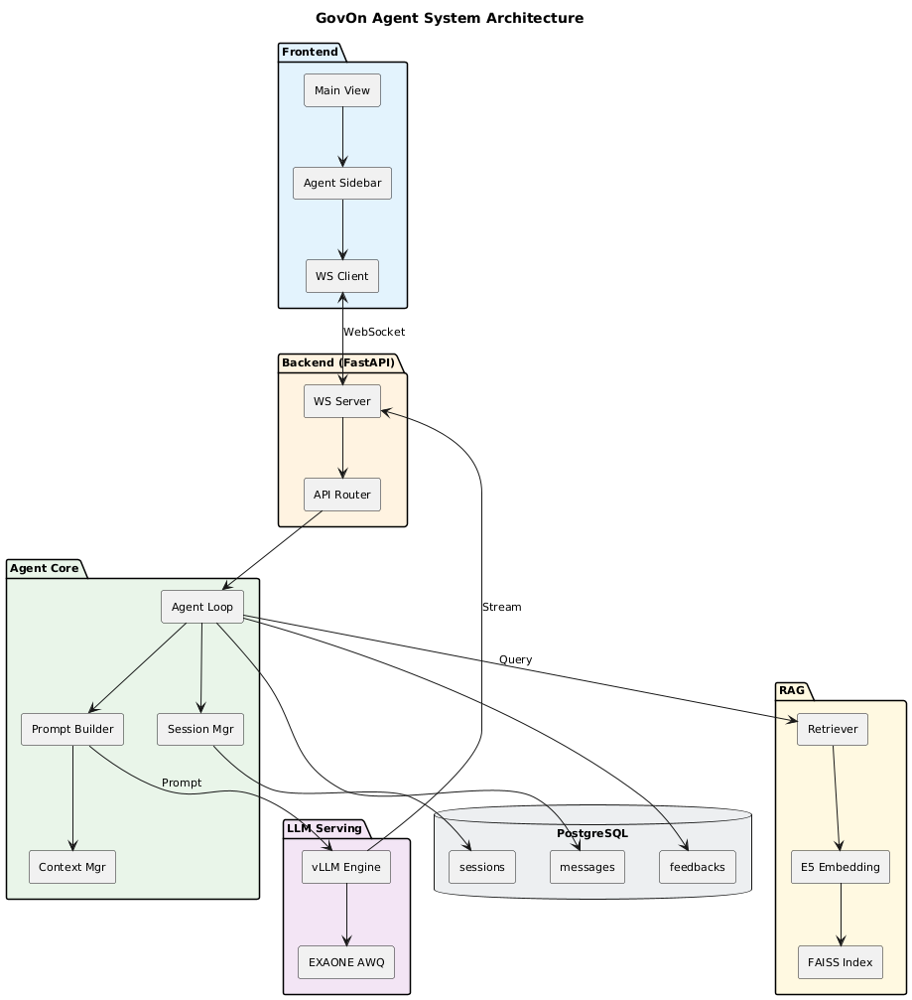
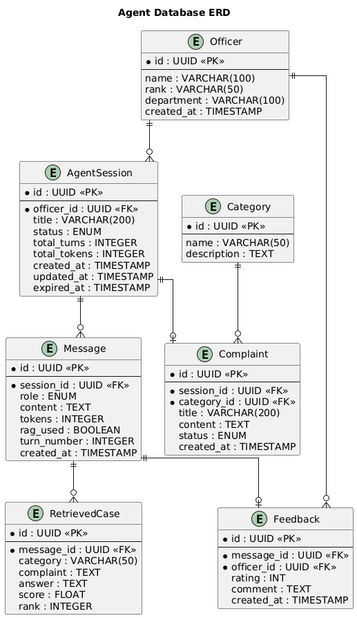
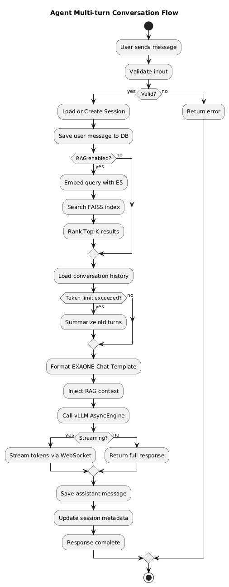
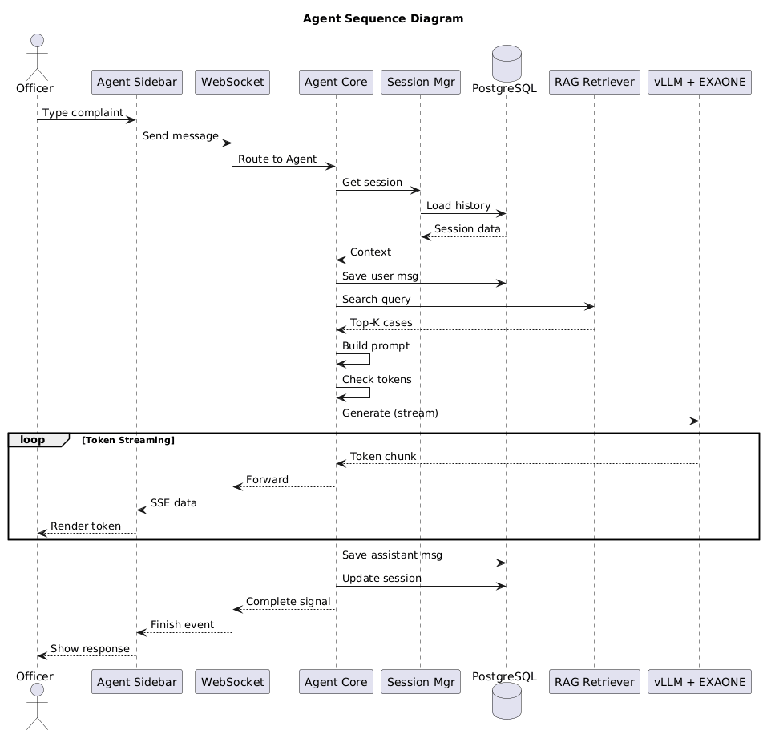
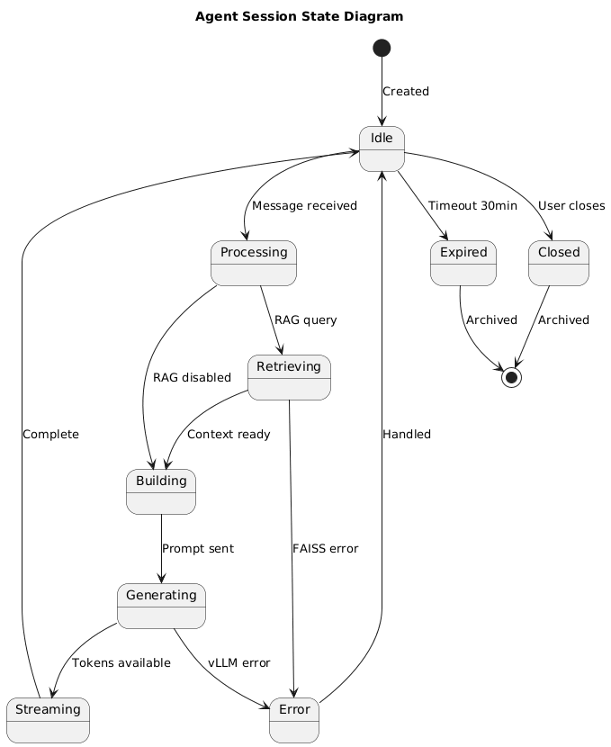

# ADR: Agent 시스템 아키텍처 설계

> Superseded by `docs/architecture/ADR-006-agentic-architecture.md`

**문서 ID**: ADR-003
**작성일**: 2026-03-21
**상태**: Proposed
**관련 이슈**: [#128 (GOV-96)](https://github.com/GovOn-Org/GovOn/issues/128)
**마일스톤**: M3 고도화 및 최적화

---

## 목차

1. [개요](#1-개요)
2. [Agent 시스템 정의](#2-agent-시스템-정의)
3. [시스템 아키텍처](#3-시스템-아키텍처)
4. [핵심 컴포넌트 상세 설계](#4-핵심-컴포넌트-상세-설계)
5. [데이터베이스 스키마](#5-데이터베이스-스키마)
6. [API 명세서](#6-api-명세서)
7. [시스템 흐름도](#7-시스템-흐름도)
8. [아키텍처 결정 사항](#8-아키텍처-결정-사항)
9. [비기능 요구사항](#9-비기능-요구사항)

---

## 1. 개요

### 1.1 목적

본 문서는 GovOn 프로젝트의 **멀티턴 대화형 Agent 시스템**의 기술 아키텍처를 정의한다. 공무원이 에이전트 사이드바에서 AI와 자연어로 대화하며 민원 분류, 유사 사례 검색, 답변 초안 생성을 처리하는 시스템의 전체 설계를 다룬다.

### 1.2 배경

현재 GovOn 시스템은 단일 요청-응답(Single-turn) 구조의 REST API로 동작한다. 이슈 #128에 따라, 이를 **상태 관리 기반의 멀티턴 대화형 Agent 시스템**으로 확장하여 공무원의 민원 처리 업무 흐름을 대화형 인터페이스로 지원한다.

### 1.3 현재 시스템 현황

| 구성요소 | 현재 상태 | Agent 확장 |
|---------|----------|-----------|
| API 서버 | FastAPI + vLLM (단일 턴) | 멀티턴 대화 루프 + WebSocket |
| 프롬프트 | 정적 EXAONE Chat Template | 동적 멀티턴 프롬프트 빌더 |
| 세션 관리 | 없음 (Stateless) | DB 기반 세션 + 대화 이력 |
| RAG | FAISS 검색 (단일 쿼리) | 대화 문맥 기반 동적 검색 |
| Frontend | 없음 (API 전용) | 에이전트 사이드바 UI |

---

## 2. Agent 시스템 정의

### 2.1 Agent란?

GovOn Agent는 다음과 같이 정의된다:

> **사용자(공무원)의 입력을 받아, LLM에 전달할 프롬프트를 동적으로 구성하고, LLM의 응답을 받아 사용자에게 반환하는 상태 관리 기반의 대화형 루프**

```
┌─────────────────────────────────────────────────────┐
│                    Agent Loop                        │
│                                                      │
│   User Input ──→ Session Load ──→ RAG Search         │
│                                      │               │
│                                      ▼               │
│   Response   ←── LLM Generate ←── Prompt Build      │
│      │                                               │
│      ▼                                               │
│   Save to DB ──→ Wait for next input                 │
│                                                      │
└─────────────────────────────────────────────────────┘
```

### 2.2 Agent의 핵심 역할

| 역할 | 설명 |
|------|------|
| **민원 분류** | 민원 본문을 입력받아 카테고리를 자동 분류 (동음이의어 처리 포함) |
| **유사 사례 검색** | FAISS 벡터 검색으로 유사 민원 Top-K건 검색 및 제시 |
| **답변 초안 생성** | RAG 컨텍스트 기반 표준 답변 초안 생성 |
| **대화형 수정** | 멀티턴 대화를 통한 답변 수정 및 정제 |
| **감사 로그** | 모든 대화 이력을 DB에 저장 (추적성 확보) |

### 2.3 Agent vs 기존 API 비교

| 특성 | 기존 API (`/v1/generate`) | Agent 시스템 |
|------|--------------------------|-------------|
| 대화 방식 | Single-turn | Multi-turn |
| 상태 관리 | Stateless | Session 기반 Stateful |
| 프롬프트 | 사용자가 직접 구성 | Agent가 동적 구성 |
| 컨텍스트 | 매 요청 독립 | 이전 턴 문맥 유지 |
| RAG 통합 | 수동 옵션 | 자동 판단 및 주입 |
| 응답 방식 | REST (JSON) | WebSocket (실시간 스트리밍) |

---

## 3. 시스템 아키텍처

### 3.1 전체 아키텍처 구성도



### 3.2 레이어 구조

```
┌─────────────────────────────────────────────────┐
│           Presentation Layer (Frontend)          │
│   React/Next.js │ Agent Sidebar │ WebSocket      │
├─────────────────────────────────────────────────┤
│            Communication Layer                   │
│   WebSocket Server │ SSE │ REST API              │
├─────────────────────────────────────────────────┤
│             Agent Core Layer                     │
│   Agent Loop │ Prompt Builder │ Session Mgr      │
│   Context Window Mgr │ Token Counter             │
├──────────────────┬──────────────────────────────┤
│  LLM Serving     │       RAG Pipeline            │
│  vLLM + EXAONE   │  FAISS + E5 Embedding         │
├──────────────────┴──────────────────────────────┤
│             Data Layer (PostgreSQL)              │
│   Sessions │ Messages │ Feedbacks │ Complaints   │
├─────────────────────────────────────────────────┤
│           Infrastructure Layer                   │
│   Docker Compose │ Nginx │ GPU Runtime            │
└─────────────────────────────────────────────────┘
```

### 3.3 컴포넌트 간 통신

| 경로 | 프로토콜 | 설명 |
|------|---------|------|
| Frontend ↔ Backend | WebSocket | 실시간 양방향 대화 메시지 |
| Frontend → Backend | HTTP REST | 세션 관리, 이력 조회 |
| Agent Core → vLLM | Python async | AsyncLLMEngine 내부 호출 |
| Agent Core → FAISS | Python sync | 벡터 검색 (< 50ms) |
| Agent Core → DB | SQLAlchemy async | 세션/메시지 CRUD |

---

## 4. 핵심 컴포넌트 상세 설계

### 4.1 Agent Loop Controller

Agent의 핵심 제어 루프로, 사용자 메시지 수신부터 응답 반환까지의 전체 파이프라인을 관장한다.

```python
class AgentLoopController:
    """Agent 대화 루프의 핵심 컨트롤러"""

    async def process_message(
        self,
        session_id: UUID,
        user_message: str,
        use_rag: bool = True,
        stream: bool = True
    ) -> AsyncGenerator[str, None]:
        # 1. 세션 로드 및 대화 이력 가져오기
        session = await self.session_mgr.get_or_create(session_id)
        history = await self.session_mgr.get_history(session_id)

        # 2. 사용자 메시지 저장
        await self.save_message(session_id, "user", user_message)

        # 3. RAG 검색 (활성화 시)
        retrieved_cases = []
        if use_rag:
            retrieved_cases = await self.retriever.search(user_message)

        # 4. 멀티턴 프롬프트 빌드
        prompt = self.prompt_builder.build(
            history=history,
            user_message=user_message,
            retrieved_cases=retrieved_cases
        )

        # 5. vLLM 생성 (스트리밍)
        async for token in self.generate_stream(prompt):
            yield token

        # 6. 어시스턴트 응답 저장
        await self.save_message(session_id, "assistant", full_response)
        await self.session_mgr.update_metadata(session_id)
```

### 4.2 Multi-turn Prompt Builder

이전 대화 턴들을 EXAONE Chat Template 형식으로 조합하여 LLM에 전달할 프롬프트를 동적으로 구성한다.

**EXAONE Chat Template 형식**:
```
[|system|]당신은 공공기관 민원 처리를 돕는 AI 어시스턴트입니다.[|endofturn|]
[|user|]민원 내용: OO동 도로가 파손되었습니다.[|endofturn|]
[|assistant|]해당 민원은 [도로/교통] 카테고리로 분류됩니다...[|endofturn|]
[|user|]답변 초안을 생성해줘[|endofturn|]
[|assistant|]
```

**프롬프트 빌드 과정**:

```python
class MultiTurnPromptBuilder:
    SYSTEM_PROMPT = (
        "당신은 공공기관 민원 처리를 돕는 AI 어시스턴트입니다. "
        "민원을 분류하고, 유사 사례를 참고하여 표준 답변 초안을 작성합니다."
    )
    MAX_CONTEXT_TOKENS = 6144  # 8192 - 2048(생성 여유)

    def build(self, history, user_message, retrieved_cases=None):
        # 1. 시스템 프롬프트
        prompt = f"[|system|]{self.SYSTEM_PROMPT}[|endofturn|]\n"

        # 2. RAG 컨텍스트 주입 (첫 번째 사용자 메시지 앞에)
        if retrieved_cases:
            prompt += self._format_rag_context(retrieved_cases)

        # 3. 이전 대화 이력 추가 (컨텍스트 윈도우 내)
        trimmed = self.context_mgr.trim_history(history)
        for msg in trimmed:
            role = msg.role  # "user" or "assistant"
            prompt += f"[|{role}|]{msg.content}[|endofturn|]\n"

        # 4. 현재 사용자 메시지
        prompt += f"[|user|]{user_message}[|endofturn|]\n"

        # 5. 어시스턴트 응답 시작 토큰
        prompt += "[|assistant|]"

        return prompt
```

### 4.3 Session Manager

대화 세션의 생명주기를 관리하며, 모든 대화 이력을 PostgreSQL에 영속화한다.

**세션 생명주기**:

| 상태 | 설명 | 전이 조건 |
|------|------|----------|
| `active` | 대화 진행 중 | 세션 생성 시 |
| `idle` | 대기 중 | 마지막 메시지 후 |
| `expired` | 만료됨 | 30분 비활성 |
| `closed` | 사용자 종료 | 사용자 명시적 종료 |
| `archived` | 아카이브 | expired/closed 후 |

**핵심 메서드**:

```python
class SessionManager:
    async def get_or_create(self, session_id: UUID) -> AgentSession
    async def get_history(self, session_id: UUID, limit: int = 50) -> List[Message]
    async def update_metadata(self, session_id: UUID) -> None
    async def close_session(self, session_id: UUID) -> None
    async def cleanup_expired(self) -> int  # 만료 세션 정리
```

### 4.4 Context Window Manager

EXAONE 모델의 8,192 토큰 컨텍스트 윈도우를 효율적으로 관리한다. 토큰 초과 시 오래된 턴을 요약하거나 제거한다.

**토큰 할당 전략**:

```
총 컨텍스트 윈도우: 8,192 토큰
├── 시스템 프롬프트:    ~200 토큰 (고정)
├── RAG 컨텍스트:      ~1,500 토큰 (Top-3 사례)
├── 대화 이력:         ~4,500 토큰 (가변, 최신 우선)
└── 생성 여유:         ~2,000 토큰 (max_tokens)
```

**컨텍스트 관리 전략**:

| 전략 | 조건 | 동작 |
|------|------|------|
| **최신 우선 유지** | 토큰 < 6,144 | 전체 이력 유지 |
| **오래된 턴 제거** | 토큰 > 6,144 | 가장 오래된 턴부터 제거 |
| **요약 압축** | 턴 > 10개 | 초기 턴들을 1~2문장으로 요약 |
| **강제 절단** | 요약 후에도 초과 | 시스템 프롬프트 + 최근 3턴만 유지 |

```python
class ContextWindowManager:
    MAX_CONTEXT = 6144
    SUMMARY_THRESHOLD = 10  # 10턴 이상 시 요약 시작

    def trim_history(self, history: List[Message]) -> List[Message]:
        total_tokens = sum(m.tokens for m in history)

        if total_tokens <= self.MAX_CONTEXT:
            return history

        # 전략 1: 오래된 턴 제거
        while total_tokens > self.MAX_CONTEXT and len(history) > 2:
            removed = history.pop(0)
            total_tokens -= removed.tokens

        return history

    def count_tokens(self, text: str) -> int:
        """EXAONE 토크나이저 기반 토큰 수 계산"""
        return len(self.tokenizer.encode(text))
```

### 4.5 Streaming Generator

vLLM AsyncEngine의 토큰 스트리밍을 WebSocket으로 전달한다.

```python
class StreamingGenerator:
    async def stream_tokens(
        self,
        prompt: str,
        sampling_params: SamplingParams,
        websocket: WebSocket,
        session_id: UUID
    ):
        request_id = str(uuid.uuid4())
        results = self.engine.generate(prompt, sampling_params, request_id)
        full_text = ""

        async for output in results:
            token = output.outputs[0].text[len(full_text):]
            full_text = output.outputs[0].text

            await websocket.send_json({
                "type": "token",
                "session_id": str(session_id),
                "token": token,
                "finished": output.finished
            })

        return full_text
```

---

## 5. 데이터베이스 스키마

### 5.1 ERD



### 5.2 테이블 정의

#### `officer` — 공무원 정보

| 컬럼 | 타입 | 제약조건 | 설명 |
|------|------|---------|------|
| id | UUID | PK | 고유 식별자 |
| name | VARCHAR(100) | NOT NULL | 이름 |
| rank | VARCHAR(50) | | 직급 (6급, 7급 등) |
| department | VARCHAR(100) | | 소속 부서 |
| created_at | TIMESTAMP | DEFAULT NOW() | 생성일시 |

#### `agent_session` — 대화 세션

| 컬럼 | 타입 | 제약조건 | 설명 |
|------|------|---------|------|
| id | UUID | PK | 세션 고유 ID |
| officer_id | UUID | FK → officer.id | 공무원 참조 |
| title | VARCHAR(200) | | 세션 제목 (자동 생성) |
| status | ENUM | NOT NULL | active/idle/expired/closed/archived |
| total_turns | INTEGER | DEFAULT 0 | 총 대화 턴 수 |
| total_tokens | INTEGER | DEFAULT 0 | 총 사용 토큰 수 |
| created_at | TIMESTAMP | DEFAULT NOW() | 생성일시 |
| updated_at | TIMESTAMP | ON UPDATE | 마지막 수정일시 |
| expired_at | TIMESTAMP | NULLABLE | 만료 예정 시각 |

#### `message` — 메시지 이력

| 컬럼 | 타입 | 제약조건 | 설명 |
|------|------|---------|------|
| id | UUID | PK | 메시지 고유 ID |
| session_id | UUID | FK → agent_session.id | 세션 참조 |
| role | ENUM | NOT NULL | user / assistant / system |
| content | TEXT | NOT NULL | 메시지 본문 |
| tokens | INTEGER | | 토큰 수 |
| rag_used | BOOLEAN | DEFAULT FALSE | RAG 사용 여부 |
| turn_number | INTEGER | | 턴 번호 |
| created_at | TIMESTAMP | DEFAULT NOW() | 생성일시 |

#### `retrieved_case` — RAG 검색 결과

| 컬럼 | 타입 | 제약조건 | 설명 |
|------|------|---------|------|
| id | UUID | PK | 고유 ID |
| message_id | UUID | FK → message.id | 메시지 참조 |
| category | VARCHAR(50) | | 민원 카테고리 |
| complaint | TEXT | | 민원 원문 |
| answer | TEXT | | 답변 원문 |
| score | FLOAT | | 유사도 점수 |
| rank | INTEGER | | 순위 |

#### `feedback` — 답변 품질 피드백

| 컬럼 | 타입 | 제약조건 | 설명 |
|------|------|---------|------|
| id | UUID | PK | 고유 ID |
| message_id | UUID | FK → message.id | 대상 메시지 |
| officer_id | UUID | FK → officer.id | 평가자 |
| rating | INTEGER | CHECK(1~5) | 평점 |
| comment | TEXT | | 코멘트 |
| created_at | TIMESTAMP | DEFAULT NOW() | 생성일시 |

#### `complaint` — 민원 데이터

| 컬럼 | 타입 | 제약조건 | 설명 |
|------|------|---------|------|
| id | UUID | PK | 고유 ID |
| session_id | UUID | FK → agent_session.id | 처리 세션 |
| category_id | UUID | FK → category.id | 분류 카테고리 |
| title | VARCHAR(200) | | 민원 제목 |
| content | TEXT | NOT NULL | 민원 본문 |
| status | ENUM | NOT NULL | pending/processing/completed |
| created_at | TIMESTAMP | DEFAULT NOW() | 접수일시 |

#### `category` — 민원 카테고리

| 컬럼 | 타입 | 제약조건 | 설명 |
|------|------|---------|------|
| id | UUID | PK | 고유 ID |
| name | VARCHAR(50) | UNIQUE, NOT NULL | 카테고리명 |
| description | TEXT | | 설명 |

### 5.3 인덱스 전략

```sql
-- 세션 조회 최적화
CREATE INDEX idx_session_officer ON agent_session(officer_id);
CREATE INDEX idx_session_status ON agent_session(status);
CREATE INDEX idx_session_updated ON agent_session(updated_at DESC);

-- 메시지 조회 최적화
CREATE INDEX idx_message_session ON message(session_id, turn_number);
CREATE INDEX idx_message_created ON message(created_at DESC);

-- 피드백 집계 최적화
CREATE INDEX idx_feedback_message ON feedback(message_id);

-- 민원 검색 최적화
CREATE INDEX idx_complaint_category ON complaint(category_id);
CREATE INDEX idx_complaint_status ON complaint(status);
```

---

## 6. API 명세서

### 6.1 API 개요

Agent 시스템은 **REST API** (세션/이력 관리)와 **WebSocket** (실시간 대화)을 병행한다.

| 기본 URL | 설명 |
|---------|------|
| `http://localhost:8000/api/v2` | REST API 베이스 |
| `ws://localhost:8000/ws/agent` | WebSocket 엔드포인트 |

### 6.2 REST API 엔드포인트

#### 세션 관리

| Method | Path | 설명 |
|--------|------|------|
| `POST` | `/api/v2/sessions` | 새 대화 세션 생성 |
| `GET` | `/api/v2/sessions` | 세션 목록 조회 |
| `GET` | `/api/v2/sessions/{id}` | 세션 상세 조회 |
| `DELETE` | `/api/v2/sessions/{id}` | 세션 종료 |
| `GET` | `/api/v2/sessions/{id}/messages` | 대화 이력 조회 |

#### 비스트리밍 생성 (하위 호환)

| Method | Path | 설명 |
|--------|------|------|
| `POST` | `/api/v2/generate` | 단일 턴 생성 (REST) |

#### 피드백

| Method | Path | 설명 |
|--------|------|------|
| `POST` | `/api/v2/messages/{id}/feedback` | 메시지 피드백 제출 |

#### 시스템

| Method | Path | 설명 |
|--------|------|------|
| `GET` | `/health` | 헬스체크 |
| `GET` | `/api/v2/system/status` | 시스템 상태 (GPU, VRAM) |

### 6.3 REST API 상세

#### `POST /api/v2/sessions` — 세션 생성

**Request Body**:
```json
{
  "officer_id": "uuid-string",
  "title": "도로 파손 민원 분석"  // optional, 자동 생성
}
```

**Response** (`201 Created`):
```json
{
  "id": "session-uuid",
  "officer_id": "officer-uuid",
  "title": "도로 파손 민원 분석",
  "status": "active",
  "total_turns": 0,
  "created_at": "2026-03-21T14:30:00Z",
  "websocket_url": "ws://localhost:8000/ws/agent/session-uuid"
}
```

#### `GET /api/v2/sessions/{id}/messages` — 대화 이력 조회

**Query Parameters**:
- `limit` (int, default=50): 최대 조회 수
- `offset` (int, default=0): 페이지네이션 오프셋

**Response** (`200 OK`):
```json
{
  "session_id": "session-uuid",
  "total_count": 6,
  "messages": [
    {
      "id": "msg-uuid-1",
      "role": "user",
      "content": "도로 파손 민원인데 분류해줘",
      "tokens": 15,
      "rag_used": false,
      "turn_number": 1,
      "created_at": "2026-03-21T14:30:05Z"
    },
    {
      "id": "msg-uuid-2",
      "role": "assistant",
      "content": "해당 민원은 [도로/교통] 카테고리로 분류됩니다. 신뢰도 92%입니다.",
      "tokens": 45,
      "rag_used": true,
      "turn_number": 1,
      "retrieved_cases": [
        {
          "category": "도로/교통",
          "complaint": "OO구 도로 파손 보수 요청",
          "answer": "안녕하십니까. 해당 도로 파손 건은...",
          "score": 0.94,
          "rank": 1
        }
      ],
      "created_at": "2026-03-21T14:30:08Z"
    }
  ]
}
```

#### `POST /api/v2/messages/{id}/feedback` — 피드백 제출

**Request Body**:
```json
{
  "officer_id": "officer-uuid",
  "rating": 4,
  "comment": "분류는 정확하지만 답변이 조금 길어요"
}
```

**Response** (`201 Created`):
```json
{
  "id": "feedback-uuid",
  "message_id": "msg-uuid",
  "rating": 4,
  "created_at": "2026-03-21T14:35:00Z"
}
```

### 6.4 WebSocket API

#### 연결: `ws://localhost:8000/ws/agent/{session_id}`

**Client → Server (사용자 메시지)**:
```json
{
  "type": "message",
  "content": "이 민원 답변 초안을 생성해줘",
  "use_rag": true
}
```

**Server → Client (토큰 스트리밍)**:
```json
{
  "type": "token",
  "session_id": "session-uuid",
  "token": "안녕",
  "finished": false
}
```

**Server → Client (생성 완료)**:
```json
{
  "type": "complete",
  "session_id": "session-uuid",
  "message_id": "msg-uuid",
  "full_text": "안녕하십니까. 귀하의 민원에 대해...",
  "tokens": {
    "prompt": 1250,
    "completion": 180
  },
  "retrieved_cases": [
    {
      "category": "도로/교통",
      "complaint": "OO구 도로 파손",
      "answer": "해당 구간 보수 공사...",
      "score": 0.94,
      "rank": 1
    }
  ]
}
```

**Server → Client (오류)**:
```json
{
  "type": "error",
  "code": "TOKEN_LIMIT_EXCEEDED",
  "message": "컨텍스트 윈도우 초과. 새 세션을 시작하세요."
}
```

**WebSocket 이벤트 유형 요약**:

| type | 방향 | 설명 |
|------|------|------|
| `message` | Client → Server | 사용자 메시지 전송 |
| `token` | Server → Client | 토큰 스트리밍 |
| `complete` | Server → Client | 생성 완료 + 메타데이터 |
| `error` | Server → Client | 오류 알림 |
| `session_expired` | Server → Client | 세션 만료 알림 |
| `ping` / `pong` | 양방향 | 연결 유지 |

---

## 7. 시스템 흐름도

### 7.1 멀티턴 대화 흐름



### 7.2 시퀀스 다이어그램

공무원이 Agent 사이드바에서 민원을 분석하는 전체 흐름:



### 7.3 세션 상태 전이



### 7.4 사용자 시나리오 예시

```
[공무원] 도로 파손 민원이 들어왔는데 분류 좀 해줘
  ↓
[Agent] 해당 민원은 [도로/교통] 카테고리로 분류됩니다.
        신뢰도: 92.3%
        유사 사례 3건을 찾았습니다.
        답변 초안을 생성할까요?
  ↓
[공무원] 응 답변 생성해줘
  ↓
[Agent] (스트리밍으로 답변 생성)
        안녕하십니까. 귀하의 민원에 대해 답변드립니다.
        해당 구간의 도로 파손 부분은 관할 부서에서 현장 확인 후
        보수 공사를 진행할 예정입니다...
        [복사하기] 버튼
  ↓
[공무원] 좀 더 공식적인 톤으로 수정해줘
  ↓
[Agent] (이전 답변 컨텍스트를 유지하며 수정본 생성)
        OO구청 도로관리과입니다.
        귀하께서 신고하신 OO동 일대 도로 파손 건에 대하여...
```

---

## 8. 아키텍처 결정 사항

### ADR-003-1: WebSocket + SSE 하이브리드 방식

**결정**: 대화 메시지 교환은 WebSocket, 토큰 스트리밍은 SSE 형식으로 WebSocket 위에 전달

**근거**:
- WebSocket: 양방향 실시간 통신에 적합, 세션 연결 유지
- SSE 형식: `data: {...}\n\n` 포맷으로 토큰 전달, 기존 `/v1/stream` 호환성 유지
- FastAPI의 WebSocket 네이티브 지원 활용

**대안 검토**:
- gRPC 스트리밍: 폐쇄망에서 추가 인프라 부담, 브라우저 직접 연결 불가
- HTTP Long Polling: 레이턴시 증가, 연결 오버헤드

### ADR-003-2: EXAONE Chat Template 직접 구성

**결정**: HuggingFace `apply_chat_template()` 대신 직접 문자열 포맷팅

**근거**:
- EXAONE-Deep-7.8B의 특수 토큰(`[|user|]`, `[|assistant|]`, `[|endofturn|]`) 직접 제어 필요
- RAG 컨텍스트 주입 위치를 정밀하게 제어
- 프롬프트 인젝션 방어를 위한 특수 토큰 이스케이핑 구현 (`_escape_special_tokens()`)
- 현재 `api_server.py`에서 이미 이 패턴을 사용 중

### ADR-003-3: PostgreSQL 기반 세션 저장

**결정**: Redis 대신 PostgreSQL을 세션 저장소로 사용

**근거**:
- 감사 로그 요구사항: 모든 대화 이력은 영속적으로 보관되어야 함
- 폐쇄망 환경에서 추가 인프라(Redis) 최소화
- SQLAlchemy ORM으로 통합 관리 (이슈 요구사항)
- 예상 동시 사용자 수가 소규모 (단일 지자체 기준 수~십 명)

**트레이드오프**:
- Redis 대비 세션 조회 속도 저하 가능 → 인덱스로 보완
- 대규모 확장 시 Redis 캐시 레이어 추가 검토

### ADR-003-4: 토큰 기반 컨텍스트 윈도우 관리

**결정**: 대화 이력의 토큰 수를 실시간 추적하여 6,144 토큰 내로 유지

**근거**:
- EXAONE 최대 컨텍스트: 8,192 토큰
- 생성 여유(max_tokens=2,048)를 확보해야 함
- 단순 턴 수 제한 대비, 토큰 기반 관리가 컨텍스트 활용률 극대화

### ADR-003-5: 기존 API 하위 호환성 유지

**결정**: `/v1/generate`, `/v1/stream` 엔드포인트는 유지하고, Agent API는 `/api/v2/*`로 분리

**근거**:
- 기존 평가/벤치마킹 스크립트가 v1 API에 의존
- 점진적 마이그레이션 지원
- v1: 단일 턴(Stateless), v2: 멀티턴(Stateful) 명확한 분리

---

## 9. 비기능 요구사항

### 9.1 성능 목표

| 지표 | 목표값 | 측정 방법 |
|------|-------|----------|
| 첫 토큰 응답 시간 (TTFT) | < 500ms | WebSocket 메시지 → 첫 토큰 수신 |
| 전체 응답 시간 (p95) | < 3초 | 기존 AC-002 KPI 유지 |
| RAG 검색 시간 (p95) | < 50ms | FAISS 검색 레이턴시 |
| WebSocket 연결 수립 | < 100ms | 핸드셰이크 완료 시간 |
| 동시 세션 수 | ≥ 10 | 단일 서버 기준 |

### 9.2 보안

| 항목 | 요구사항 |
|------|---------|
| 프롬프트 인젝션 방어 | EXAONE 특수 토큰 이스케이핑 (기존 `_escape_special_tokens()` 확장) |
| 세션 격리 | 세션 간 대화 이력 교차 접근 차단 |
| 감사 추적 | 모든 대화 이력 DB 영속 저장 (삭제 불가) |
| PII 보호 | 민원 데이터 내 개인정보 마스킹 유지 |
| 폐쇄망 준수 | 외부 API 호출 100% 차단, 온프레미스 완전 독립 |

### 9.3 가용성

| 항목 | 요구사항 |
|------|---------|
| Uptime | ≥ 99.5% (주간 업무시간 기준) |
| 세션 복구 | 서버 재시작 시 DB 기반 세션 복원 |
| 장애 대응 | WebSocket 끊김 시 자동 재연결 (클라이언트) |
| 모니터링 | `/health` 엔드포인트 + GPU/VRAM 상태 API |

---

## 부록

### A. 기술 스택 요약

| 영역 | 기술 | 용도 |
|------|------|------|
| Backend | FastAPI 0.100+ | REST API + WebSocket 서버 |
| LLM Serving | vLLM (AsyncLLMEngine) | EXAONE 추론 엔진 |
| LLM Model | EXAONE-Deep-7.8B AWQ INT4 | 한국어 민원 처리 LLM |
| Embedding | multilingual-e5-large | 1024차원 한국어 벡터 임베딩 |
| Vector DB | FAISS (IndexFlatIP) | 유사 사례 검색 |
| Database | PostgreSQL + SQLAlchemy | 세션/메시지/피드백 저장 |
| Frontend | React / Next.js | 에이전트 사이드바 UI |
| Container | Docker Compose | 폐쇄망 배포 |

### B. 파일 구조 (예상)

```
src/
├── inference/
│   ├── api_server.py          # 기존 v1 API (유지)
│   ├── schemas.py             # 기존 스키마 (유지)
│   ├── retriever.py           # RAG Retriever (유지)
│   └── vllm_stabilizer.py     # EXAONE 패치 (유지)
├── agent/                     # [신규] Agent 시스템
│   ├── __init__.py
│   ├── agent_loop.py          # Agent Loop Controller
│   ├── prompt_builder.py      # Multi-turn Prompt Builder
│   ├── session_manager.py     # Session Manager
│   ├── context_manager.py     # Context Window Manager
│   ├── streaming.py           # Streaming Generator
│   ├── websocket_handler.py   # WebSocket 핸들러
│   ├── api_v2.py              # v2 REST API Router
│   ├── schemas.py             # v2 Pydantic 스키마
│   └── models.py              # SQLAlchemy ORM 모델
└── database/                  # [신규] DB 설정
    ├── __init__.py
    ├── connection.py           # DB 연결 관리
    └── migrations/             # Alembic 마이그레이션
```

### C. 다이어그램 목록

| 파일 | 설명 |
|------|------|
| `diagrams/01_system_architecture.png` | 전체 시스템 아키텍처 구성도 |
| `diagrams/02_conversation_flow.png` | 멀티턴 대화 처리 흐름도 |
| `diagrams/03_sequence_diagram.png` | 컴포넌트 간 시퀀스 다이어그램 |
| `diagrams/04_session_state.png` | 세션 상태 전이 다이어그램 |
| `diagrams/05_database_erd.png` | 데이터베이스 ERD |
