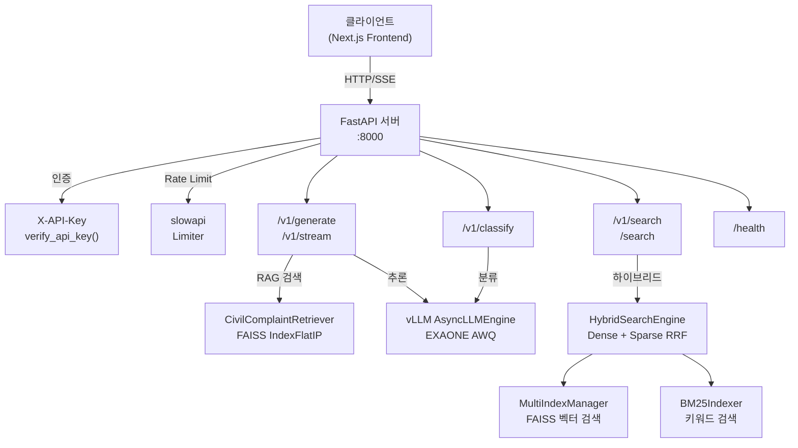

# API 명세

GovOn 추론 서버의 REST API 레퍼런스입니다. 모든 엔드포인트는 FastAPI 기반으로 구현되어 있으며, `src/inference/api_server.py`에 정의되어 있습니다.

---

## 아키텍처 개요



---

## 인증

API Key가 설정된 환경에서는 모든 요청에 `X-API-Key` 헤더가 필요합니다.

```http
X-API-Key: <your-api-key>
```

`API_KEY` 환경변수가 미설정된 경우 인증을 건너뜁니다(개발 환경 호환).

!!! warning "프로덕션 환경"
    프로덕션 배포 시 반드시 `API_KEY` 환경변수를 설정하세요. 미설정 시 모든 요청이 인증 없이 처리됩니다.

---

## 공통 사항

**Base URL**: `http://<host>:8000`

**Content-Type**: `application/json`

**Rate Limiting**: slowapi 기반. 제한 초과 시 `429 Too Many Requests` 반환.

**오류 응답**: 내부 시스템 정보를 노출하지 않습니다. 모든 오류는 일반화된 메시지로 반환됩니다(C-3 보안 정책).

---

## 엔드포인트 목록

| 메서드 | 경로 | 설명 | Rate Limit |
|--------|------|------|------------|
| `GET` | `/health` | 헬스 체크 | 없음 |
| `POST` | `/v1/classify` | 민원 분류 | 60회/분 |
| `POST` | `/v1/generate` | 답변 생성 (RAG) | 30회/분 |
| `POST` | `/v1/stream` | SSE 스트리밍 답변 생성 | 30회/분 |
| `POST` | `/v1/search`, `/search` | 하이브리드 검색 | 60회/분 |

---

## GET /health

서버 상태를 확인합니다. 인증 없이 접근 가능합니다.

### 응답 예시

```json
{
  "status": "healthy",
  "rag_enabled": true,
  "agents_loaded": ["classifier", "generator"],
  "indexes": {
    "case": { "loaded": true, "doc_count": 10148 },
    "law": { "loaded": true, "doc_count": 523 },
    "manual": { "loaded": false, "doc_count": 0 },
    "notice": { "loaded": false, "doc_count": 0 }
  },
  "bm25_indexes": {
    "case": { "loaded": true, "doc_count": 10148 },
    "law": { "loaded": false },
    "manual": { "loaded": false },
    "notice": { "loaded": false }
  },
  "hybrid_search_enabled": true,
  "pii_masking_enabled": true,
  "feature_flags": {
    "use_rag_pipeline": true,
    "model_version": "v2"
  }
}
```

!!! note "정보 노출 최소화 (H-1)"
    `/health` 응답은 운영에 필요한 최소한의 정보만 포함합니다. 인덱스별 `loaded` 상태와 `doc_count`만 노출하며, 내부 경로나 모델 상세 정보는 포함하지 않습니다.

---

## POST /v1/classify

민원 텍스트를 카테고리로 분류합니다. classifier 에이전트 페르소나가 분류 근거와 함께 결과를 반환합니다.

### 요청

```json
{
  "prompt": "우리 동네 놀이터 바닥이 깨져서 아이들이 다칠 위험이 있습니다. 빨리 수리해주세요."
}
```

| 필드 | 타입 | 필수 | 설명 |
|------|------|------|------|
| `prompt` | `string` | 필수 | 분류할 민원 텍스트 (1~10,000자) |

### 응답

```json
{
  "request_id": "550e8400-e29b-41d4-a716-446655440000",
  "classification": {
    "category": "facilities",
    "confidence": 0.92,
    "reason": "놀이터 시설물 파손 및 안전 문제에 대한 수리 요청으로, 시설물 관련 민원에 해당합니다."
  },
  "classification_error": null,
  "prompt_tokens": 156,
  "completion_tokens": 78
}
```

| 필드 | 타입 | 설명 |
|------|------|------|
| `request_id` | `string` | 요청 고유 식별자 (UUID) |
| `classification` | `object | null` | 분류 결과. LLM 응답 파싱 실패 시 `null` |
| `classification.category` | `string` | 분류 카테고리 (아래 표 참조) |
| `classification.confidence` | `float` | 분류 신뢰도 (0.0~1.0) |
| `classification.reason` | `string` | 분류 근거 설명 |
| `classification_error` | `string | null` | 분류 실패 시 오류 메시지 |
| `prompt_tokens` | `int` | 입력 토큰 수 |
| `completion_tokens` | `int` | 생성 토큰 수 |

### 카테고리 목록

| 카테고리 | 설명 |
|----------|------|
| `environment` | 환경 관련 민원 (소음, 악취, 폐기물 등) |
| `traffic` | 교통 관련 민원 (도로, 주차, 신호등 등) |
| `facilities` | 시설물 관련 민원 (놀이터, 공원, 건물 등) |
| `civil_service` | 행정 서비스 관련 민원 (주민등록, 인허가 등) |
| `welfare` | 복지 관련 민원 (의료, 돌봄, 지원금 등) |
| `other` | 기타 민원 |

---

## POST /v1/generate

RAG 기반 민원 답변을 생성합니다. 유사 민원 사례를 검색한 후, 검색 결과를 컨텍스트로 포함하여 EXAONE 모델이 답변을 생성합니다.

### 요청

```json
{
  "prompt": "주민등록증 재발급 절차가 어떻게 되나요?",
  "max_tokens": 512,
  "temperature": 0.7,
  "top_p": 0.9,
  "stream": false,
  "use_rag": true
}
```

| 필드 | 타입 | 기본값 | 설명 |
|------|------|--------|------|
| `prompt` | `string` | (필수) | 민원 텍스트 (1~10,000자) |
| `max_tokens` | `int` | `512` | 최대 생성 토큰 수 (1~4,096) |
| `temperature` | `float` | `0.7` | 샘플링 온도 (0.0~2.0) |
| `top_p` | `float` | `0.9` | Top-p 샘플링 (0.0~1.0) |
| `stream` | `bool` | `false` | `true` 설정 시 `/v1/stream` 사용 안내 반환 |
| `stop` | `string[]` | `null` | 생성 중단 시퀀스 목록 |
| `use_rag` | `bool` | `true` | RAG 검색 활성화 여부 |

### 응답

```json
{
  "request_id": "550e8400-e29b-41d4-a716-446655440001",
  "text": "주민등록증 재발급 절차를 안내드립니다.\n\n1. 주소지 관할 주민센터를 방문합니다.\n2. 주민등록증 발급 신청서를 작성합니다.\n3. 본인 확인 후 사진 촬영을 합니다.\n4. 약 3~5일 후 수령 가능합니다.\n\n필요 서류: 신분증(임시), 사진 1매",
  "prompt_tokens": 234,
  "completion_tokens": 128,
  "retrieved_cases": [
    {
      "id": "case_001",
      "category": "civil_service",
      "complaint": "주민등록증을 분실했는데 재발급 받으려면 어떻게 해야 하나요?",
      "answer": "주민등록증 재발급은 주소지 관할 주민센터에서 신청할 수 있습니다...",
      "score": 0.95
    }
  ]
}
```

| 필드 | 타입 | 설명 |
|------|------|------|
| `request_id` | `string` | 요청 고유 식별자 |
| `text` | `string` | 생성된 답변 텍스트 (`<thought>` 블록 자동 제거) |
| `prompt_tokens` | `int` | 입력 토큰 수 |
| `completion_tokens` | `int` | 생성 토큰 수 |
| `retrieved_cases` | `array | null` | RAG 검색된 유사 민원 사례 목록 |

!!! info "Thought Block 제거"
    EXAONE-Deep 모델은 내부 추론 과정을 `<thought>...</thought>` 블록으로 출력합니다. API 응답에서는 `_strip_thought_blocks()` 메서드가 이 블록을 자동 제거하여 최종 답변만 반환합니다.

---

## POST /v1/stream

SSE(Server-Sent Events) 방식으로 답변을 스트리밍 생성합니다. 토큰 단위로 실시간 응답을 받을 수 있어 첫 토큰 응답 시간(TTFT)을 최소화합니다.

### 요청

`/v1/generate`와 동일한 요청 스키마를 사용합니다. `stream` 필드는 자동으로 `true`로 설정됩니다.

```json
{
  "prompt": "소음 민원 처리 방법을 알려주세요.",
  "max_tokens": 1024,
  "temperature": 0.7,
  "use_rag": true
}
```

### 응답

`Content-Type: text/event-stream`으로 SSE 이벤트를 반환합니다.

```
data: {"request_id": "...", "text": "소음", "finished": false}

data: {"request_id": "...", "text": "소음 민원", "finished": false}

data: {"request_id": "...", "text": "소음 민원 처리 방법을 안내...", "finished": true, "retrieved_cases": [...]}
```

| 필드 | 타입 | 설명 |
|------|------|------|
| `request_id` | `string` | 요청 고유 식별자 |
| `text` | `string` | 현재까지 생성된 텍스트 (누적) |
| `finished` | `bool` | 생성 완료 여부 |
| `retrieved_cases` | `array` | 생성 완료 시(`finished: true`)에만 포함 |

!!! tip "클라이언트 구현 가이드"
    SSE 이벤트는 `data: ` 접두사 후 JSON 문자열로 전달됩니다. 각 이벤트는 빈 줄(`\n\n`)로 구분됩니다. `finished: true` 이벤트를 수신하면 스트림을 종료하세요.

    ```javascript
    const eventSource = new EventSource('/v1/stream');
    eventSource.onmessage = (event) => {
      const data = JSON.parse(event.data);
      if (data.finished) {
        eventSource.close();
      }
    };
    ```

---

## POST /v1/search

하이브리드 검색 엔드포인트입니다. Dense(FAISS 벡터 검색), Sparse(BM25 키워드 검색), Hybrid(RRF 융합) 세 가지 모드를 지원합니다.

!!! note "경로 별칭"
    `/search`와 `/v1/search` 두 경로 모두 사용 가능합니다. 각각 별도의 Rate Limit 버킷으로 관리됩니다.

### 요청

```json
{
  "query": "도로 포장 파손 보수 요청",
  "doc_type": "case",
  "top_k": 5,
  "search_mode": "hybrid"
}
```

| 필드 | 타입 | 기본값 | 설명 |
|------|------|--------|------|
| `query` | `string` | (필수) | 검색 쿼리 텍스트 (1~2,000자) |
| `doc_type` | `string` | `"case"` | 검색 대상 문서 타입 |
| `top_k` | `int` | `5` | 반환할 최대 결과 수 (1~50) |
| `search_mode` | `string` | `"hybrid"` | 검색 모드 |

#### 문서 타입 (`doc_type`)

| 값 | 설명 | RRF 가중치 (Dense / Sparse) |
|----|------|---------------------------|
| `case` | 유사 민원 사례 | 1.0 / 0.7 |
| `law` | 법령/규정 | 0.9 / 1.2 |
| `manual` | 업무 매뉴얼 | 0.8 / 0.8 |
| `notice` | 공시정보 | 0.6 / 0.6 |

#### 검색 모드 (`search_mode`)

| 값 | 설명 |
|----|------|
| `dense` | FAISS 벡터 검색만 사용 (의미 기반, multilingual-e5-large) |
| `sparse` | BM25 키워드 검색만 사용 (키워드 기반) |
| `hybrid` | Dense + Sparse 결과를 RRF(Reciprocal Rank Fusion)로 융합 |

### 응답

```json
{
  "query": "도로 포장 파손 보수 요청",
  "doc_type": "case",
  "search_mode": "hybrid",
  "actual_search_mode": null,
  "results": [
    {
      "doc_id": "case_00123",
      "source_type": "case",
      "title": "도로 파손 민원",
      "content": "도로 포장이 파손되어 차량 통행에 불편이 있습니다...",
      "score": 0.89,
      "reliability_score": 1.0,
      "metadata": {
        "complaint_text": "도로 포장이 파손되어...",
        "answer_text": "관할 도로 관리 부서에서..."
      },
      "chunk_index": 0,
      "total_chunks": 1
    }
  ],
  "total": 5,
  "search_time_ms": 12.45
}
```

| 필드 | 타입 | 설명 |
|------|------|------|
| `query` | `string` | 요청한 검색 쿼리 |
| `doc_type` | `string` | 검색 대상 문서 타입 |
| `search_mode` | `string` | 실제 사용된 검색 모드 |
| `actual_search_mode` | `string | null` | 폴백 발생 시 실제 사용된 모드. 미발생 시 `null` |
| `results` | `array` | 검색 결과 목록 (PII 마스킹 적용됨) |
| `total` | `int` | 반환된 결과 수 |
| `search_time_ms` | `float` | 검색 소요 시간 (밀리초) |

!!! warning "검색 모드 폴백"
    `hybrid` 모드로 요청했더라도 BM25 인덱스가 로드되지 않은 문서 타입의 경우 자동으로 `dense` 모드로 폴백됩니다. 이 경우 `actual_search_mode` 필드에 실제 사용된 모드가 표시됩니다.

---

## 보안

### Prompt Injection 방어

사용자 입력에 포함될 수 있는 EXAONE 특수 토큰을 이스케이프하여 프롬프트 인젝션을 방지합니다.

```python
# _escape_special_tokens() 메서드가 처리하는 토큰 목록
ESCAPED_TOKENS = [
    "[|user|]",
    "[|assistant|]",
    "[|system|]",
    "[|endofturn|]",
    "<thought>",
    "</thought>",
]
```

이 메서드는 모든 생성/분류 요청에서 사용자 입력이 프롬프트에 삽입되기 전에 자동 적용됩니다.

### CORS 정책

`CORS_ORIGINS` 환경변수로 허용할 Origin을 쉼표(`,`)로 구분하여 설정합니다.

```bash
CORS_ORIGINS=https://govon.example.com,https://admin.govon.example.com
```

미설정 시 CORS 미들웨어가 비활성화됩니다.

### PII 마스킹

검색 결과(`/v1/search`)에 포함된 개인식별정보(이름, 전화번호, 주민번호 등)는 `PIIMasker`를 통해 자동 마스킹된 후 반환됩니다. 마스킹은 결과의 `content` 필드와 `metadata` 내 텍스트 필드(`complaint_text`, `answer_text` 등)에 적용됩니다.

---

## Feature Flag 오버라이드

`X-Feature-Flag` 요청 헤더를 통해 서버의 Feature Flag를 요청 단위로 오버라이드할 수 있습니다.

```http
X-Feature-Flag: use_rag_pipeline=false
```

이 헤더는 주로 A/B 테스트나 디버깅 용도로 사용됩니다.

---

## 환경변수

| 변수명 | 기본값 | 설명 |
|--------|--------|------|
| `MODEL_PATH` | `umyunsang/GovOn-EXAONE-LoRA-v2` | HuggingFace 모델 ID 또는 로컬 경로 |
| `DATA_PATH` | `data/processed/v2_train.jsonl` | RAG용 학습 데이터 경로 |
| `INDEX_PATH` | `models/faiss_index/complaints.index` | FAISS 인덱스 파일 경로 |
| `GPU_UTILIZATION` | `0.8` | GPU 메모리 활용률 (0.0~1.0) |
| `MAX_MODEL_LEN` | `8192` | 최대 시퀀스 길이 |
| `API_KEY` | (미설정) | API 인증키. 미설정 시 인증 비활성화 |
| `CORS_ORIGINS` | (미설정) | 허용 Origin 목록 (쉼표 구분) |
| `FAISS_INDEX_DIR` | `models/faiss_index` | MultiIndexManager 인덱스 디렉토리 |
| `BM25_INDEX_DIR` | `models/bm25_index` | BM25 인덱스 디렉토리 |
| `BM25_INDEX_HMAC_KEY` | (미설정) | BM25 인덱스 무결성 검증 HMAC 키 |
| `AGENTS_DIR` | `<project_root>/agents` | 에이전트 페르소나 디렉토리 |
| `SKIP_MODEL_LOAD` | `false` | `true` 시 모델/인덱스 로딩 건너뜀 (E2E 테스트용) |

---

## 오류 코드

| 상태 코드 | 설명 |
|-----------|------|
| `400` | 잘못된 요청 (스트리밍 엔드포인트 혼용 등) |
| `401` | 유효하지 않은 API 키 |
| `422` | 요청 본문 검증 실패 (Pydantic validation error) |
| `429` | Rate Limit 초과 |
| `500` | 내부 서버 오류 (상세 정보 미노출) |
| `503` | 서비스 미준비 (에이전트 미로드, 검색 엔진 미초기화) |

---

## 서버 시작

```bash
# 개발 환경 (auto-reload)
uvicorn src.inference.api_server:app --host 0.0.0.0 --port 8000 --reload

# 프로덕션 환경
API_KEY=your-secret-key \
CORS_ORIGINS=https://govon.example.com \
MODEL_PATH=umyunsang/GovOn-EXAONE-LoRA-v2 \
uvicorn src.inference.api_server:app --host 0.0.0.0 --port 8000
```
