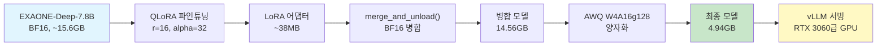
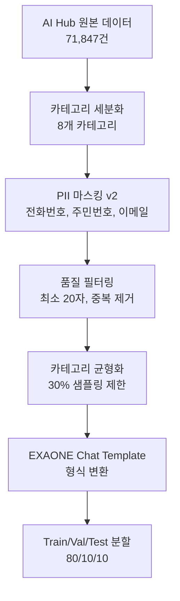
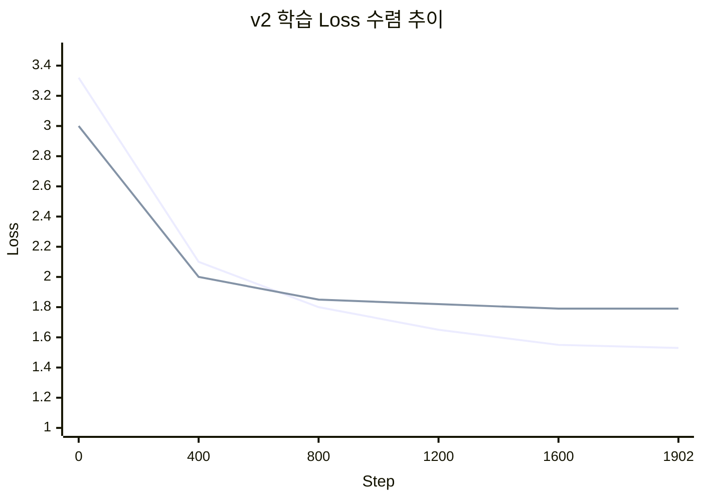
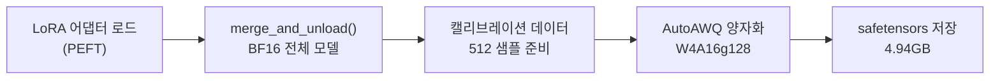

# 모델 카드

GovOn에서 사용하는 AI 모델의 상세 정보를 설명합니다. 베이스 모델 선정부터 QLoRA 파인튜닝, AWQ 양자화까지의 전체 모델 파이프라인을 다룹니다. 이 문서는 [Model Cards for Model Reporting (Mitchell et al., 2019)](https://arxiv.org/abs/1810.03993) 형식을 따릅니다.

---

## 모델 개요

| 항목 | 값 |
|------|-----|
| **모델명** | GovOn-EXAONE-LoRA-v2 |
| **베이스 모델** | [LGAI-EXAONE/EXAONE-Deep-7.8B](https://huggingface.co/LGAI-EXAONE/EXAONE-Deep-7.8B) |
| **파인튜닝 방식** | QLoRA (4-bit NF4, double quantization) |
| **양자화** | AWQ W4A16g128 |
| **라이선스** | [LGAI EXAONE AI Model License Agreement 1.1](https://huggingface.co/LGAI-EXAONE/EXAONE-Deep-7.8B/blob/main/LICENSE) |
| **용도** | 지자체 민원 분류 및 답변 초안 생성 |
| **HuggingFace** | [umyunsang/GovOn-EXAONE-LoRA-v2](https://huggingface.co/umyunsang/GovOn-EXAONE-LoRA-v2) |
| **W&B Run** | [umyun3/GovOn-retrain-v2/uggxvc3s](https://wandb.ai/umyun3/GovOn-retrain-v2/runs/uggxvc3s) |

---

## 모델 파이프라인



---

## 베이스 모델: EXAONE-Deep-7.8B

LG AI Research가 개발한 한국어 특화 대규모 언어 모델입니다.

| 항목 | 설명 |
|------|------|
| **파라미터** | 7.8B |
| **아키텍처** | Decoder-only Transformer |
| **개발사** | LG AI Research |
| **컨텍스트 길이** | 최대 32,768 토큰 |
| **학습 데이터 언어** | 한국어, 영어 |
| **특징** | `<thought>` 태그 기반 추론 체인(CoT) 내장 |
| **특수 토큰** | `[|system|]`, `[|user|]`, `[|assistant|]`, `[|endofturn|]` |
| **선정 근거** | 한국어 민원 도메인 최적, 폐쇄망 배포 무제약, 양자화 파이프라인 검증 완료 |

EXAONE 모델을 선정한 상세 근거는 [ADR-001](adr/index.md#adr-001-exaone-deep-78b-모델-선정)을 참고하세요.

!!! info "EXAONE-Deep의 특징"
    EXAONE-Deep은 내부 추론 과정을 `<thought>...</thought>` 블록으로 출력하는 Deep Thinking 모델입니다. GovOn에서는 이 추론 블록을 API 응답 시 자동 제거(`_strip_thought_blocks()`)하여 최종 답변만 사용자에게 전달합니다.

---

## QLoRA 파인튜닝

### 하이퍼파라미터

| 파라미터 | 값 | 비고 |
|---------|-----|------|
| 파인튜닝 방식 | QLoRA (4-bit NF4) | `BitsAndBytesConfig` 기반 |
| LoRA rank (r) | 16 | |
| LoRA alpha | 32 | alpha/r = 2.0 |
| LoRA dropout | 0.05 | |
| Target modules | q_proj, k_proj, v_proj, o_proj, gate_proj, up_proj, down_proj | 모든 선형 레이어 |
| 양자화 | 4-bit NF4, double quantization, bfloat16 compute | |
| Optimizer | paged_adamw_8bit | 메모리 효율 최적화 |
| Learning rate | 2e-4 | |
| LR scheduler | cosine | |
| Warmup ratio | 0.03 | |
| Weight decay | 0.01 | |
| Epochs | 3 | |
| Batch size (per device) | 2 | |
| Gradient accumulation | 8 | |
| **Effective batch size** | **16** | |
| Max sequence length | 2048 | EXAONE 최대 32K 중 학습 효율 위해 제한 |
| Max grad norm | 1.0 | |
| 정밀도 | bf16 + TF32 | |
| Gradient checkpointing | True | |
| 실험 추적 | W&B (`report_to="wandb"`) | |

### LoRA 어댑터 버전 비교

| 항목 | v1 (폐기) | v2 (현재) |
|------|-----------|-----------|
| **HuggingFace** | [civil-complaint-exaone-lora](https://huggingface.co/umyunsang/civil-complaint-exaone-lora) | [GovOn-EXAONE-LoRA-v2](https://huggingface.co/umyunsang/GovOn-EXAONE-LoRA-v2) |
| **상태** | 폐기 | 프로덕션 활성 |
| **Eval Loss** | 1.7909 | 1.7872 (-0.21%) |
| **Token Accuracy** | 0.6044 | 0.6046 (+0.03%) |
| **EOS 생성률** | 0% | 20% |

### v2 주요 개선사항

| 개선 항목 | 내용 |
|-----------|------|
| EOS 토큰 학습 정상화 | `pad_token`을 `unk_token`으로 분리하여 EOS 학습 차단 문제 해결 (0% -> 20%) |
| 데이터 균형화 | 카테고리별 30% 샘플링 제한으로 편향(행정 89.6%) 해소 |
| PII 마스킹 강화 | 개인정보 마스킹 로직 v2 적용 |
| 학습 파이프라인 안정화 | SFTConfig + DataCollatorForCompletionOnlyLM 적용 |

!!! warning "v1 폐기 사유"
    v1은 EXAONE Chat Template 미적용, 전처리 파이프라인 불완전, EOS 토큰 학습 차단 등의 문제로 폐기되었습니다. 프로덕션에서는 반드시 v2를 사용하세요.

---

## 학습 데이터

한국 지방자치단체 민원 데이터를 기반으로 구성했습니다. 71,847건의 원본 데이터에서 카테고리 세분화 및 품질 필터링을 거쳤습니다.

### 데이터 출처

| 데이터셋 번호 | 명칭 | 규모 | 용도 | 우선순위 |
|-------------|------|------|------|---------|
| AI Hub 71852 | 공공 민원 상담 LLM 데이터 | 150,000건+ | 주 학습 데이터 (Instruction Tuning) | 1 |
| AI Hub 71844 | 민간 민원 상담 LLM 데이터 | 200,000건+ | 보조 학습 데이터 (도메인 확장) | 2 |

### 데이터 분할

| 분할 | 샘플 수 | 비율 |
|------|---------|------|
| Train | 10,148 | 80% |
| Validation | 1,265 | 10% |
| Test | 1,265 | 10% |
| **합계** | **12,678** | **100%** |

### 카테고리 분포

8개 카테고리: 행정, 교통, 환경, 복지, 문화, 경제, 안전, 기타

### 데이터 전처리 파이프라인



### 데이터 포맷

```text
[|system|]
당신은 지자체 민원 담당 공무원을 돕는 AI 어시스턴트입니다.
[|user|]
{instruction}

{input}
[|assistant|]
{output}
```

`DataCollatorForCompletionOnlyLM`을 사용하여 assistant 응답 부분에만 loss를 적용합니다.

---

## 학습 결과

### 학습 곡선 요약

| 지표 | 값 |
|------|-----|
| 초기 train loss | 3.3224 |
| 최종 train loss | 1.5320 |
| 최종 eval loss | 1.7872 |
| 최종 train token accuracy | 0.6444 |
| 최종 eval token accuracy | 0.6046 |
| Train-Eval gap | 0.2552 |
| Total steps | 1,902 |
| 학습 시간 | 약 167분 |



!!! success "수렴 분석"
    학습은 3 epoch 동안 안정적으로 수렴했으며, train-eval gap이 0.25 수준으로 과적합이 심하지 않습니다.

---

## AWQ 양자화

파인튜닝된 모델을 프로덕션 서빙에 적합한 크기로 양자화합니다.

### 양자화 과정



### 양자화 설정

| 설정 | 값 | 설명 |
|------|----|------|
| `w_bit` | 4 | 4비트 가중치 양자화 |
| `q_group_size` | 128 | 128개 가중치를 하나의 양자화 그룹으로 묶음 |
| `zero_point` | True | 비대칭 양자화로 정밀도 향상 |
| `version` | GEMM | vLLM 호환 GEMM 커널 사용 |
| 캘리브레이션 데이터 | 512샘플 | 민원 학습 데이터에서 추출 (도메인 특화) |

### 양자화 결과

| 단계 | 크기 | 변화 |
|------|------|------|
| 베이스 (BF16) | ~15.6 GB | - |
| 병합 (BF16) | 14.56 GB | LoRA 병합 후 |
| **AWQ (W4A16g128)** | **4.94 GB** | **-66.1%** |

양자화 방식을 선정한 상세 근거는 [ADR-002](adr/index.md#adr-002-awq-w4a16g128-양자화-방식-선정)를 참고하세요.

---

## 추론 성능

### 핵심 지표

| 지표 | 값 | 목표 |
|------|-----|------|
| 민원 분류 정확도 | 90% | >= 85% |
| BERTScore F1 | 46.05 | >= 80% |
| 추론 응답 시간 (p50) | 2.43초 | < 2초 |
| GPU VRAM 사용 | ~4.95 GB | < 8 GB |
| EOS 생성률 | 20% | 지속 개선 중 |

### v1 자동 평가 지표 (참고)

| 지표 | v1 값 |
|------|-------|
| BLEU | 0.53 |
| ROUGE-L | 4.20 |
| length_ratio | 0.63 |

---

## 추론 설정

프로덕션 환경에서의 vLLM 추론 설정입니다.

| 항목 | 값 | 근거 |
|------|----|------|
| `gpu_memory_utilization` | 0.8 | 16GB GPU 기준 KV 캐시 여유 확보 |
| `max_model_len` | 8192 | 민원 텍스트 + RAG 컨텍스트 + 답변 생성 |
| `trust_remote_code` | True | EXAONE 커스텀 모델 코드 로드 |
| `enforce_eager` | True | 패치된 모델 안정성 확보 |
| `dtype` | float16 | AWQ 모델 연산 정밀도 |
| `repetition_penalty` | 1.1 | EXAONE 안정성을 위한 반복 페널티 |

---

## 배포 모델 목록

| 모델 | HuggingFace URL | 크기 | 상태 |
|------|-----------------|------|------|
| LoRA 어댑터 (v1) | [umyunsang/civil-complaint-exaone-lora](https://huggingface.co/umyunsang/civil-complaint-exaone-lora) | ~38MB | 폐기 |
| BF16 병합 | [umyunsang/civil-complaint-exaone-merged](https://huggingface.co/umyunsang/civil-complaint-exaone-merged) | 14.56 GB | 참고용 |
| AWQ 4-bit | [umyunsang/civil-complaint-exaone-awq](https://huggingface.co/umyunsang/civil-complaint-exaone-awq) | 4.94 GB | 서빙용 |
| LoRA 어댑터 (v2) | [umyunsang/GovOn-EXAONE-LoRA-v2](https://huggingface.co/umyunsang/GovOn-EXAONE-LoRA-v2) | ~38MB | **프로덕션** |

---

## 학습 인프라

| 항목 | 내용 |
|------|------|
| GPU | NVIDIA A100 40GB (Google Colab) |
| 학습 시간 | 약 167분 (2시간 47분) |
| 학습 프레임워크 | TRL 0.18.x + PEFT 0.18.1 + Transformers 4.49.0 |
| 양자화 라이브러리 | BitsAndBytes (학습), AutoAWQ (프로덕션 양자화) |
| 실험 추적 | Weights & Biases |

!!! note "L4에서 A100으로 이전"
    L4 런타임(24GB)에서 OOM이 발생하여 A100(40GB)으로 이전한 후 학습을 완수하였습니다.

---

## 의도된 사용 범위

### 적합한 사용

- 한국 지방자치단체 민원 처리 업무 보조
- 유사 민원 사례 검색 및 답변 초안 생성
- 민원 자동 분류 (8개 카테고리)

### 부적합한 사용

- 법적 구속력이 있는 판단이나 결정
- 개인정보가 포함된 원문 데이터 직접 노출
- 민원 외 일반 목적의 대화형 AI 서비스
- 의료, 금융 등 전문 도메인 자문

---

## 제한사항

1. **EOS 생성 불안정**: EOS 생성률이 20%로, 대부분의 응답이 `max_new_tokens`에 도달할 때까지 생성을 계속합니다. `max_new_tokens`를 적절히 설정하고 후처리로 응답을 정리해야 합니다.

2. **Thought 태그 포함**: EXAONE-Deep 모델의 특성상 `<thought>...</thought>` 태그가 응답에 포함될 수 있습니다. 추론 서버(`api_server.py`)에서 `_strip_thought_blocks()`로 자동 제거합니다.

3. **응답 길이**: 응답이 참조 답변 대비 짧은 경향이 있습니다 (v1 기준 length_ratio 0.63). 중요한 정보가 누락될 수 있으므로 답변 품질 검수가 필요합니다.

4. **카테고리 범위**: 8개 카테고리(행정, 교통, 환경, 복지, 문화, 경제, 안전, 기타)에 대해 학습되었으며, 이 범위를 벗어나는 질의에 대해서는 답변 품질이 보장되지 않습니다.

5. **법적/규정 정확성**: AI가 생성한 답변은 참고용이며, 법적 효력이 있는 공식 답변으로 사용할 수 없습니다. 실제 업무에서는 반드시 담당 공무원의 검토가 필요합니다.

6. **최대 시퀀스 길이**: `max_seq_length=2048`로 학습되었으므로, 이를 초과하는 긴 입력은 잘릴 수 있습니다. 추론 시 `max_model_len=8192`로 설정하지만, 학습 시 본 적 없는 긴 시퀀스에 대한 품질은 보장되지 않습니다.

---

## 윤리적 고려사항

- **개인정보 보호**: 학습 데이터에 PII 마스킹을 적용하고, 검색 결과 반환 시에도 `PIIMasker`를 통해 실시간 마스킹을 수행합니다.
- **온프레미스 배포**: 민원 데이터의 민감성을 고려하여 온프레미스 배포를 기본으로 합니다. 공개 데이터만 클라우드 호환 전략을 사용합니다.
- **인간 감독**: 모델 답변은 초안이며, 최종 민원 답변은 반드시 담당 공무원이 검토한 후 발송합니다.
- **편향**: AI Hub 공공 민원 데이터에 내재된 편향이 모델에 반영될 수 있습니다. 카테고리 균형화(30% 샘플링 제한)로 완화하였으나, 완전한 해소는 아닙니다.

---

## 인용

```bibtex
@misc{govon-exaone-lora-v2,
  title={GovOn-EXAONE-LoRA-v2: QLoRA Fine-tuned EXAONE-Deep-7.8B for Korean Civil Complaint Assistance},
  author={GovOn Team},
  year={2026},
  url={https://huggingface.co/umyunsang/GovOn-EXAONE-LoRA-v2}
}
```

---

## 관련 문서

- [시스템 구성도](overview.md) -- 전체 아키텍처 개요
- [API 명세](api.md) -- 추론 서버 REST API 레퍼런스
- [파인튜닝](../research/finetuning.md) -- QLoRA 실험 상세
- [양자화](../research/quantization.md) -- AWQ 양자화 과정
- [평가 결과](../research/evaluation.md) -- 모델 평가 지표
- [W&B 실험 로그](../research/wandb.md) -- 실험 추적 기록
- [ADR-001: EXAONE 모델 선정](adr/index.md#adr-001-exaone-deep-78b-모델-선정) -- 모델 선정 근거
- [ADR-002: AWQ 양자화](adr/index.md#adr-002-awq-w4a16g128-양자화-방식-선정) -- 양자화 방식 선정 근거
