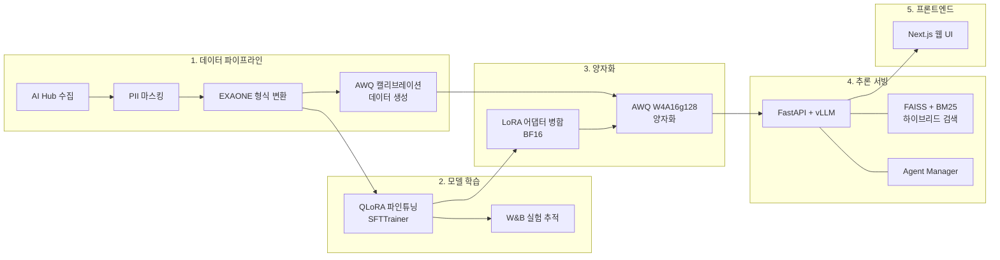
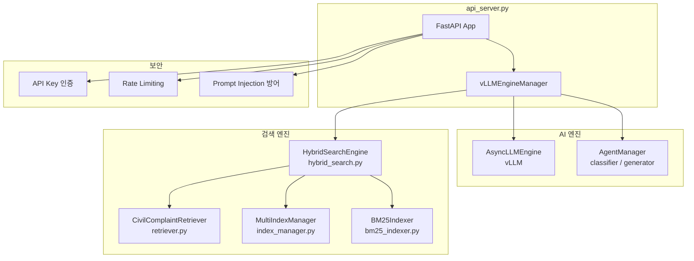

# 시스템 구성도

GovOn의 전체 시스템 아키텍처를 설명합니다. 데이터 수집부터 프론트엔드 서빙까지의 End-to-End 파이프라인과 각 모듈의 역할을 다룹니다.

---

## E2E 아키텍처

데이터 수집에서 사용자 인터페이스까지의 전체 흐름입니다.



---

## 모듈 상세

### `src/data_collection_preprocessing/`

AI Hub에서 민원 데이터를 수집하고 학습에 사용할 수 있는 형태로 전처리하는 모듈입니다.

| 기능 | 설명 |
|------|------|
| AI Hub 수집 | 지자체 민원 원본 데이터 71,847건 수집 |
| PII 마스킹 | 전화번호, 주민등록번호, 이메일 등 개인식별정보 마스킹 (v2) |
| EXAONE 형식 변환 | Chat template 형식(system / user / assistant)으로 변환 |
| AWQ 캘리브레이션 | 양자화용 캘리브레이션 데이터 512샘플 추출 |
| 카테고리 균형화 | 카테고리별 30% 샘플링 제한으로 편향 해소 |

**최종 데이터셋**: Train 10,148건 / Validation 1,265건 / Test 1,265건 (총 12,678건)

파이프라인 실행:

```bash
python -m src.data_collection_preprocessing.pipeline --mode full
```

---

### `src/training/`

EXAONE-Deep-7.8B를 민원 도메인에 특화시키기 위한 QLoRA 파인튜닝 모듈입니다.

| 항목 | 값 |
|------|-----|
| 파인튜닝 방식 | QLoRA (4-bit NF4, double quantization) |
| LoRA rank (r) | 16 |
| LoRA alpha | 32 |
| Learning rate | 2e-4 (cosine scheduler) |
| Effective batch size | 16 (per_device=2 x gradient_accumulation=8) |
| Epochs | 3 |
| 정밀도 | bf16 |
| Optimizer | paged_adamw_8bit |
| Target modules | q_proj, k_proj, v_proj, o_proj, gate_proj, up_proj, down_proj |

학습 과정은 **Weights & Biases**로 실시간 추적합니다. 학습 곡선, 손실값, 토큰 정확도 등을 W&B 대시보드에서 확인할 수 있습니다.

- W&B Run: [umyun3/GovOn-retrain-v2/uggxvc3s](https://wandb.ai/umyun3/GovOn-retrain-v2/runs/uggxvc3s)

---

### `src/quantization/`

파인튜닝된 모델을 프로덕션 서빙에 적합한 크기로 양자화하는 모듈입니다. 2단계로 구성됩니다.

**Stage 1 -- LoRA 병합** (`merge_lora.py`)

QLoRA 어댑터를 베이스 모델에 BF16으로 병합합니다. 병합 후 파라미터 수가 베이스 모델과 일치하는지 검증하고, 추론 테스트로 무결성을 확인합니다.

**Stage 2 -- AWQ 양자화** (`quantize_awq.py`)

병합된 BF16 모델에 AutoAWQ로 W4A16g128 양자화를 적용합니다.

| 설정 | 값 | 설명 |
|------|----|------|
| `w_bit` | 4 | 4비트 가중치 양자화 |
| `q_group_size` | 128 | 128개 가중치를 하나의 양자화 그룹으로 묶음 |
| `zero_point` | True | 비대칭 양자화로 정밀도 향상 |
| `version` | GEMM | vLLM 호환 GEMM 커널 사용 |

**결과**: 모델 크기 15.6GB에서 4.94GB로 68.3% 감소

---

### `src/inference/`

FastAPI + vLLM 기반 추론 서빙 모듈입니다. GovOn의 핵심 런타임 모듈로, 민원 분류, 답변 생성, 유사 민원 검색을 수행합니다.



#### 주요 컴포넌트

| 파일 | 역할 |
|------|------|
| `api_server.py` | FastAPI 앱, vLLMEngineManager, 엔드포인트 정의, 보안 미들웨어 |
| `retriever.py` | FAISS IndexFlatIP + multilingual-e5-large 기반 유사 민원 검색 |
| `index_manager.py` | CASE/LAW/MANUAL/NOTICE 4개 도메인 독립 인덱스 관리 |
| `bm25_indexer.py` | BM25 키워드 검색 인덱서 |
| `hybrid_search.py` | Dense + Sparse RRF 융합 하이브리드 검색 엔진 |
| `schemas.py` | Pydantic v2 요청/응답 모델 정의 |
| `vllm_stabilizer.py` | EXAONE 모델용 transformers 런타임 패치 |
| `agent_manager.py` | 에이전트 페르소나 관리 (classifier, generator) |
| `feature_flags.py` | Feature Flag 기반 기능 토글 |
| `db/` | SQLAlchemy ORM, Alembic 마이그레이션 |

[:octicons-arrow-right-24: API 명세 보기](api.md)

---

### `src/evaluation/`

파인튜닝 및 양자화된 모델의 성능을 평가하는 모듈입니다.

| 평가 지표 | 설명 |
|-----------|------|
| Accuracy | 민원 분류 정확도 |
| BERTScore | 생성 답변과 참조 답변 간 의미 유사도 |
| BLEU | n-gram 기반 텍스트 일치도 |
| ROUGE-L | 최장 공통 부분 시퀀스 기반 유사도 |
| length_ratio | 생성 답변 길이 / 참조 답변 길이 비율 |

---

## 보안 아키텍처

GovOn은 공공기관 폐쇄망 환경을 위해 다층 보안을 적용합니다.

### API Key 인증

`X-API-Key` 헤더를 통한 인증입니다. `API_KEY` 환경변수가 설정된 경우 모든 API 요청에 유효한 키가 필요합니다.

```
Authorization: X-API-Key: <your-api-key>
```

### Rate Limiting

slowapi 기반 요청 속도 제한입니다.

| 엔드포인트 | 제한 |
|-----------|------|
| `POST /v1/classify` | 60회/분 |
| `POST /v1/generate` | 30회/분 |
| `POST /v1/stream` | 30회/분 |
| `POST /v1/search` | 60회/분 |

### CORS

`CORS_ORIGINS` 환경변수로 허용 출처를 제어합니다. 쉼표로 구분된 도메인 목록을 설정합니다.

### Prompt Injection 방어

`_escape_special_tokens()` 메서드가 사용자 입력에서 EXAONE 특수 토큰을 이스케이프하여 프롬프트 주입 공격을 방어합니다. 이스케이프 대상 토큰:

- `[|user|]`, `[|assistant|]`, `[|system|]`, `[|endofturn|]`
- `<thought>`, `</thought>`

### PII 마스킹

검색 결과를 클라이언트에 반환하기 전에 `PIIMasker`가 개인식별정보(전화번호, 주민등록번호, 이메일 등)를 마스킹합니다.

### 오류 응답 제한

내부 스택 트레이스나 시스템 정보가 클라이언트에 노출되지 않습니다. 오류 발생 시 일반적인 메시지만 반환합니다.

---

## EXAONE 채팅 템플릿

EXAONE-Deep-7.8B는 고유한 채팅 템플릿을 사용합니다.

```
[|system|]당신은 지자체 민원 상담 AI 어시스턴트입니다.[|endofturn|]
[|user|]주민등록증 재발급 절차가 어떻게 되나요?[|endofturn|]
[|assistant|]<thought>주민등록증 재발급 절차를 단계별로 안내해야 합니다.</thought>
주민등록증 재발급 절차를 안내드립니다...
[|endofturn|]
```

- `[|system|]` ~ `[|endofturn|]`: 시스템 프롬프트 (에이전트 페르소나)
- `[|user|]` ~ `[|endofturn|]`: 사용자 입력 (민원 내용)
- `[|assistant|]`: 모델 응답 시작
- `<thought>` ~ `</thought>`: 모델의 내부 추론 과정 (클라이언트 응답에서 자동 제거)

---

## 환경변수

| 변수명 | 기본값 | 설명 |
|--------|--------|------|
| `MODEL_PATH` | `umyunsang/GovOn-EXAONE-LoRA-v2` | HuggingFace 모델 경로 또는 로컬 경로 |
| `DATA_PATH` | `data/processed/v2_train.jsonl` | 학습 데이터 경로 (인덱스 빌드용) |
| `INDEX_PATH` | `models/faiss_index/complaints.index` | FAISS 인덱스 파일 경로 |
| `FAISS_INDEX_DIR` | `models/faiss_index` | MultiIndexManager 인덱스 디렉토리 |
| `BM25_INDEX_DIR` | `models/bm25_index` | BM25 인덱스 디렉토리 |
| `GPU_UTILIZATION` | `0.8` | GPU VRAM 사용 비율 (0.0~1.0) |
| `MAX_MODEL_LEN` | `8192` | 최대 시퀀스 길이 (토큰 수) |
| `API_KEY` | (미설정) | API 인증 키. 미설정 시 인증 비활성화 |
| `CORS_ORIGINS` | (미설정) | 허용 CORS 출처 (쉼표 구분) |
| `AGENTS_DIR` | `agents/` | 에이전트 페르소나 디렉토리 |
| `SKIP_MODEL_LOAD` | `false` | `true` 설정 시 모델 로딩 생략 (E2E 테스트용) |
| `BM25_INDEX_HMAC_KEY` | (미설정) | BM25 인덱스 무결성 검증용 HMAC 키 |

---

## 관련 문서

- [API 명세](api.md) -- 전체 REST API 엔드포인트 레퍼런스
- [모델 카드](model-card.md) -- EXAONE-Deep-7.8B 파인튜닝 모델 상세 정보
- [ADR 목록](adr/index.md) -- 아키텍처 결정 기록
