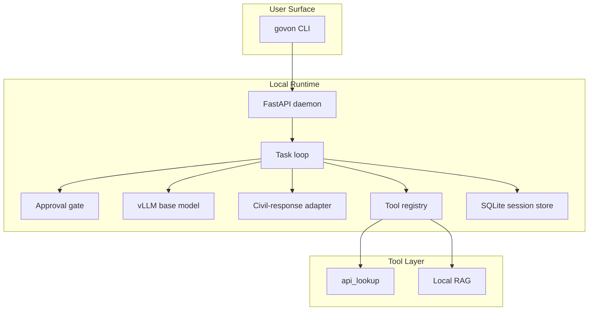

# GovOn Shell MVP 아키텍처

이 문서는 현재 GovOn의 최종 MVP 구조를 요약한다. 루트 문서 기준선은 `docs/architecture/GovOn-shell-mvp-architecture.md`다.

## 한 줄 정의

GovOn은 `govon` CLI 셸을 진입점으로 사용하고, 내부의 로컬 FastAPI daemon runtime이 base model, civil-response adapter, API lookup, RAG 검색, SQLite 세션 저장을 조정하는 승인 기반 행정 보조 시스템이다.

## 상위 구조

## 요청 처리 원칙

### 1. 자연어 우선

업무 요청은 전부 자연어로 받는다. 명령은 `/help`, `/clear`, `/exit`만 유지한다.

### 2. 작업 단위 승인

모델은 사용자의 요청을 보고 한 번의 작업 루프를 정의한다. 이 작업을 실행하기 전에 사용자가 이해할 수 있는 설명과 함께 `승인 / 거절` 선택을 받는다.

### 3. 거절 시 완전 대기

거절되면 시스템은 대안을 마음대로 실행하지 않는다. 아무 작업도 진행하지 않고 다음 사용자 입력을 기다린다.

### 4. 초안과 근거 분리

민원 답변 초안은 품질을 위해 내부 검색을 활용할 수 있지만, 근거/출처는 기본 출력이 아니다. 사용자가 나중에 근거를 요구하면 별도 승인 후 기존 답변 아래에 덧붙인다.

## 주요 컴포넌트

### CLI

- `govon`
- 자연어 대화
- 승인 UI
- 세션 resume 진입점

### FastAPI daemon

- CLI가 붙는 내부 runtime
- task loop 실행
- tool 호출 orchestration
- 상태 브로커 역할

### Base model + adapter

- base model: 의도 파악, 작업 계획, 응답 합성
- civil-response adapter: 작성 단계에서만 내부적으로 사용

### Tool registry

- `api_lookup`: 민원분석정보조회 계열 외부 API wrapper
- `local_rag`: 지정 폴더 문서 검색

### Session store

- SQLite 사용
- 저장 대상: 대화 기록, tool 사용 기록
- 종료 시 session id 표시
- `govon --session <id>`로 재개

## RAG 범위

- 문서 위치: 지정 폴더
- 검증 포맷: `pdf`, `hwp`, `docx`, `txt`, `html`
- MVP provenance: 파일 경로 + 페이지

## MVP 제외

- 공문서 작성
- 분류 기능
- 웹/앱 제품화
