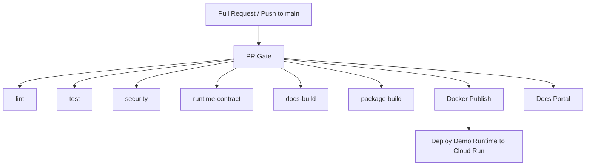

# 파이프라인 개요

GovOn의 CI/CD는 shell-first MVP를 기준으로 다시 정렬되어 있다. 핵심은 "PR 머지 전에 runtime 계약이 깨지지 않는가"를 확인하는 것이며, 배포는 그 다음 단계다.

## 설계 원칙

- `PR Gate`가 유일한 기본 품질 게이트다.
- 품질 게이트는 lint, runtime unit test, 보안 정적 분석, shell-first contract test, docs strict build로 구성한다.
- Docker 이미지는 `PR Gate` 성공 이후에만 발행한다.
- Cloud Run은 merge 자동배포가 아니라 수동 데모 검증 레인으로 분리한다.
- 문서 포털은 PR에서도 strict build를 수행해 깨진 링크와 누락된 nav를 조기에 잡는다.

## 파이프라인 구조

## 왜 이렇게 바꿨는가

이전 구조는 `CI`, `Selective Deploy`, `E2E`가 서로 겹쳤고, Cloud Run 배포는 실제 PR 게이트 성공 여부와 분리되어 있었다. 현재 구조는 다음 문제를 직접 해결한다.

- 중복 테스트 제거
- 실패한 main 커밋의 자동 배포 차단
- 더 이상 사용하지 않는 `/v1/classify` 계약 제거
- shell-first MVP surface인 `/v1/agent/*`, `/v1/generate-civil-response`, SQLite session store를 검증 대상으로 승격

## 운영 메모

- 브랜치 보호 규칙의 required checks 설정은 저장소 설정에서 별도로 켜야 한다.
- `Deploy Demo Runtime to Cloud Run`은 `SKIP_MODEL_LOAD=true` 데모 런타임을 기준으로 한다.
- 패키지/오프라인 번들은 여전히 artifact 레인이다. 최종 `govon` 설치 경험은 별도 packaging 작업으로 완성해야 한다.
