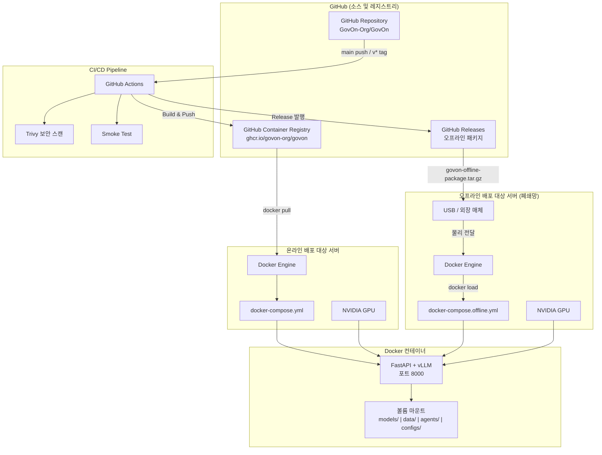
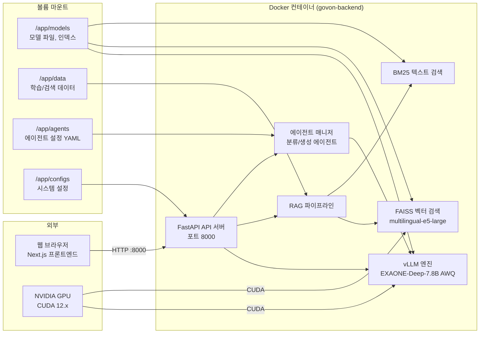
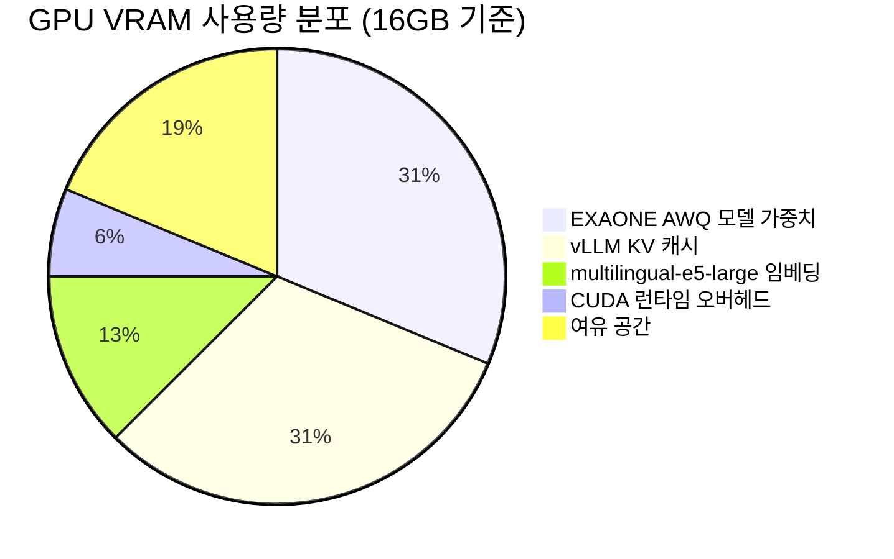
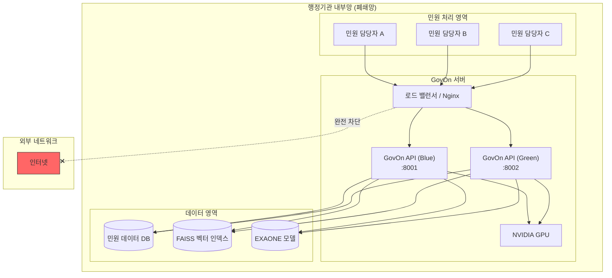
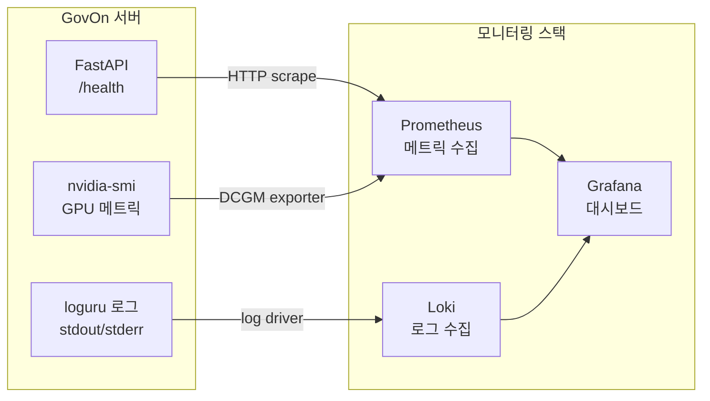
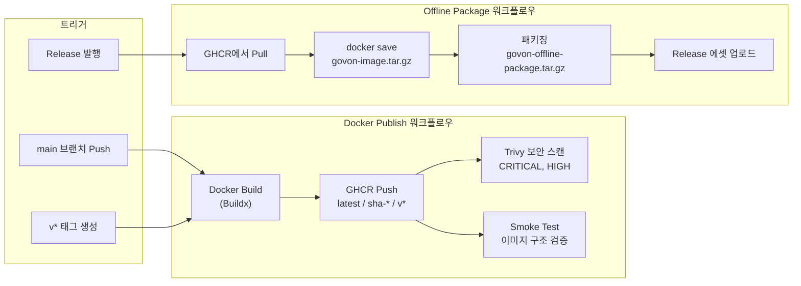
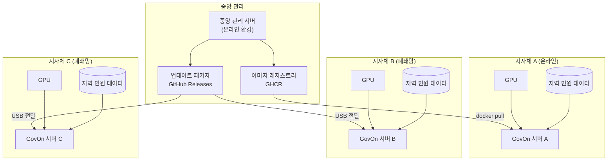
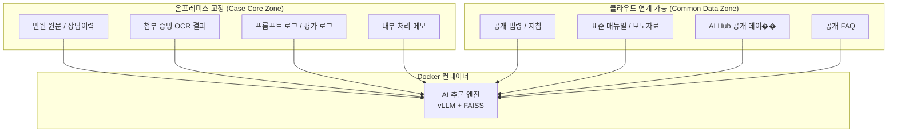

# 인프라 아키텍처

GovOn 시스템의 배포 인프라 구성, Docker Compose 서비스 토폴로지, GPU 할당, 네트워크 아키텍처, 모니터링, 확장 전략을 설명���다.

---

## 전체 배포 아키텍처



---

## Docker Compose 서비스 토폴로지

### 컨테이너 내부 구조



### 서비스 구성 파일

| Compose 파일 | 용도 | 환경 |
|--------------|------|------|
| `docker-compose.yml` | 기본 배포 | 개발, 스테이징 |
| `docker-compose.prod.yml` | 프로덕션 배포 (Blue/Green) | 프로��션 |
| `docker-compose.offline.yml` | 오프라인 폐쇄망 배포 | 행정 내부망 |

### 볼륨 마운트 구조

| 호스트 경로 | 컨테이너 경로 | 내용 |
|-------------|---------------|------|
| `./models/` | `/app/models/` | EXAONE AWQ 모델 가중치, FAISS 인덱스, BM25 인덱스 |
| `./data/` | `/app/data/` | 학습 데이터 (JSONL), 검색용 데이터 |
| `./agents/` | `/app/agents/` | 에이전트 설정 파일 (YAML) |
| `./configs/` | `/app/configs/` | 시스템 설정 파일 |

### 컨테이너 설정

```yaml
# docker-compose.yml 핵심 설정
services:
  govon-backend:
    image: ghcr.io/govon-org/govon:latest
    ports:
      - "8000:8000"
    env_file:
      - .env
    volumes:
      - ./models:/app/models
      - ./data:/app/data
      - ./agents:/app/agents
      - ./configs:/app/configs
    deploy:
      resources:
        reservations:
          devices:
            - driver: nvidia
              count: all
              capabilities: [gpu]
    healthcheck:
      test: ["CMD", "curl", "-f", "http://localhost:8000/health"]
      interval: 30s
      timeout: 10s
      retries: 5
      start_period: 120s  # 모델 로딩에 시간이 걸림
    restart: unless-stopped
```

!!! info "start_period 설정"
    EXAONE 모델 로딩에 1~2분이 소요될 수 있다. `start_period`를 충분히 설정하여 기동 중 헬스체크 실패로 컨테이너가 재시작되는 것을 방지한다.

---

## GPU 할당 및 VRAM 요구사항

### VRAM 사용량 분석



| 구성 요소 | VRAM 사용량 | 설명 |
|-----------|-------------|------|
| EXAONE-Deep-7.8B AWQ (W4A16g128) | ~5 GB | AWQ INT4 양자화로 FP16 대비 약 75% 절감 |
| vLLM KV 캐시 | ~3~5 GB | `GPU_UTILIZATION` 및 `MAX_MODEL_LEN`에 비례 |
| multilingual-e5-large | ~2 GB | 임베딩 모델 (dim=1024) |
| CUDA 런타임 | ~1 GB | PyTorch, CUDA 컨텍스트 |
| **합계 (최소)** | **~11 GB** | 최소 16 GB VRAM 필요 |

### 환경별 권장 사양

| 환경 | GPU | VRAM | `GPU_UTILIZATION` | `MAX_MODEL_LEN` |
|------|-----|------|-------------------|------------------|
| 최소 | RTX 4060 Ti | 16 GB | `0.7` | `4096` |
| 권장 | RTX 4090 | 24 GB | `0.8` | `8192` |
| 서버 | A100 | 40 GB+ | `0.85` | `8192` |

!!! warning "다중 GPU 미지원"
    현재 GovOn은 단일 GPU에서 동작한다. 다중 GPU 텐서 병렬처리는 향후 지원 예정이다.

---

## 네트워크 아키텍처: 폐쇄망 (Closed Network)

GovOn은 행정기관 내부망(폐쇄망)에서의 운영을 기본 전제로 설계되었다.

### 폐쇄망 네트워크 구성



### 포트 구성

| 서비스 | 포트 | 설명 |
|--------|------|------|
| GovOn API (기본) | `8000` | 단일 인스턴스 배포 |
| GovOn API (Blue) | `8001` | Blue/Green 배포 시 Blue 슬롯 |
| GovOn API (Green) | `8002` | Blue/Green 배포 시 Green 슬롯 |
| 프론트엔드 (Next.js) | `3000` | 웹 UI (별도 구성) |

### 온라인 vs 오프라인 배포 비교

| 항목 | 온라인 배포 | 오프라인 배포 (폐쇄���) |
|------|-----------|---------------------|
| **이미지 소스** | GHCR에서 직접 Pull | GitHub Release 패키지 → `docker load` |
| **Compose 파일** | `docker-compose.yml` | `docker-compose.offline.yml` |
| **모델 파일** | HuggingFace에서 자동 다운로드 가능 | USB 등으로 사전 전달 필요 |
| **인터넷 필요** | 최초 Pull 시 필요 | 불필요 (완전 오프라인) |
| **배포 스크립트** | `scripts/deploy.sh` (Blue/Green) | `scripts/offline-deploy.sh` |
| **업데이트 방법** | `docker pull` → 재시작 | 새 패키지 전달 → `docker load` → 재시작 |
| **보안 감사** | 외부 레지스트리 접근 이력 존재 | 외부 네트워크 연결 0건 |
| **적합 환경** | 개발/스테이징, 인터넷 접근 가능 서버 | 행정 내부망, 보안 등급 서버 |

---

## 모니터링

### /health 엔드포인트

서버 상태를 확인하는 헬스 체크 엔드포인트이다. 인증 없이 접근 가능하다.

```bash
curl -s http://localhost:8000/health | python -m json.tool
```

```json
{
    "status": "healthy",
    "rag_enabled": true,
    "indexes": null
}
```

| 필드 | 설명 |
|------|------|
| `status` | 서버 상태 (`healthy` / `unhealthy`) |
| `rag_enabled` | RAG 파이프라인 활성화 여부 |
| `indexes` | 로드된 인덱스 정보 |

### Docker 헬스체크

`docker-compose.yml`에 정의된 헬스체크가 30초 간격으로 `/health` 엔드포인트를 호출한다.

```bash
# 컨테이너 헬스 상태 확인
docker inspect --format='{{.State.Health.Status}}' govon-backend

# 헬스체크 로그 확인
docker inspect --format='{{json .State.Health}}' govon-backend | python -m json.tool
```

### 모니터링 대시보드 구성



### 주요 모니터링 지표

| 지표 | 소스 | 경고 기준 |
|------|------|-----------|
| API 응답 시간 | FastAPI 미들웨어 | P95 > 10초 |
| GPU VRAM 사용률 | nvidia-smi | > 90% |
| GPU 온도 | nvidia-smi | > 85도C |
| 추론 요청 수 | FastAPI 로그 | 급격한 변동 |
| Rate Limit 초과 횟수 | slowapi 로그 | > 100회/시간 |
| 헬스체크 실패 | Docker healthcheck | 연속 3회 실패 |
| 컨테이너 재시작 횟수 | Docker | > 0회 |

---

## CI/CD 배포 파이프라인



### 배포 모드별 상세

#### 온라인 배포

```
개발자 PC → git push → GitHub Actions → GHCR → 서버에서 docker pull → docker compose up
```

- `main` 브랜치에 push할 때마다 최신 이미지가 자동으로 빌드되어 GHCR에 저장된다
- 서버에서 `docker pull`로 최신 이미지를 가져와 배포한다
- Blue/Green 배포 스크립트(`scripts/deploy.sh`)를 사용하면 무중단 업데이트가 가능하다

#### 오프라인 배포

```
GitHub Release 발행 → 오프라인 패키지 자동 생성 → USB 전달 → offline-deploy.sh ���행
```

- Release를 발행하면 GitHub Actions가 자동으로 오프라인 패키지를 생성한다
- 패키지에는 Docker 이미지 아카이브, 배포 스크립트, Compose 파일이 포함된다
- 폐��망 서버에서 `offline-deploy.sh` 한 번 실행으로 전체 배포가 완료된다

---

## 243개 기초자치단체 확장 전략

GovOn은 전국 243개 기초자치단체에 배포하는 것을 목표로 설계되었다.

### 확장 모델



### 확장 시 고려사항

| 항목 | 전략 |
|------|------|
| **모델 배포** | 공통 AWQ 모델 1벌 배포, 지자체별 추가 파인튜닝은 선택 |
| **인덱스 관리** | 지자체별 독립 FAISS 인덱스 (지역 민원 데이터 기반) |
| **업데이트** | 온라인 지자체: 자동 Pull / 오프라인 지자체: USB 패키지 |
| **설정 관리** | 환경변수 기반 설정으로 지자체별 커스터마이징 |
| **GPU 사양** | 최소 16 GB VRAM (RTX 4060 Ti급) |
| **하드웨어 비용** | GPU 서버 1대 / 지자체 (약 200~500만 원대) |

---

## 하이브리드 전략: 온프레미스 + 클라우드

GovOn은 사건별 핵심 데이터와 공개/공통 데이터를 구조적으로 분리하는 하이브리드 전략을 따른다.



### 데이터 배치 전략

| 데이터 유형 | 배치 전략 | 법적 근거 |
|------------|----------|----------|
| 사건별 민원 핵심 데이터 | **온프레미스 고정** | 개인정보보호법 제23조, 제24조, 제26조, 제29조 |
| 권리영향 판단 보조 데이터 | **온프레미스 고정** | 공공 AI 영향평가 대상 (행동계획 92쪽) |
| 공개/공통 참조 데이터 | **클라우드 연계 가능** | 범정부 AI 공통기반 연계 대상 |
| 비식별 공개 학습 데이터 | **하이브리드 운영 가능** | 정책과 예산에 따라 유동적 |

!!! note "클라우드 연계 시 주의사항"
    공개 데이터라 하더라도 클라우드 연계 시 기관의 보안 정책과 망분리 규정을 반드시 확인한다.
    민원 원문이 포함된 데이터는 어떤 경우에도 외부 네트워크로 전송하지 않는다.

---

## 관련 문서

- [시작하기](../guide/getting-started.md) -- Docker 기반 실행, 환경 변수 설정
- [보안 정책](../guide/security.md) -- 온프레미스 보안 이점, 네트워크 격리
- [트러블슈팅](../guide/troubleshooting.md) -- Docker 네트워킹, GPU 인식 문제
- [온라인 배포](online.md) -- 온라인 환경 배포 절차 상세
- [오프라인 배포](offline.md) -- 폐���망 배포 절차 상세
- [Docker 가이드](docker.md) -- Docker 이미지 빌드, 컨테이너 관리
