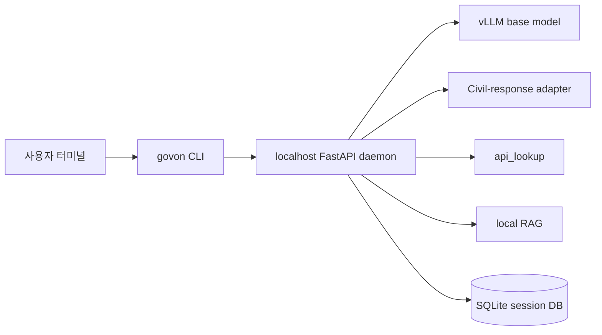

# 배포 아키텍처

GovOn R1의 기본 배포 단위는 `govon` CLI와 로컬 FastAPI daemon runtime이다. 사용자는 CLI만 직접 실행하고, daemon은 필요 시 자동 기동된다.

## 기본 토폴로지

## 배포 원칙

- 사용자는 `govon`만 실행한다.
- daemon이 없으면 CLI가 자동으로 daemon을 기동한다.
- daemon이 이미 떠 있으면 재사용한다.
- daemon은 CLI 종료 후에도 유지되어 다음 실행의 기동 시간을 줄인다.

## 로컬 런타임 구성

| 계층 | 역할 |
|------|------|
| CLI | 사용자 입력, 승인 UI, 종료 시 세션 ID 안내 |
| FastAPI daemon | task loop, tool orchestration, 세션 I/O |
| vLLM | base model 추론 |
| Adapter layer | 민원 답변 작성 단계의 특화 생성 |
| Tool layer | API 조회, RAG 검색 |
| SQLite | 대화 기록 및 tool 기록 저장 |

## 세션 저장

MVP의 세션 저장소는 SQLite다.

- 저장 대상: 대화 기록, tool 사용 기록
- 저장 제외: 대용량 초안 이력, 전체 문서 캐시
- 재개 방식: `govon --session <id>`

## 로컬 문서 폴더

RAG는 지정된 로컬 문서 폴더를 기준으로 동작한다.

- 지원 검증 포맷: `pdf`, `hwp`, `docx`, `txt`, `html`
- 운영 문서가 없을 때는 샘플 문서로 ingestion과 provenance를 검증한다.

## 컨테이너와 패키징

MVP의 우선 배포 경험은 `설치 가능한 CLI 패키지`다. 컨테이너는 내부 runtime 검증 또는 운영 자동화 수단으로 보조 사용한다.

패키징 문서는 설치/배포 workstream에서 별도로 구체화한다.
