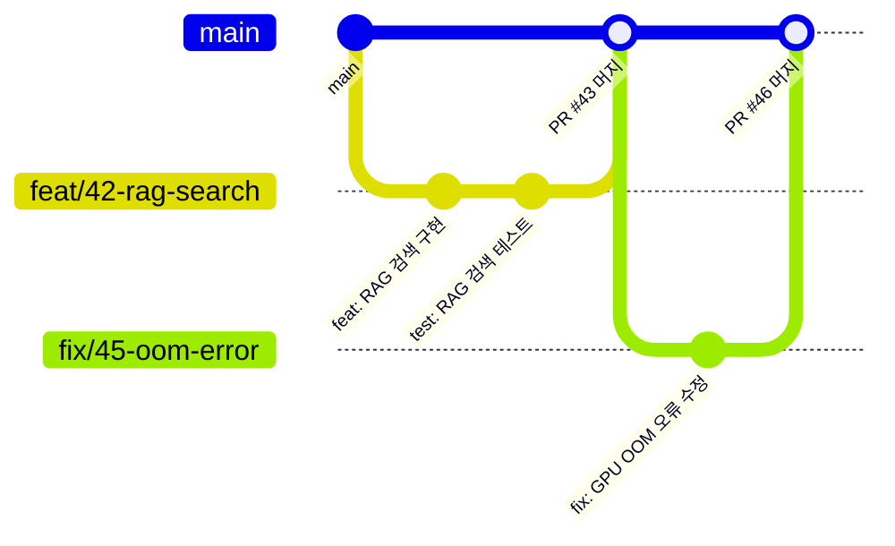
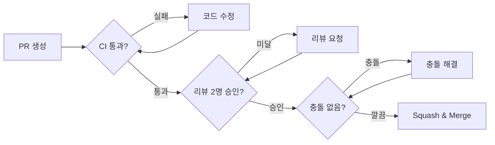

# 개발 규칙

이 문서는 GovOn 프로젝트의 브랜치 전략, 커밋 컨벤션, PR 프로세스, 코드 스타일, 테스트 요구사항을 정의한다.
모든 기여자는 이 규칙을 따른다.

---

## 브랜치 전략

GovOn은 **GitHub Flow** 기반의 단일 브랜치 전략을 사용한다. `main` 브랜치만 운영하며, 모든 변경은 PR을 통해 머지한다.



### 브랜치 네이밍 규칙

| 접두사 | 용도 | 예시 |
|--------|------|------|
| `feat/` | 새 기능 개발 | `feat/42-rag-search` |
| `fix/` | 버그 수정 | `fix/45-oom-error` |
| `docs/` | 문서 변경 | `docs/50-api-reference` |
| `chore/` | 설정, 의존성, CI 변경 | `chore/55-upgrade-vllm` |
| `refactor/` | 코드 리팩토링 | `refactor/60-retriever-cleanup` |
| `test/` | 테스트 추가/수정 | `test/65-coverage-improvement` |

!!! warning "main 브랜치 직접 push 금지"
    `main` 브랜치에는 직접 push할 수 없다. 반드시 PR을 생성하고 리뷰를 받은 뒤 머지한다.
    브랜치 보호 규칙으로 강제된다.

### 브랜치 생명주기

```bash
# 1. main에서 최신 코드를 가져온다
git checkout main
git pull origin main

# 2. 작업 브랜치를 생성한다
git checkout -b feat/42-rag-search

# 3. 작업 후 커밋한다
git add src/inference/retriever.py
git commit -m "feat: FAISS 기반 유사 민원 검색 구현"

# 4. 원격에 push하고 PR을 생성한다
git push -u origin feat/42-rag-search

# 5. PR 머지 후 로컬 브랜치를 삭제한다
git checkout main
git pull origin main
git branch -d feat/42-rag-search
```

---

## 커밋 컨벤션

[Conventional Commits](https://www.conventionalcommits.org/) 형식을 따르며, **커밋 메시지는 한글**로 작성한다.

### 형식

```
<type>: <subject>

[optional body]
[optional footer]
```

### 타입 목록

| 타입 | 설명 | 예시 |
|------|------|------|
| `feat` | 새 기능 추가 | `feat: 민원 분류 에이전트 구현` |
| `fix` | 버그 수정 | `fix: FAISS 인덱스 로드 시 메타데이터 누락 수정` |
| `docs` | 문서 변경 | `docs: API 레퍼런스 업데이트` |
| `style` | 포맷팅, 세미콜론 등 (코드 동작 변경 없음) | `style: black 포맷팅 적용` |
| `refactor` | 코드 리팩토링 (기능 변경 없음) | `refactor: retriever 검색 로직 분리` |
| `test` | 테스트 추가/수정 | `test: api_server 유닛 테스트 추가` |
| `chore` | 빌드, CI, 의존성 변경 | `chore: vLLM 0.6.x로 업그레이드` |
| `perf` | 성능 개선 | `perf: 임베딩 배치 처리로 검색 속도 개선` |

### 좋은 커밋 메시지 예시

```
feat: MultiIndexManager에 법령 인덱스 타입 추가

CASE, LAW, MANUAL, NOTICE 4개 타입을 지원하도록 확장한다.
각 타입별 독립 FAISS 인덱스를 관리하며, index_registry.json으로
메타데이터를 추적한다.

Closes #156
```

### 나쁜 커밋 메시지 예시

```
# 너무 모호함
fix: 버그 수정

# 영어 사용 (한글 규칙 위반)
feat: add RAG search functionality

# 타입 누락
민원 분류 기능 추가
```

!!! note "Breaking Change 표기"
    하위 호환성을 깨는 변경은 타입 뒤에 `!`를 붙인다.
    ```
    feat!: 검색 API 응답 스키마 변경

    BREAKING CHANGE: SearchResponse의 results 필드가 items로 변경됨.
    v1 API를 사용하는 클라이언트는 필드명을 업데이트해야 한다.
    ```

---

## PR 프로세스

### PR 생성 규칙

1. **PR 제목**: 커밋 컨벤션과 동일한 형식을 사용한다 (예: `feat: FAISS 기반 유사 민원 검색 구현`)
2. **PR 본문**: 아래 템플릿을 따른다
3. **대상 브랜치**: 항상 `main`
4. **리뷰어**: 최소 2명의 승인이 필요하다
5. **라벨**: 변경 유형에 맞는 라벨을 부착한다

### PR 템플릿

```markdown
## 변경 사항

<!-- 이 PR에서 무엇을 변경했는지 설명한다 -->

## 변경 이유

<!-- 왜 이 변경이 필요한지 설명한다 -->

## 테스트 방법

<!-- 변경 사항을 어떻게 테스트했는지 설명한다 -->
- [ ] 단위 테스트 통과
- [ ] 통합 테스트 통과
- [ ] 수동 테스트 완료

## 관련 이슈

<!-- 관련 이슈 번호를 링크한다 -->
Closes #이슈번호

## 체크리스트

- [ ] 코드 스타일 검사 통과 (black, isort, flake8)
- [ ] 테스트 커버리지 유지 또는 개선
- [ ] 문서 업데이트 (해당되는 경우)
- [ ] breaking change 여부 확인
```

### PR 라벨

| 라벨 | 색상 | 용도 |
|------|------|------|
| `feat` | 녹색 | 새 기능 |
| `fix` | 빨간색 | 버그 수정 |
| `docs` | 파란색 | 문서 변경 |
| `chore` | 회색 | 설정, 의존성 |
| `breaking` | 주황색 | 하위 호환성 깨짐 |
| `security` | 보라색 | 보안 관련 |

### 머지 전 필수 조건



- [x] CI 파이프라인 전체 통과 (lint, test, security scan)
- [x] 최소 2명의 리뷰어 승인
- [x] 머지 충돌 해결
- [x] 관련 이슈 연결

---

## 코드 스타일

### Python 기본 규칙

| 항목 | 규칙 |
|------|------|
| Python 버전 | 3.10+ |
| 포매터 | `black` (line-length=100) |
| import 정렬 | `isort` (black profile) |
| 린터 | `flake8` |
| 타입 검사 | `mypy` (점진적 도입) |
| 타입 힌트 | 모든 public 함수에 필수 |
| 로깅 | `loguru.logger` (`print()` 금지) |

### 포맷팅 실행

```bash
# 코드 포매팅 (자동 수정)
black --line-length 100 src/ tests/

# import 정렬 (자동 수정)
isort --profile black src/ tests/

# 린트 검사 (보고만)
flake8 src/

# 타입 검사
mypy src/ --ignore-missing-imports
```

### 로깅 규칙

`print()` 대신 `loguru.logger`를 사용한다.

```python
# 올바른 사용
from loguru import logger

logger.info("서버 시작: 포트 {}", port)
logger.warning("GPU 메모리 사용률 {}% 초과", usage)
logger.error("모델 로딩 실패: {}", str(e))
logger.debug("검색 결과 {} 건", len(results))
```

```python
# 잘못된 사용 (금지)
print("서버 시작")
print(f"에러: {e}")
```

!!! danger "API 에러 응답 규칙"
    API 에러 응답에 내부 시스템 정보를 노출하지 않는다. 스택 트레이스, 파일 경로, 환경변수 값을 클라이언트에 반환하지 않는다.

    ```python
    # 올바른 에러 응답
    raise HTTPException(status_code=500, detail="내부 서버 오류가 발생했습니다.")

    # 잘못된 에러 응답 (금지)
    raise HTTPException(status_code=500, detail=str(traceback.format_exc()))
    ```

### 타입 힌트

모든 public 함수와 메서드에 타입 힌트를 작성한다.

```python
from typing import Dict, List, Optional

def search_complaints(
    query: str,
    top_k: int = 5,
    doc_type: Optional[str] = None,
) -> List[Dict[str, str]]:
    """유사 민원을 검색한다.

    Args:
        query: 검색 쿼리 텍스트.
        top_k: 반환할 최대 결과 수.
        doc_type: 문서 유형 필터 (case, law, manual, notice).

    Returns:
        검색 결과 목록. 각 항목은 complaint, answer 키를 포함한다.
    """
    ...
```

---

## 테스트 요구사항

### 테스트 실행

```bash
# 전체 테스트 + 커버리지
pytest tests/ -v --cov=src --cov-report=term-missing

# 특정 모듈
pytest tests/test_inference/ -v

# 특정 파일
pytest tests/test_inference/test_schemas.py -v

# 특정 테스트 함수
pytest tests/test_inference/test_schemas.py::TestGenerateRequest::test_valid_request -v
```

### 테스트 작성 규칙

| 규칙 | 설명 |
|------|------|
| 파일 위치 | `tests/test_<모듈명>/test_<파일명>.py` |
| 클래스 네이밍 | `Test<기능명>` (예: `TestEscapeSpecialTokens`) |
| 함수 네이밍 | `test_<동작>` (예: `test_escapes_user_token`) |
| 비동기 테스트 | `@pytest.mark.asyncio` 데코레이터 사용 |
| GPU 불필요 | mock을 사용하여 GPU 없이 테스트 가능하도록 작성 |

### 커버리지 기준

- **최소 커버리지**: PR이 기존 커버리지를 낮추지 않아야 한다
- **새 코드 커버리지**: 새로 추가하는 코드는 80% 이상 커버리지를 목표로 한다
- **핵심 모듈**: `api_server.py`, `retriever.py`, `schemas.py`는 90% 이상 유지

### 테스트 예시

```python
import pytest
from unittest.mock import patch, MagicMock

class TestEscapeSpecialTokens:
    """_escape_special_tokens 메서드 테스트."""

    def setup_method(self):
        with patch("src.inference.api_server.AsyncLLMEngine"):
            self.mgr = vLLMEngineManager()

    def test_escapes_user_token(self):
        """[|user|] 토큰을 이스케이프한다."""
        result = self.mgr._escape_special_tokens("hello [|user|] world")
        assert "[|user|]" not in result
        assert "\\[|user|\\]" in result

    def test_no_special_tokens(self):
        """특수 토큰이 없으면 원본을 반환한다."""
        text = "일반 텍스트입니다."
        result = self.mgr._escape_special_tokens(text)
        assert result == text
```

---

## 코드 리뷰 가이드

리뷰 코멘트에 다음 접두사를 사용하여 중요도를 명확히 한다.

### 리뷰 접두사

| 접두사 | 의미 | 머지 차단 |
|--------|------|-----------|
| `[MUST]` | 반드시 수정해야 머지 가능 | 차단 |
| `[SHOULD]` | 강력히 권장하지만 합의 가능 | 경우에 따라 |
| `[NITS]` | 사소한 스타일 개선 제안 | 비차단 |
| `[QUESTION]` | 이해를 위한 질문 | 비차단 |

### 리뷰 코멘트 예시

```
[MUST] 이 함수에서 사용자 입력을 검증하지 않고 있다.
_escape_special_tokens()를 호출하여 프롬프트 인젝션을 방어해야 한다.

[SHOULD] 이 로직은 retriever.py에 있는 게 더 적합해 보인다.
api_server.py의 책임 범위를 넘어서는 것 같다.

[NITS] 변수명 `res`보다 `search_results`가 더 명확하다.

[QUESTION] 이 타임아웃 값(30초)은 어떤 기준으로 결정한 것인가?
```

### 리뷰 체크리스트

리뷰어는 다음 항목을 확인한다.

- [ ] **기능 정확성**: 코드가 의도한 대로 동작하는가?
- [ ] **테스트 충분성**: 새 코드에 대한 테스트가 있는가?
- [ ] **보안**: 사용자 입력 검증, 인증 확인, 정보 노출 방지
- [ ] **성능**: 불필요한 DB 쿼리, N+1 문제, 메모리 누수 가능성
- [ ] **코드 스타일**: black, isort, flake8 규칙 준수
- [ ] **문서화**: public API에 docstring이 있는가?
- [ ] **에러 처리**: 예외 상황이 적절히 처리되는가?

---

## 다음 단계

- [시작하기](getting-started.md) -- 로컬 환경 설정, 서버 기동
- [트러블슈팅](troubleshooting.md) -- 자주 발생하는 문제와 해결 방법
- [보안 정책](security.md) -- 보안 레이어, 취약점 대응
