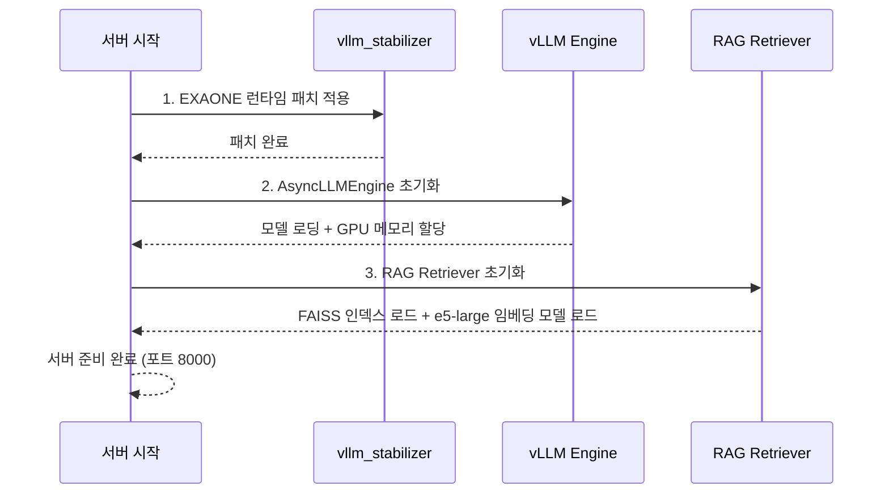

# 시작하기

이 가이드를 완료하면 로컬 환경에서 GovOn 추론 서버를 기동하고, API를 호출하여 민원 분석 결과를 확인할 수 있다.

---

## 사전 요구사항

| 항목 | 최소 요구 | 권장 |
|------|-----------|------|
| Python | 3.10+ | 3.10.x ~ 3.12.x |
| Git | 2.30+ | 최신 버전 |
| CUDA | 12.x | 12.1+ |
| GPU VRAM | 16 GB (AWQ INT4 모델 기준) | 24 GB 이상 |
| RAM | 16 GB | 32 GB |
| 디스크 | 30 GB (모델 + 인덱스) | 50 GB |

NVIDIA 드라이버와 CUDA Toolkit이 설치되어 있는지 확인한다.

```bash
nvidia-smi          # GPU 인식 및 드라이버 버전 확인
nvcc --version      # CUDA 컴파일러 버전 확인
python --version    # Python 3.10 이상인지 확인
```

!!! tip "GPU 없이 개발하기"
    추론 서버 기동에는 NVIDIA GPU가 필요하지만, 테스트와 린트는 CPU 환경에서도 실행할 수 있다.
    데이터 파이프라인(`src/data_collection_preprocessing/`)도 CPU만으로 동작한다.

---

## 저장소 클론

```bash
git clone https://github.com/GovOn-Org/GovOn.git
cd GovOn
```

팀 외부 기여자는 Fork 후 클론한다.

```bash
git clone https://github.com/<your-username>/GovOn.git
cd GovOn
git remote add upstream https://github.com/GovOn-Org/GovOn.git
```

---

## 프로젝트 구조 개요

```
GovOn/
├── src/
│   ├── data_collection_preprocessing/   # AI Hub 수집 → PII 마스킹 → 형식 변환
│   ├── training/                        # QLoRA 파인튜닝 (SFTTrainer, WandB)
│   ├── quantization/                    # AWQ 양자화 (W4A16g128), LoRA 병합
│   ├── inference/                       # FastAPI + vLLM 추론 서버 (핵심)
│   │   ├── api_server.py               # vLLMEngineManager, 엔드포인트, 보안
│   │   ├── retriever.py                # FAISS IndexFlatIP + e5-large 임베딩
│   │   ├── index_manager.py            # MultiIndexManager (CASE/LAW/MANUAL/NOTICE)
│   │   ├── schemas.py                  # Pydantic 요청/응답 모델
│   │   ├── vllm_stabilizer.py          # EXAONE용 transformers 런타임 패치
│   │   └── db/                         # SQLAlchemy ORM, Alembic 마이그레이션
│   └── evaluation/                     # 모델 평가 스크립트
├── tests/                              # pytest 테스트 스위트
├── agents/                             # 에이전트 설정 (YAML)
├── configs/                            # 시스템 설정 파일
├── data/                               # 학습/검색 데이터 (Git 미추적)
├── models/                             # 모델 가중치, FAISS 인덱스 (Git 미추적)
├── scripts/                            # 배포, 마이그레이션 스크립트
├── docker-compose.yml                  # 기본 Docker Compose
├── docker-compose.offline.yml          # 오프라인(폐쇄망) 배포용
└── pyproject.toml                      # 패키지 설정 및 의존성
```

!!! info "핵심 모듈 관계"
    ```mermaid
    graph LR
        A[api_server.py] -->|추론 요청| B[vLLM AsyncLLMEngine]
        A -->|유사 민원 검색| C[retriever.py]
        C -->|벡터 검색| D[FAISS IndexFlatIP]
        C -->|임베딩 생성| E[multilingual-e5-large]
        A -->|다중 인덱스| F[index_manager.py]
        A -->|런타임 패치| G[vllm_stabilizer.py]
    ```

---

## 가상환경 생성

프로젝트 의존성을 시스템 Python과 분리하기 위해 가상환경을 생성한다.

=== "venv (표준)"

    ```bash
    python -m venv .venv
    source .venv/bin/activate  # Windows: .venv\Scripts\activate
    ```

=== "uv (고속)"

    ```bash
    pip install uv
    uv venv .venv
    source .venv/bin/activate
    ```

---

## 의존성 설치

### 기본 의존성

```bash
pip install -r requirements.txt
```

### 개발 도구 설치

테스트, 린터, 포매터를 포함한 개발 환경을 구축한다.

```bash
pip install -e ".[dev]"
```

이 명령으로 다음 도구가 설치된다.

| 패키지 | 용도 |
|--------|------|
| `pytest`, `pytest-cov`, `pytest-asyncio` | 테스트 프레임워크 |
| `black` | 코드 포매터 (line-length=100) |
| `isort` | import 정렬 (black profile) |
| `flake8` | 린터 |
| `mypy` | 정적 타입 검사 |
| `pre-commit` | Git 훅 관리 |
| `bandit` | 보안 정적 분석 |

### 추론 서버 전용 설치

추론 서버만 실행할 경우 다음 명령어를 사용한다.

```bash
pip install -e ".[inference]"
```

이 명령으로 `vllm`, `fastapi`, `uvicorn`, `sentence-transformers`, `faiss-cpu` 등이 설치된다.

### 전체 설치 (모든 옵션)

```bash
pip install -e ".[all]"
```

---

## 환경 변수 설정

추론 서버는 환경변수로 동작을 제어한다. `.env` 파일을 프로젝트 루트에 생성하거나 셸에서 직접 export한다.

```bash
# .env 예시
MODEL_PATH=umyunsang/GovOn-EXAONE-AWQ-v2     # HuggingFace 모델 경로 또는 로컬 경로
DATA_PATH=data/processed/v2_train.jsonl        # RAG용 학습 데이터 (JSONL)
INDEX_PATH=models/faiss_index/complaints.index # FAISS 인덱스 파일 경로
GPU_UTILIZATION=0.8                            # GPU 메모리 사용 비율 (0.0~1.0)
MAX_MODEL_LEN=8192                             # 최대 시퀀스 길이
API_KEY=your-secret-api-key                    # API 인증 키 (미설정 시 인증 건너뜀)
CORS_ORIGINS=http://localhost:3000             # 허용할 CORS 출처 (쉼표 구분)
```

### 환경변수 상세 설명

| 변수 | 기본값 | 설명 |
|------|--------|------|
| `MODEL_PATH` | `umyunsang/GovOn-EXAONE-AWQ-v2` | EXAONE AWQ 양자화 모델 경로. HuggingFace Hub ID 또는 로컬 디렉토리 경로를 지정한다. |
| `DATA_PATH` | `data/processed/v2_train.jsonl` | RAG 인덱스 빌드에 사용할 JSONL 데이터 경로. `INDEX_PATH`에 인덱스가 없을 때 이 데이터로 인덱스를 자동 생성한다. |
| `INDEX_PATH` | `models/faiss_index/complaints.index` | FAISS 인덱스 파일 경로. 파일이 존재하면 로드하고, 없으면 `DATA_PATH`에서 빌드한다. |
| `GPU_UTILIZATION` | `0.8` | vLLM이 사용할 GPU 메모리 비율. OOM 발생 시 `0.7` 이하로 낮춘다. |
| `MAX_MODEL_LEN` | `8192` | 입력+출력 합산 최대 토큰 수. VRAM이 부족하면 `4096`으로 줄인다. |
| `API_KEY` | 미설정 | `X-API-Key` 헤더로 전달하는 인증 키. 미설정 시 인증 없이 접근 가능하다 (개발 환경용). |
| `CORS_ORIGINS` | 빈 문자열 | 허용할 CORS 출처 목록. 쉼표로 구분한다. 빈 문자열이면 CORS 미들웨어를 추가하지 않는다. |

!!! warning "프로덕션 환경 주의사항"
    프로덕션 환경에서는 반드시 `API_KEY`를 설정하고, `.env` 파일이 `.gitignore`에 포함되어 있는지 확인한다.
    자세한 내용은 [보안 정책](security.md)을 참고한다.

---

## 테스트 실행

코드를 수정한 뒤에는 반드시 테스트를 실행하여 기존 기능이 정상 동작하는지 확인한다.

### 전체 테스트 (커버리지 포함)

```bash
pytest tests/ -v --cov=src --cov-report=term-missing
```

### 모듈별 테스트

```bash
# 추론 모듈 테스트
pytest tests/test_inference/ -v

# 데이터 파이프라인 테스트
pytest tests/test_data_collection_preprocessing/ -v
```

### 단일 파일 테스트

```bash
pytest tests/test_inference/test_schemas.py -v
```

!!! tip "테스트는 GPU 없이 실행 가능하다"
    추론 모듈 테스트는 mock을 사용하므로 GPU가 없는 환경에서도 동작한다.

---

## 린트 및 포맷팅

코드 변경 후 반드시 린트와 포맷팅을 실행한다.

```bash
# 코드 포매팅
black --line-length 100 src/

# import 정렬
isort --profile black src/

# 린트 검사
flake8 src/
```

!!! tip "CI에서 자동 검사"
    PR을 생성하면 CI 파이프라인이 자동으로 Black, isort, Flake8 검사를 실행한다.
    로컬에서 미리 확인하면 CI 실패를 방지할 수 있다.

---

## 서버 실행

### 로컬 실행

환경변수를 설정한 뒤 다음 명령어로 서버를 기동한다.

```bash
uvicorn src.inference.api_server:app --host 0.0.0.0 --port 8000 --reload
```

서버가 정상 기동되면 다음 과정이 순차적으로 실행된다.



기동 완료 후 `http://localhost:8000/docs`에서 Swagger UI를 확인할 수 있다.

### Docker 기반 실행

GPU가 장착된 환경에서 Docker로 실행할 수 있다. NVIDIA Container Toolkit이 사전 설치되어 있어야 한다.

```bash
# 실행 템플릿 준비
cp .env.example .env

# 볼륨 디렉토리 준비
mkdir -p models/faiss_index models/bm25_index data/processed agents configs logs .cache

# 이미지 빌드 및 컨테이너 실행
docker compose up -d --build
```

`docker-compose.yml`은 다음 설정을 포함한다.

- **GPU 자동 할당**: NVIDIA 드라이버를 통해 모든 GPU를 컨테이너에 연결
- **볼륨 마운트**: `./models`, `./data`, `./agents`, `./configs`, `./logs`, `./.cache` 디렉토리를 컨테이너에 매핑
- **헬스체크**: 30초 간격으로 `/health` 엔드포인트를 확인하여 서버 상태를 모니터링
- **자동 재시작**: 장애 발생 시 자동으로 컨테이너를 재시작

환경변수는 `.env` 파일에서 자동으로 로드된다.

```bash
# .env 파일 생성 후 실행
cp .env.example .env
docker compose up -d --build
```

프로덕션 환경에서는 `docker-compose.prod.yml`을, 오프라인 환경에서는 `docker-compose.offline.yml`을 사용한다.

```bash
# 프로덕션 환경
cp .env.prod.example .env
docker compose -f docker-compose.prod.yml --profile blue up -d

# 오프라인 환경
cp .env.airgap.example .env
docker compose --env-file .env -f docker-compose.offline.yml up -d
```

---

## 빠른 시작 튜토리얼: 민원 분석 요청

서버가 기동된 상태에서 실제 민원을 분석하는 전체 흐름을 따라 해 본다.

### 1단계: 헬스 체크

먼저 서버가 정상 동작하는지 확인한다.

```bash
curl -s http://localhost:8000/health | python -m json.tool
```

정상 응답 예시:

```json
{
    "status": "healthy",
    "rag_enabled": true,
    "indexes": null
}
```

!!! failure "서버가 응답하지 않는 경우"
    `Connection refused` 오류가 발생하면 서버가 아직 모델을 로딩 중일 수 있다.
    터미널 로그를 확인하고 1~2분 후 다시 시도한다.
    지속적으로 문제가 발생하면 [트러블슈팅](troubleshooting.md)을 참고한다.

### 2단계: 민원 분석 요청 (비스트리밍)

```bash
curl -X POST http://localhost:8000/v1/generate \
  -H "Content-Type: application/json" \
  -H "X-API-Key: your-secret-api-key" \
  -d '{
    "prompt": "[|system|]당신은 민원 처리 전문가입니다.[|endofturn|]\n[|user|]도로 포장이 파손되어 위험합니다. 보수 요청합니다.[|endofturn|]\n[|assistant|]",
    "max_tokens": 512,
    "temperature": 0.7,
    "use_rag": true
  }'
```

`use_rag: true`로 설정하면 FAISS 인덱스에서 유사 민원을 검색하여 응답 품질을 높인다.

### 3단계: 스트리밍 응답

실시간으로 토큰을 수신하려면 스트리밍 엔드포인트를 사용한다.

```bash
curl -X POST http://localhost:8000/v1/stream \
  -H "Content-Type: application/json" \
  -H "X-API-Key: your-secret-api-key" \
  -d '{
    "prompt": "[|system|]당신은 민원 처리 전문가입니다.[|endofturn|]\n[|user|]소음 민원을 제기합니다.[|endofturn|]\n[|assistant|]",
    "max_tokens": 256,
    "stream": true,
    "use_rag": true
  }'
```

스트리밍 응답은 SSE(Server-Sent Events) 형식으로 전달된다.

### 4단계: 유사 민원 검색

RAG 파이프라인의 검색 기능만 단독으로 사용할 수도 있다.

```bash
curl -X POST http://localhost:8000/search \
  -H "Content-Type: application/json" \
  -H "X-API-Key: your-secret-api-key" \
  -d '{
    "query": "도로 포장 파손",
    "doc_type": "case",
    "top_k": 5
  }'
```

!!! success "튜토리얼 완료"
    서버 기동, 헬스 체크, 민원 분석 요청, 유사 민원 검색까지 모두 완료했다.
    이제 GovOn API를 사용하여 민원 분석 시스템을 구축할 수 있다.

---

## 데이터 파이프라인 실행

학습 데이터 수집과 전처리 파이프라인을 실행하려면 다음 명령어를 사용한다.

```bash
# 전체 파이프라인 (수집 → 전처리 → BM25 인덱스)
python -m src.data_collection_preprocessing.pipeline --mode full

# 수집만
python -m src.data_collection_preprocessing.pipeline --mode collect

# 전처리만
python -m src.data_collection_preprocessing.pipeline --mode preprocess

# BM25 인덱스 빌드만
python -m src.data_collection_preprocessing.pipeline --mode bm25
```

파이프라인은 다음 단계를 순차 실행한다.

1. AI Hub, 서울 열린데이터 API에서 민원 데이터 수집
2. 데이터 정제 및 유효성 검증
3. PII(개인식별정보) 마스킹 (주민등록번호, 전화번호, 이메일 등)
4. EXAONE 인스트럭션 튜닝 형식으로 변환
5. 학습/검증/테스트 세트 분리
6. AWQ 캘리브레이션 데이터셋 생성
7. BM25 인덱스 빌드

---

## 다음 단계

- [개발 규칙](development.md) -- 브랜치 전략, 커밋 컨벤션, PR 규칙
- [트러블슈팅](troubleshooting.md) -- GPU OOM, vLLM 오류, FAISS 인덱스 문제 해결
- [보안 정책](security.md) -- API 인증, Rate Limiting, 프롬프트 인젝션 방어
- [인프라 아키텍처](../deployment/architecture.md) -- 배포 구조, Docker 구성, 네트워크 아키텍처
