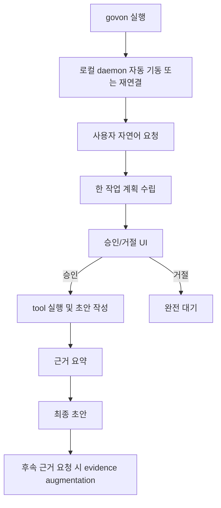

---
hide:
  - navigation
---

# GovOn

GovOn은 행정 업무를 보조하는 **대화형 CLI 셸**이다. 사용자는 `govon`을 실행한 뒤 자연어로 업무를 요청하고, 셸은 로컬 daemon runtime과 연결되어 필요한 검색·조회·작성 도구를 승인 기반으로 사용한다.

## R1 제품 방향

- 제품 표면은 `GovOn Shell`이다.
- 웹/앱 UI는 R1 이후 단계다.
- 내부 runtime은 로컬 FastAPI daemon이다.
- base model은 의도 파악, 작업 계획, tool 선택을 맡는다.
- 민원 답변 작성 단계에서만 civil-response adapter를 사용한다.
- 근거/출처는 필요 시 후속 작업으로 증강한다.

## 핵심 사용자 흐름

## MVP 포함 범위

- 자연어 기반 대화형 CLI
- 로컬 daemon runtime 자동 기동
- 민원 답변 작성
- 외부 API lookup
- 로컬 RAG 검색
- 작업 단위 승인 UI
- SQLite 기반 세션 resume
- 후속 근거/출처 증강

## MVP 제외 범위

- 공문서 작성 adapter
- 분류 기능
- 웹/앱 인터페이스 제품화
- 고급 daemon 운영 명령

## 문서 빠른 링크

- :material-sitemap:{ .lg .middle } **아키텍처**

  ---

  CLI + daemon + approval loop 기준선

  [:octicons-arrow-right-24: 아키텍처 보기](architecture/overview.md)

- :material-file-document-outline:{ .lg .middle } **ADR**

  ---

  유지할 기술 결정을 추적

  [:octicons-arrow-right-24: ADR 보기](architecture/adr/index.md)

- :material-book-open-variant:{ .lg .middle } **개발 가이드**

  ---

  브랜치, PR, 이슈 구조, 개발 규칙

  [:octicons-arrow-right-24: 개발 규칙 보기](guide/development.md)

- :material-server-outline:{ .lg .middle } **배포 구조**

  ---

  CLI와 로컬 daemon 배치 구조

  [:octicons-arrow-right-24: 배포 아키텍처 보기](deployment/architecture.md)

