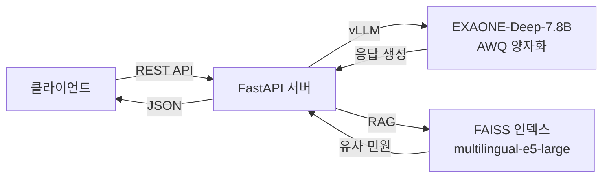

---
hide:
  - navigation
---

# On-Device AI 민원 처리 및 분석 시스템

**EXAONE-Deep-7.8B 기반 경량화 LLM으로 온디바이스에서 실행되는 민원 처리 시스템**

---

## 프로젝트 개요

GovOn은 **현장미러형 연계 프로젝트**로, 실제 현장에서 부딪히는 민원 처리 문제를 해결하기 위해 개발된 On-Device AI 시스템입니다.

LLM을 경량화하여 온디바이스에서 실행하고, 파인튜닝을 통해 현장 산업체에 최적화된 민원 처리 솔루션을 제공합니다.

### 핵심 기술

| 기술 | 설명 |
|------|------|
| **LLM 경량화** | QLoRA 파인튜닝 + AWQ 양자화 (W4A16g128) |
| **추론 엔진** | FastAPI + vLLM 기반 비동기 서빙 |
| **유사 민원 검색** | FAISS IndexFlatIP + multilingual-e5-large 임베딩 RAG |
| **보안** | API Key 인증, Rate Limiting, Prompt Injection 방어 |

---

## 빠른 링크

-   :material-floor-plan:{ .lg .middle } **아키텍처**

    ---

    시스템 구성도, ADR, API 명세, 모델 카드

    [:octicons-arrow-right-24: 아키텍처 보기](architecture/overview.md)

-   :material-flask:{ .lg .middle } **연구 & 실험**

    ---

    모델 분석, 파인튜닝, 양자화, 평가 결과

    [:octicons-arrow-right-24: 연구 결과 보기](research/model-analysis.md)

-   :material-book-open-variant:{ .lg .middle } **개발 가이드**

    ---

    시작하기, 개발 규칙, 트러블슈팅

    [:octicons-arrow-right-24: 가이드 보기](guide/getting-started.md)

-   :material-pipe:{ .lg .middle } **CI/CD**

    ---

    파이프라인, 워크플로우, DORA 메트릭

    [:octicons-arrow-right-24: CI/CD 보기](cicd/overview.md)

-   :material-docker:{ .lg .middle } **배포**

    ---

    Docker, 온라인/오프라인 배포 가이드

    [:octicons-arrow-right-24: 배포 가이드 보기](deployment/docker.md)

-   :material-flag:{ .lg .middle } **마일스톤**

    ---

    M1~M6 프로젝트 진행 현황

    [:octicons-arrow-right-24: 마일스톤 보기](milestones/index.md)

---

## 시스템 아키텍처 요약

---

## DORA Metrics 대시보드

프로젝트의 DevOps 성숙도를 DORA 4대 지표로 측정하고 Grafana Cloud에서 실시간 모니터링합니다.

**[DORA Metrics Dashboard (공개 링크)](https://umyunsang.grafana.net/public-dashboards/a7672d6682fb498eb4578a8634262280)**

| 지표 | 설명 |
|------|------|
| 배포 빈도 | main 브랜치 머지 PR 수 / 주 |
| 리드 타임 | PR 생성 → 머지 평균 시간 |
| 변경 실패율 | hotfix/revert 커밋 비율 |
| MTTR | bug 이슈 open → close 평균 시간 |

---

## 팀원

| 역할 | 이름 | 학번 | 학과 | GitHub |
|------|------|------|------|--------|
| 팀장 | 엄윤상 | 1705817 | AI학과 | [@umyunsang](https://github.com/umyunsang) |
| 팀원 | 장시우 | 2143655 | AI학과 | [@siuJang](https://github.com/siuJang) |
| 팀원 | 이유정 | 2243951 | AI학과 | [@yuujjjj](https://github.com/yuujjjj) |

---

## 라이선스

이 프로젝트는 [MIT License](https://github.com/GovOn-Org/GovOn/blob/main/LICENSE)로 배포됩니다.

!!! note "EXAONE 모델 라이선스"
    이 프로젝트에서 사용하는 EXAONE 모델은 [LGAI EXAONE License](https://huggingface.co/LGAI-EXAONE/EXAONE-Deep-7.8B)의 적용을 받습니다.
