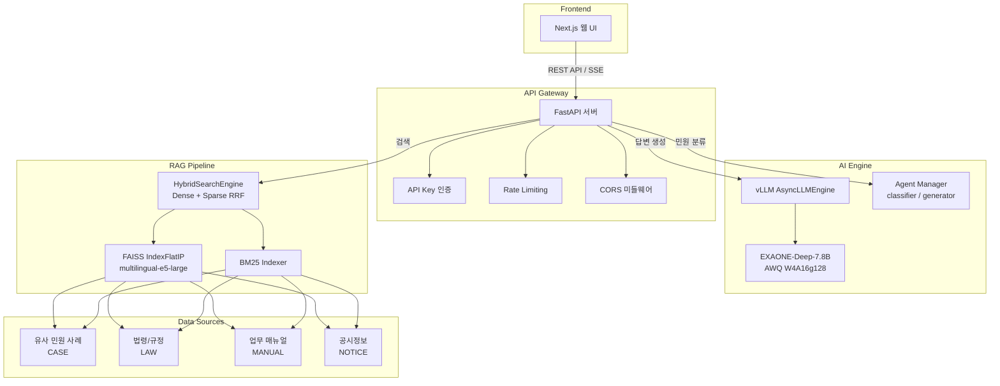

---
hide:
  - navigation
---

# GovOn -- 온프레미스 AI 민원 처리 인프라

**강력한 보안 + 뛰어난 연산 효율 = 실무 공무원 업무 생산성 혁신**

---

## 프로젝트 소개

GovOn은 **동아대학교 SW 현장미러형 연계 프로젝트**로 개발된 온프레미스 AI 기반 민원 처리 인프라입니다. EXAONE-Deep-7.8B 모델을 QLoRA 파인튜닝 후 AWQ 양자화하여, 망 분리된 공공기관 내부 서버에서 민원 분류와 답변 초안 생성을 수행합니다.

**주 사용자는 민원 처리 및 분류를 담당하는 일선 공무원**입니다. GovOn은 공무원의 반복적인 민원 업무 부담을 최소화하면서, 국가 정보 보안을 완벽하게 보장하는 것을 목표로 합니다.

### 정책 배경

국가인공지능전략위원회의 **"대한민국 인공지능 행동계획(2026~2028)"**에 따라 공공 부문의 AI 도입이 가속화되고 있습니다. 그러나 부처 간 데이터 사일로, 공무원의 위험 회피 문화, 행정망 해킹 사고의 현실화 등 공공 AI 도입에는 여전히 구조적 장벽이 존재합니다.

GovOn은 **하이브리드 전략**으로 이 문제를 해결합니다. 민감한 민원 데이터의 핵심 처리는 온프레미스에서, 공개 및 공통 데이터는 클라우드와 연계하는 구조입니다.

---

## AS-IS vs TO-BE

| 구분 | AS-IS (현재) | TO-BE (GovOn 도입 후) |
|------|-------------|----------------------|
| **민원 분류** | 공무원이 직접 읽고 수동 분류 | AI가 카테고리 자동 분류 + 근거 제시 |
| **답변 작성** | 유사 사례를 수작업 검색 후 작성 | RAG 기반 유사 민원 자동 검색 + 답변 초안 생성 |
| **보안** | 외부 클라우드 API 의존 시 정보 유출 위험 | 망 분리 온프레미스 서버에서 전체 처리 |
| **응답 시간** | 민원당 평균 30분 이상 소요 | AI 초안 + 검토로 처리 시간 대폭 단축 |
| **일관성** | 담당자별 답변 품질 편차 | 학습된 모델이 일관된 품질의 답변 생성 |

---

## 시스템 아키텍처

[:octicons-arrow-right-24: 상세 아키텍처 보기](architecture/overview.md)

---

## 4단계 아키텍처

| 단계 | 이름 | 설명 |
|------|------|------|
| **1단계** | 온프레미스 LLM 구축 | EXAONE-Deep-7.8B를 망 분리된 내부 서버에 배포 |
| **2단계** | 파인튜닝 | QLoRA (r=16, lr=2e-4, bf16)로 정부 행정 규정과 민원 데이터 학습 |
| **3단계** | 양자화 | AWQ W4A16g128 적용, 15.6GB에서 4.94GB로 68.3% 감소 |
| **4단계** | 검색 증강 생성 | FAISS + BM25 하이브리드 검색으로 유사 민원 기반 RAG 답변 생성 |

---

## 핵심 성과 지표 (KPI)

| 지표 | 목표 | 현재 |
|------|------|------|
| 민원 분류 정확도 | 90% 이상 | 90% |
| BERTScore | 50 이상 | 46.05 |
| 추론 응답 시간 | 3초 이내 | 2.43초 |
| 모델 크기 절감율 | 60% 이상 | 68.3% (15.6GB → 4.94GB) |
| EOS 생성률 | 50% 이상 | 20% (개선 진행 중) |

---

## 기술 스택

| 영역 | 기술 |
|------|------|
| **기반 모델** | EXAONE-Deep-7.8B (LG AI Research, Apache 2.0) |
| **파인튜닝** | QLoRA + SFTTrainer + W&B |
| **양자화** | AutoAWQ (W4A16g128) |
| **추론 서빙** | FastAPI + vLLM (AsyncLLMEngine, PagedAttention) |
| **벡터 검색** | FAISS IndexFlatIP + multilingual-e5-large (dim=1024) |
| **키워드 검색** | BM25 (하이브리드 RRF 융합) |
| **프론트엔드** | Next.js |
| **CI/CD** | GitHub Actions |
| **컨테이너** | Docker |
| **실험 추적** | Weights & Biases |
| **모니터링** | Grafana Cloud (DORA Metrics) |

---

## 프로젝트 진행 현황

| 마일스톤 | 내용 | 상태 |
|----------|------|------|
| **M1** | 기획 및 요구사항 정의 | 완료 |
| **M2** | 핵심 MVP (모델 학습, 추론 서버, RAG) | 완료 |
| **M3** | 시스템 고도화 (Agent, 하이브리드 검색, UI) | 진행 중 (46%) |
| **M4** | 테스트 및 최종 발표 | 예정 |

총 95개 이슈 중 45개 완료 (47% 진행률)

[:octicons-arrow-right-24: 마일스톤 상세 보기](milestones/index.md)

---

## 빠른 링크

-   :material-floor-plan:{ .lg .middle } **아키텍처**

    ---

    시스템 구성도, ADR, API 명세, 모델 카드

    [:octicons-arrow-right-24: 아키텍처 보기](architecture/overview.md)

-   :material-flask:{ .lg .middle } **연구 & 실험**

    ---

    모델 분석, 파인튜닝, 양자화, 평가 결과

    [:octicons-arrow-right-24: 연구 결과 보기](research/model-analysis.md)

-   :material-book-open-variant:{ .lg .middle } **개발 가이드**

    ---

    시작하기, 개발 규칙, 트러블슈팅

    [:octicons-arrow-right-24: 가이드 보기](guide/getting-started.md)

-   :material-pipe:{ .lg .middle } **CI/CD**

    ---

    파이프라인, 워크플로우, DORA 메트릭

    [:octicons-arrow-right-24: CI/CD 보기](cicd/overview.md)

-   :material-docker:{ .lg .middle } **배포**

    ---

    Docker, 온라인/오프라인 배포 가이드

    [:octicons-arrow-right-24: 배포 가이드 보기](deployment/docker.md)

-   :material-flag:{ .lg .middle } **마일스톤**

    ---

    M1~M4 프로젝트 진행 현황

    [:octicons-arrow-right-24: 마일스톤 보기](milestones/index.md)

---

## DORA Metrics 대시보드

프로젝트의 DevOps 성숙도를 DORA 4대 지표로 측정하고 Grafana Cloud에서 실시간 모니터링합니다.

**[DORA Metrics Dashboard (공개 링크)](https://umyunsang.grafana.net/public-dashboards/a7672d6682fb498eb4578a8634262280)**

| 지표 | 설명 |
|------|------|
| 배포 빈도 | main 브랜치 머지 PR 수 / 주 |
| 리드 타임 | PR 생성에서 머지까지 평균 시간 |
| 변경 실패율 | hotfix/revert 커밋 비율 |
| MTTR | bug 이슈 open에서 close까지 평균 시간 |

---

## 팀 정보

**동아대학교 AI학과** | 지도교수: 천세진 (sjchun@dau.ac.kr)

| 역할 | 이름 | 학번 | GitHub |
|------|------|------|--------|
| 팀장 | 엄윤상 | 1705817 | [@umyunsang](https://github.com/umyunsang) |
| 팀원 | 장시우 | 2143655 | [@siuJang](https://github.com/siuJang) |
| 팀원 | 이유정 | 2243951 | [@yuujjjj](https://github.com/yuujjjj) |

---

## 라이선스

이 프로젝트는 [MIT License](https://github.com/GovOn-Org/GovOn/blob/main/LICENSE)로 배포됩니다.

!!! note "EXAONE 모델 라이선스"
    EXAONE-Deep-7.8B 모델은 [Apache 2.0 License](https://huggingface.co/LGAI-EXAONE/EXAONE-Deep-7.8B)의 적용을 받습니다. 공공기관 내부 배포 및 수정에 법적 제약이 없습니다.
