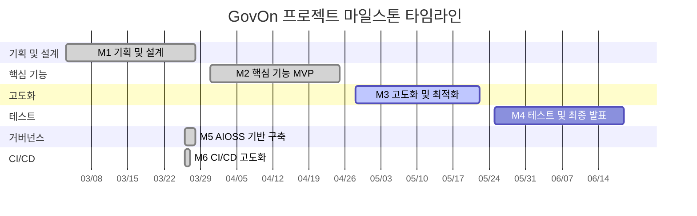
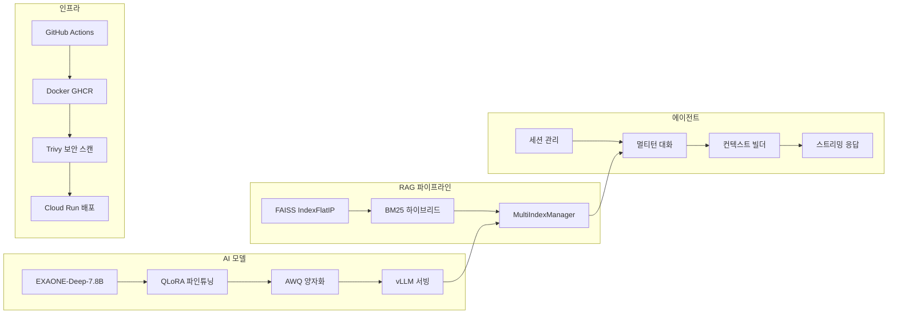

# 마일스톤 개요

GovOn 프로젝트는 7개의 마일스톤으로 구성되어 있다. 각 마일스톤은 기획부터 CI/CD 고도화까지 점진적으로 시스템을 완성해 나가는 구조이다.

---

## 타임라인

---

## 진행 현황 요약

| 마일스톤 | 기간 | 핵심 목표 | 진행률 | 상태 |
|----------|------|-----------|--------|------|
| [M1: 기획 및 설계](m1.md) | W1--W4 | 시스템 아키텍처, EXAONE 모델 분석, 데이터 수집 계획 | 90% | 완료 |
| [M2: 핵심 기능 MVP](m2.md) | W5--W8 | QLoRA 파인튜닝, AWQ 양자화, HuggingFace 배포 | 75% | 완료 |
| [M3: 고도화 및 최적화](m3.md) | W9--W12 | vLLM 서빙, RAG 파이프라인, 에이전트 시스템 | 46% | 진행 중 |
| [M4: 테스트 및 최종 발표](m4.md) | W13--W16 | 통합 테스트, UAT, 최종 검증 | 0% | 예정 |
| [M5: AIOSS 기반 구축](m5.md) | -- | OSS 거버넌스, 라이선스 분석, Inner Source | 100% | 완료 |
| [M6: CI/CD 고도화](m6.md) | -- | GitHub Actions, Docker GHCR, Shift-Left 테스트 | 100% | 완료 |

---

## 이슈 현황

- **총 이슈 수**: 95개
- **완료**: 45개 (47%)
- **진행 중 / 예정**: 50개 (53%)

---

## 기술 스택 전체 구성

---

## 마일스톤별 상세 페이지

각 마일스톤의 상세 내용은 아래 링크에서 확인할 수 있다.

- **[M1: 기획 및 설계](m1.md)** -- 프로젝트 킥오프, 시스템 설계, 데이터 수집 환경 구축
- **[M2: 핵심 기능 MVP](m2.md)** -- 모델 파인튜닝, 양자화, 성능 평가
- **[M3: 고도화 및 최적화](m3.md)** -- vLLM 도입, RAG, 에이전트 아키텍처
- **[M4: 테스트 및 최종 발표](m4.md)** -- 통합 테스트, UAT, 최종 발표
- **[M5: AIOSS 기반 구축](m5.md)** -- OSS 거버넌스, 라이선스, Inner Source
- **[M6: CI/CD 고도화](m6.md)** -- 자동화 파이프라인, 보안, 오프라인 배포
