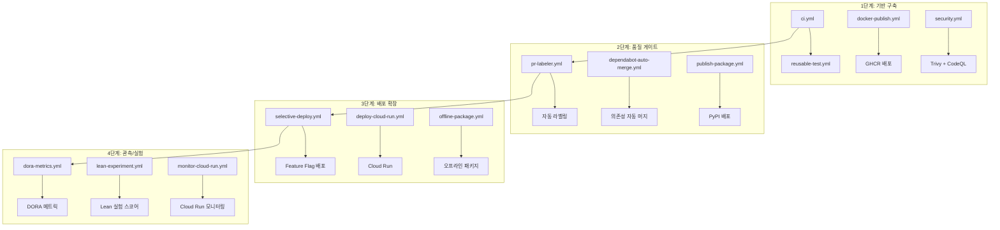

# M6: CI/CD 고도화

| 항목 | 내용 |
|------|------|
| **상태** | 완료 (100%) |
| **핵심 목표** | GitHub Actions 자동화, Docker GHCR + Trivy, Shift-Left 테스트, 오프라인 배포 |
| **관련 PR** | #238 -- #283 (2026-03-27 완료) |

---

## 개요

M6 단계에서는 4단계에 걸쳐 CI/CD 파이프라인을 체계적으로 고도화했다. 총 16개의 GitHub Actions 워크플로우를 구축하여 코드 품질, 보안, 배포, 모니터링을 자동화하고, 폐쇄망 환경을 위한 오프라인 배포 패키지를 제공한다.

---

## 4단계 고도화 구조



---

## 워크플로우 목록

### 1단계: CI/CD 기반 구축

| 워크플로우 | 파일 | 트리거 | 역할 |
|-----------|------|--------|------|
| CI Pipeline | `ci.yml` | push, PR | Lint, 테스트, 커버리지 가드 |
| Reusable Test | `reusable-test.yml` | 호출 | 재사용 가능 테스트 잡 |
| Docker Publish | `docker-publish.yml` | push(main), tag | GHCR 이미지 빌드 및 푸시 |
| Security Scan | `security.yml` | push, PR, schedule | Trivy 컨테이너 스캔 + CodeQL 분석 |

### 2단계: 품질 게이트 강화

| 워크플로우 | 파일 | 트리거 | 역할 |
|-----------|------|--------|------|
| PR Labeler | `pr-labeler.yml` | PR | 변경 파일 기반 자동 라벨링 |
| Dependabot Auto-merge | `dependabot-auto-merge.yml` | PR (dependabot) | patch/minor 업데이트 자동 머지 |
| Publish Package | `publish-package.yml` | release | PyPI 패키지 배포 |

### 3단계: 배포 전략 확장

| 워크플로우 | 파일 | 트리거 | 역할 |
|-----------|------|--------|------|
| Selective Deploy | `selective-deploy.yml` | push(main) | Feature Flag 기반 선택적 배포 |
| Deploy Cloud Run | `deploy-cloud-run.yml` | push(main), tag | Google Cloud Run 배포 |
| Offline Package | `offline-package.yml` | release, 수동 | 폐쇄망용 오프라인 배포 패키지 생성 |

### 4단계: 관측 및 실험

| 워크플로우 | 파일 | 트리거 | 역할 |
|-----------|------|--------|------|
| DORA Metrics | `dora-metrics.yml` | schedule (daily) | 배포 빈도, 리드 타임, MTTR 측정 |
| Lean Experiment | `lean-experiment.yml` | schedule, 수동 | Lean Startup 실험 스코어 산출 |
| Monitor Cloud Run | `monitor-cloud-run.yml` | schedule | Cloud Run 서비스 헬스 모니터링 |
| Model Evaluation | `model-eval.yml` | 수동 | 모델 성능 평가 파이프라인 |
| E2E Test | `e2e.yml` | push, PR | End-to-End 통합 테스트 |
| Deploy Pages | `deploy-pages.yml` | push(main) | MkDocs 문서 사이트 배포 |

---

## Docker GHCR + Trivy 보안

### Docker 이미지 빌드 및 배포

`docker-publish.yml`이 main 브랜치 push 또는 태그 생성 시 Docker 이미지를 빌드하여 GitHub Container Registry(GHCR)에 배포한다.

```
코드 Push / Tag
    |
    v
Docker Build (멀티 스테이지)
    |
    v
Trivy 취약점 스캔
    |
    v  CRITICAL/HIGH 취약점 0건 확인
GHCR Push (ghcr.io/govon-org/govon)
```

### 보안 스캔 구성

`security.yml`이 매일 정기 스캔과 PR/push 시 실시간 스캔을 수행한다.

| 스캔 유형 | 도구 | 대상 | 기준 |
|-----------|------|------|------|
| 컨테이너 취약점 | Trivy | Docker 이미지 | CRITICAL/HIGH 0건 |
| 코드 분석 | CodeQL | Python 소스 | 보안 패턴 위반 0건 |
| 의존성 취약점 | Dependabot | requirements.txt | 알려진 CVE 0건 |

---

## Shift-Left 테스트 + 커버리지 가드

`ci.yml`에서 모든 PR에 대해 린트, 테스트, 커버리지를 검증한다.

### 테스트 파이프라인

```
PR 생성
    |
    v
Black (코드 포맷팅) + isort (임포트 정렬) + flake8 (린트)
    |
    v
pytest --cov=src (단위 테스트 + 커버리지)
    |
    v  커버리지 기준 미달 시 실패
PR 머지 가능
```

### 재사용 가능 테스트

`reusable-test.yml`은 여러 워크플로우에서 호출 가능한 공용 테스트 잡이다. Python 버전 매트릭스, 캐싱, 의존성 설치를 표준화하여 중복을 제거했다.

---

## 오프라인 배포 패키지

공공기관 폐쇄망 환경에서 인터넷 연결 없이 시스템을 설치할 수 있도록 오프라인 배포 패키지를 생성한다.

### 패키지 구성

`offline-package.yml`이 릴리즈 생성 시 자동으로 아래 항목을 번들링한다.

| 구성 요소 | 내용 |
|----------|------|
| Docker 이미지 | `docker save`로 추출한 tar 파일 |
| Python 패키지 | pip wheel 파일 (오프라인 설치용) |
| 설치 스크립트 | `install.sh` -- 원커맨드 설치 |
| 설정 파일 | docker-compose.yml, 환경 변수 템플릿 |

### 폐쇄망 설치 절차

```bash
# 1. 오프라인 패키지를 USB 등으로 폐쇄망 서버에 전달
# 2. 압축 해제 및 설치
tar xzf govon-offline-v1.0.0.tar.gz
cd govon-offline-v1.0.0
./install.sh
```

---

## Lean Startup 실험

`lean-experiment.yml`은 프로젝트의 Lean Startup 실험 메트릭을 자동으로 산출한다.

### 측정 항목

| 메트릭 | 설명 |
|--------|------|
| 이슈 완료율 | 전체 이슈 대비 완료 이슈 비율 |
| PR 머지 속도 | PR 생성 후 머지까지 평균 소요 시간 |
| 테스트 커버리지 | 코드 커버리지 비율 |
| 실험 가설 검증률 | 마일스톤별 가설 달성 비율 |

---

## DORA 메트릭

`dora-metrics.yml`은 매일 DevOps 핵심 지표를 수집한다.

| DORA 메트릭 | 설명 | 측정 방법 |
|-------------|------|----------|
| Deployment Frequency | 배포 빈도 | main 브랜치 push 횟수 |
| Lead Time for Changes | 변경 리드 타임 | 커밋에서 배포까지 소요 시간 |
| Mean Time to Restore | 평균 복구 시간 | 장애 발생에서 해결까지 소요 시간 |
| Change Failure Rate | 변경 실패율 | 배포 후 롤백 비율 |

---

## Feature Flag 기반 배포

`selective-deploy.yml`은 Feature Flag를 기반으로 기능 단위의 선택적 배포를 수행한다. 새로운 기능을 전체 사용자에게 한 번에 배포하지 않고, 특정 조건(환경, 사용자 그룹)에 따라 점진적으로 릴리즈할 수 있다.

---

## Cloud Run 배포 및 모니터링

### 배포

`deploy-cloud-run.yml`이 main 브랜치 push 또는 태그 생성 시 Google Cloud Run에 자동 배포한다.

### 모니터링

`monitor-cloud-run.yml`이 정기적으로 Cloud Run 서비스의 헬스 상태를 확인한다.

| 모니터링 항목 | 설명 |
|-------------|------|
| 서비스 상태 | 실행 중 / 정지 확인 |
| 응답 시간 | 헬스체크 엔드포인트 레이턴시 |
| 에러율 | 최근 배포 후 5xx 에러 비율 |

---

## 관련 PR

M6 고도화는 총 46개의 PR(#238 -- #283)을 통해 완료되었다. 모든 작업은 2026-03-27에 마무리되었다.
