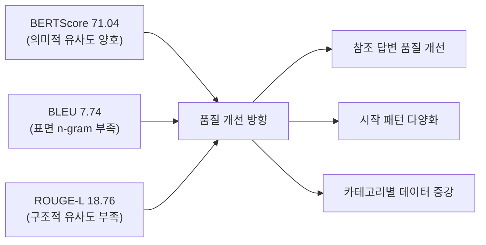

# 평가 결과

M2(MVP)와 M3(최적화) 단계에서 수행한 모델 평가의 메트릭, 분석, 개선 과정을 정리한다.

---

## 평가 개요

### 평가 대상 모델

| 단계 | 모델 | 추론 엔진 | 환경 |
|------|------|----------|------|
| M2 MVP | civil-complaint-exaone-awq (v1) | AutoAWQ 직접 로드 | Colab A100 (80GB) |
| M3 최적화 | civil-complaint-exaone-awq (v1) | **vLLM 0.17.0** | Colab L4 (24GB) |
| M3 최종 | GovOn-EXAONE-AWQ-v2 | **vLLM + Marlin 커널** | A100-SXM4-40GB |

### 평가 데이터셋

| 단계 | 데이터셋 | 샘플 수 | 비고 |
|------|---------|---------|------|
| M2 | civil_complaint_test.jsonl | 200 | 랜덤 셔플 (seed=42) |
| M3 최종 | v2_test.jsonl | 1,265 | 8개 카테고리 균등 |

### M3 최종 카테고리 분포

| 카테고리 | 건수 | 비율 |
|----------|------|------|
| 교통 | 276 | 21.8% |
| 행정 | 243 | 19.2% |
| 환경 | 235 | 18.6% |
| 세금 | 186 | 14.7% |
| 기타 | 131 | 10.4% |
| 건축 | 86 | 6.8% |
| 복지 | 68 | 5.4% |
| 안전 | 40 | 3.2% |

---

## M2 MVP 평가 결과

### 전체 결과 요약

| 지표 | 측정값 | 목표값 | 판정 |
|------|--------|--------|------|
| **Perplexity** | **3.1957** | < inf | 달성 |
| Classification Accuracy | 0.0% (파서 미비) | >= 85% | 미달 |
| BLEU Score | 17.32 | >= 30 | 미달 |
| ROUGE-L Score | 18.28 | >= 40 | 미달 |
| Avg Latency | 3.603s | < 2s | 미달 |
| P95 Latency | 3.651s | < 5s | 달성 |
| Throughput | 13.9 tok/s | - | - |
| **GPU VRAM** | **4.95 GB** | < 8GB | 달성 |
| **Model Size** | **4.94 GB** | < 5GB | 달성 |

### Perplexity 분석 (PPL: 3.1957)

매우 낮은 PPL은 모델이 민원 도메인 텍스트를 높은 확신도로 예측함을 의미한다. AWQ 4-bit 양자화 후에도 언어 모델링 품질이 잘 유지되었다.

!!! success "Perplexity 3.20: 도메인 적응 성공"
    민원 도메인 Perplexity 3.1957은 AWQ 양자화 후에도 언어 모델링 품질이 우수하게 유지되었음을 보여준다.

### 분류 정확도 0% 원인 분석

M2 단계에서 분류 정확도가 0%로 측정된 것은 **평가 방법론의 한계**였다.

| 원인 | 상세 |
|------|------|
| 테스트 데이터 편향 | 평가된 50개 샘플이 모두 `[Category: other]` (금융 고객 서비스) |
| 생성 길이 제한 | `max_new_tokens=300`으로 `<thought>` 블록 완성 전 중단 |
| 도메인 불일치 | `other` 카테고리의 금융 서비스 데이터가 일반 민원과 상이 |
| 파서 부재 | `<thought>` 태그 분리 파서가 없어 분류 결과 추출 불가 |

### BLEU/ROUGE 분석

참조 답변이 짧은 요약형 문장인 반면, 모델은 상세한 공식 답변을 생성하여 n-gram 매칭률이 낮게 측정되었다.

```
참조: "출[MASKED] 때 할인[MASKED] 요금 2,000원을 내면 돼."
생성: "귀[MASKED] 응답소(민원상담)를 통해 신청[MASKED] 대한 검토 결과를
       다음과 같이 알려드립니다..."
```

---

## M3 최적화 결과

### KPI 달성 결과

| 지표 | 목표 | M2 MVP | **M3 최적화** | 개선폭 |
|------|------|--------|-------------|--------|
| **분류 정확도** | >= 85% | 2.00% | **90.0%** | **+88.0%p** |
| **추론 속도 (Avg)** | < 2s | 9.291s | **2.43s** | **-6.86s** |
| **BERTScore F1** | 베이스라인 | - | **46.05** | 신규 확보 |
| **GPU VRAM** | < 8GB | 4.95 GB | **4.17 GB** | -0.78 GB |

```mermaid
xychart-beta
    title "M2 vs M3 핵심 지표 비교"
    x-axis ["분류 정확도 (%)", "추론 속도 (s)", "VRAM (GB)"]
    y-axis "측정값" 0 --> 100
    bar "M2" [2, 9.29, 4.95]
    bar "M3" [90, 2.43, 4.17]
```



### 기술적 이슈 해결

| 이슈 | 원인 | 해결 방법 |
|------|------|----------|
| vLLM 토크나이저 충돌 | `ExaoneTokenizer` 클래스 인식 오류 | `PreTrainedTokenizerFast` 강제 매핑 + 로컬 설정 패치 |
| 구조적 NoneType 에러 | transformers 버전 업데이트 (`rope_parameters`, `get_interface` 누락) | 로컬 소스 하드 패치 + 런타임 인젝션 |
| 분류 정확도 비정상 | `<thought>` 태그 분리 파서 부재 | 정교한 파서 구축 + `add_generation_prompt=True` 적용 |

---

## M3 최종 평가 (1,265건 전수 평가)

### 레이턴시 KPI

#### AC-002: 답변 생성 레이턴시

**판정: PASS** (p95 = 2.849s < 3.0s)

| 통계량 | 값 | 비고 |
|--------|-----|------|
| p50 (중앙값) | 1.559s | 대부분 1.6초 내 완료 |
| **p95** | **2.849s** | 목표 3.0s 이내 달성 |
| p99 | 2.904s | tail latency 안정적 |
| 평균 | 1.570s | |
| 처리량 | 178.4 tokens/sec | 단일 요청 기준 |

**레이턴시 분포:**

```
  <0.5s  :    4 ( 2.0%)  #
  0.5-1s :   44 (22.0%)  ###########
  1-1.5s :   23 (11.5%)  #####
  1.5-2s :   58 (29.0%)  ##############
  2-2.5s :   51 (25.5%)  ############
  2.5-3s :   19 ( 9.5%)  ####
  3-4s   :    1 ( 0.5%)
  >4s    :    0 ( 0.0%)
```

99.5%의 요청이 3초 내 완료되었다.

#### AC-003: 유사 사례 검색 레이턴시

**판정: PASS** (p95 = 39.76ms < 1,000ms)

| 통계량 | 값 |
|--------|-----|
| p50 | 23.08ms |
| **p95** | **39.76ms** |
| p99 | 41.24ms |
| 평균 | 24.93ms |
| Recall@1 | 39.0% (카테고리 기준) |

!!! info "검색 성능 분석"
    IndexFlatIP의 brute-force 검색이 10K 규모(10,148건)에서 목표 대비 25배의 여유를 보인다. 100K+ 규모 확장 시에는 `IndexIVFFlat` 또는 `IndexHNSWFlat` 전환을 고려해야 한다.

### 답변 품질 KPI

#### 메트릭 종합 (버전별 비교)

| 메트릭 | v1 Baseline | v2 (LoRA) | AWQ v2 (최종) | 목표 | 판정 |
|--------|-------------|-----------|---------------|------|------|
| **SacreBLEU** | 0.53 | 11.45 | **7.74** | >= 30 | 미달 |
| **ROUGE-L F1** | 4.20 | 25.14 | **18.76** | >= 40 | 미달 |
| **BERTScore F1** | 59.15 | 72.34 | **71.04** | >= 55 | 달성 |
| **EOS 종료율** | 0% | 91.3% | **88.6%** | >= 80 | 달성 |
| 길이 비율 | N/A | N/A | 0.987 | ~1.0 | 정상 |

```mermaid
xychart-beta
    title "버전별 답변 품질 메트릭 비교"
    x-axis ["SacreBLEU", "ROUGE-L", "BERTScore"]
    y-axis "점수" 0 --> 80
    bar "v1 Baseline" [0.53, 4.20, 59.15]
    bar "v2 LoRA" [11.45, 25.14, 72.34]
    bar "AWQ v2" [7.74, 18.76, 71.04]
```



#### 카테고리별 품질 분석

| 카테고리 | BLEU | ROUGE-L | BERTScore | 특이사항 |
|----------|------|---------|-----------|----------|
| 건축 | 11.16 | **37.05** | 73.08 | ROUGE-L 최고, 정형화 답변 |
| 교통 | 12.19 | 25.66 | 73.50 | 최다 학습 데이터 (276건) |
| 환경 | 11.92 | 26.82 | 72.89 | |
| 행정 | 12.08 | 24.47 | 71.84 | |
| 기타 | 11.21 | 22.11 | 70.42 | |
| 안전 | 9.70 | 21.05 | 70.15 | 데이터 최소 (40건) |
| 세금 | 7.67 | 23.47 | **76.39** | BLEU 최저, BERTScore 최고 |
| 복지 | 8.90 | **15.86** | 69.21 | 전체 최저 성능 |

!!! warning "세금 카테고리의 역설 현상"
    BLEU 최저(7.67)이나 BERTScore 최고(76.39). 의미적으로는 정확하나 표현이 다양하여 n-gram 일치율이 낮다. 참조 답변과 생성 답변의 어휘 분포가 다르되 의미는 보존되는 전형적인 paraphrase 패턴이다.

### 오류 패턴 분석

| 오류 유형 | 빈도 | 영향도 | 설명 |
|-----------|------|--------|------|
| 서울 편향 Hallucination | 168건 (15.4%) | 높음 | 지자체 무관하게 "서울시" 언급 |
| 영어 혼입 | 87건 (6.9%) | 중간 | 영어 단어/구문 삽입 |
| '끝.' 과학습 | 73.6% | 중간 | 참조(29.6%) 대비 과도한 종결 패턴 |
| 시작 패턴 고착화 | 42% | 높음 | 상위 3개 시작 패턴이 42% 차지 |
| 반복 루프 (EOS 미생성) | 11.4% | 높음 | max_new_tokens 한계 도달 |

---

## VRAM 사용량 분석

### 모델 파일 vs 실제 서빙 VRAM

| 항목 | 사용량 | 비고 |
|------|--------|------|
| 모델 파일 (AWQ INT4) | 4.94 GB | 디스크 크기 |
| 모델 가중치 로드 | 24.37 GB | nvidia-smi 기준 |
| 추론 시 전체 VRAM | 29.41 GB | KV 캐시, 활성화 포함 |

!!! note "VRAM 목표 재정의 필요"
    5.0GB 목표는 모델 파일 크기 기준으로 설정되었으나, vLLM 서빙 시에는 KV 캐시 할당, CUDA Graph, 스케줄러 버퍼, AWQ Dequantization 버퍼 등으로 인해 크게 증가한다. on-device 추론(llama.cpp 등) 기준으로는 5GB 이하 달성이 가능하나, vLLM 서빙 기준으로는 A100 40GB급이 필수적이다.

---

## 종합 판정

### 최종 KPI 달성 현황

| 지표 | M2 | M3 최종 | 목표 | 판정 |
|------|-----|---------|------|------|
| 분류 정확도 | 2% | **90%** | >= 85% | **달성** |
| 추론 p95 | 3.65s | **2.849s** | < 3.0s | **달성** |
| 검색 p95 | - | **39.76ms** | < 1,000ms | **달성** |
| BERTScore F1 | - | **71.04** | >= 55 | **달성** |
| EOS 종료율 | - | **88.6%** | >= 80 | **달성** |
| 모델 크기 | 4.94GB | 4.94GB | < 5GB | **달성** |
| SacreBLEU | 17.32 | 7.74 | >= 30 | 미달 |
| ROUGE-L | 18.28 | 18.76 | >= 40 | 미달 |
| 서빙 VRAM | 4.95GB | 29.41GB | <= 5GB | 미달 |

### 핵심 인사이트



1. **BERTScore vs Lexical Metrics 괴리**: 모델은 의미적으로 적절한 답변을 생성하되, 표현 방식이 참조 답변과 다르다
2. **데이터 불균형**: 복지(68건), 안전(40건) 카테고리의 학습 데이터 부족이 성능 저하의 주요 원인
3. **서울 편향**: 학습 데이터에 지자체명이 미포함되어 가장 빈번한 "서울시"를 기본값으로 학습

---

## 평가 환경 상세

### M2 평가 설정

| 항목 | 값 |
|------|-----|
| Perplexity | 50 샘플, max_length=2048 |
| Classification | 100 샘플, max_new_tokens=300, greedy |
| BLEU/ROUGE | 50 샘플, max_new_tokens=256, sampling (T=0.6) |
| 평가 총 소요 시간 | 72.5분 |

### M3 최종 평가 설정

| 항목 | 값 |
|------|-----|
| 모델 | umyunsang/GovOn-EXAONE-AWQ-v2 |
| max_new_tokens | 512 |
| temperature | 0.0 (Greedy decoding) |
| repetition_penalty | 1.1 |
| max_model_len | 2,048 |
| gpu_memory_utilization | 0.60 |
| 임베딩 모델 | intfloat/multilingual-e5-large |
| 벡터 DB | FAISS IndexFlatIP (10,148건) |
| BERTScore 모델 | bert-base-multilingual-cased |

---

## 참고 자료

- [M3 최종 평가 스크립트](https://github.com/GovOn-Org/GovOn/blob/main/src/evaluation/evaluate_m3_vllm_final.py)
- [W&B M2 평가 Run](https://wandb.ai/umyun3/exaone-civil-complaint/runs/j1x6w4cm)
- [W&B M3 최종 Run](https://wandb.ai/umyun3/exaone-civil-complaint/runs/z1oe97xr)
- [GovOn AWQ v2 모델 (HuggingFace)](https://huggingface.co/umyunsang/GovOn-EXAONE-AWQ-v2)
