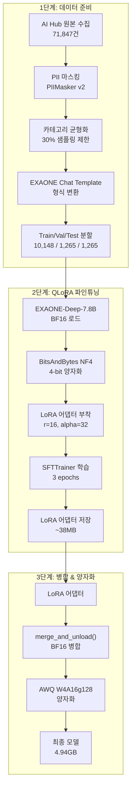
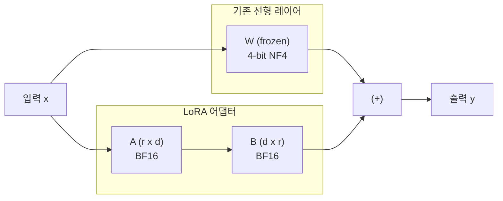
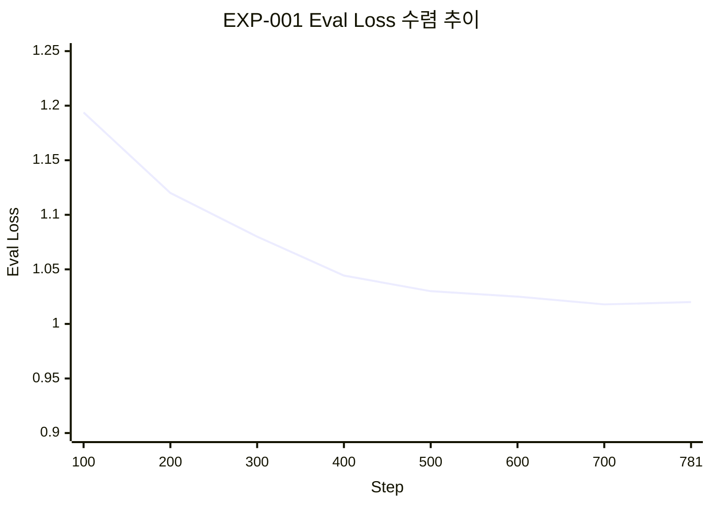

# 파인튜닝: QLoRA 실험

EXAONE-Deep-7.8B 모델을 민원 도메인에 특화하기 위한 QLoRA 파인튜닝 실험 설계, 실행 과정, 결과를 정리합니다.

---

## 실험 목적과 가설

### 연구 목적

한국어 특화 LLM인 EXAONE-Deep-7.8B를 민원 도메인에 특화하여 파인튜닝하고, 온프레미스 환경 배포를 위한 최적의 양자화 기법을 검증합니다.

### 핵심 가설

| 가설 | 내용 | 검증 기준 |
|------|------|----------|
| **H1** | QLoRA 4-bit 상태 파인튜닝으로 민원 분류 정확도 85% 이상 달성 | Test set accuracy |
| **H2** | AI Hub 민원 데이터 파인튜닝으로 일반 도메인 대비 30%p 이상 성능 향상 | 도메인 비교 |
| **H3** | AWQ 4-bit 양자화 시 크기 50%+ 감소, 속도 2배+ 향상, 성능 저하 5% 미만 | 압축률/속도 측정 |
| **H4** | EXAONE Chat Template 적용 시 답변 품질 향상 | 생성 품질 비교 |

---

## 실험 파이프라인



---

## QLoRA 방법론

### QLoRA란?

QLoRA(Quantized Low-Rank Adaptation)는 양자화된 대규모 모델에 Low-Rank 어댑터를 부착하여 파인튜닝하는 기법입니다. 전체 모델을 4-bit로 양자화한 상태에서 소량의 학습 가능한 파라미터(LoRA 어댑터)만 업데이트합니다.



| 구성 요소 | 설명 |
|-----------|------|
| **원본 가중치 (W)** | NF4 4-bit로 양자화, 동결(frozen) |
| **LoRA A 행렬** | 다운프로젝션 (d -> r), BF16 학습 가능 |
| **LoRA B 행렬** | 업프로젝션 (r -> d), BF16 학습 가능 |
| **스케일링** | alpha/r = 32/16 = 2.0 |

### 양자화 설정 (`BitsAndBytesConfig`)

```python
bnb_config = BitsAndBytesConfig(
    load_in_4bit=True,
    bnb_4bit_quant_type="nf4",          # NormalFloat4
    bnb_4bit_compute_dtype=torch.bfloat16,  # 연산은 BF16
    bnb_4bit_use_double_quant=True,      # 이중 양자화
)
```

| 파라미터 | 값 | 설명 |
|---------|-----|------|
| `load_in_4bit` | `True` | 모델을 4-bit로 양자화하여 로드 |
| `bnb_4bit_quant_type` | `nf4` | NormalFloat4: 정규분포 가중치에 최적화된 양자화 |
| `bnb_4bit_compute_dtype` | `bfloat16` | 역전파 시 BF16 정밀도로 연산 |
| `bnb_4bit_use_double_quant` | `True` | 양자화 상수도 양자화하여 추가 메모리 절감 |

### LoRA 설정 (`LoraConfig`)

```python
lora_config = LoraConfig(
    r=16,
    lora_alpha=32,
    target_modules=[
        "q_proj", "k_proj", "v_proj", "o_proj",  # Attention
        "gate_proj", "up_proj", "down_proj",       # FFN (MLP)
    ],
    lora_dropout=0.05,
    bias="none",
    task_type="CAUSAL_LM",
)
```

전체 7.8B 파라미터 중 약 0.5% 미만의 파라미터만 학습합니다.

---

## SFTTrainer 구성

[TRL(Transformer Reinforcement Learning)](https://huggingface.co/docs/trl) 라이브러리의 `SFTTrainer`를 사용하여 Supervised Fine-Tuning을 수행합니다.

### 학습 하이퍼파라미터

| 파라미터 | 값 | 비고 |
|---------|-----|------|
| Batch Size | 4 (v2) / 2 (v1) | Per-device |
| Gradient Accumulation | 4 (v2) / 8 (v1) | Effective Batch Size: 16 |
| Learning Rate | 2e-4 | |
| Epochs | 3 (Full) / 1 (EXP-001 Baseline) | |
| Max Seq Length | 2,048 | EXAONE 최대 32K 중 학습 효율 위해 제한 |
| Optimizer | paged_adamw_8bit | 메모리 효율 최적화 |
| Scheduler | cosine | |
| Warmup Ratio | 0.03 | |
| Weight Decay | 0.01 | |
| Max Grad Norm | 1.0 | |
| Precision | BF16 + TF32 | |
| Gradient Checkpointing | True | 메모리 절감 |
| Eval Strategy | steps (100 step 간격) | |
| Save Strategy | steps (100 step 간격) | |
| `save_total_limit` | 3 | 최신 3개 체크포인트만 유지 |
| `load_best_model_at_end` | True | 최적 체크포인트 자동 로드 |

### 데이터 포맷팅

`formatting_prompts_func`을 통해 각 샘플을 EXAONE Chat Template 형식으로 변환합니다.

```python
messages = [
    {"role": "system", "content": "당신은 지자체 민원 담당 공무원을 돕는 AI 어시스턴트입니다."},
    {"role": "user", "content": f"{instruction}\n\n{input}"},
    {"role": "assistant", "content": output},
]
text = tokenizer.apply_chat_template(messages, tokenize=False)
```

변환 결과:
```text
[|system|]
당신은 지자체 민원 담당 공무원을 돕는 AI 어시스턴트입니다.
[|endofturn|]
[|user|]
{instruction}

{input}
[|endofturn|]
[|assistant|]
{output}
[|endofturn|]
```

### W&B 실험 추적 연동

`TrainingArguments`에서 `report_to="wandb"`를 설정하여 모든 학습 메트릭을 자동으로 W&B에 기록합니다.

```python
training_args = TrainingArguments(
    report_to="wandb",
    run_name=f"exaone-qlora-{datetime.now().strftime('%Y%m%d-%H%M')}",
    logging_steps=10,
    # ...
)
```

추적되는 메트릭: `train_loss`, `eval_loss`, `learning_rate`, `train_runtime`, `train_samples_per_second`

---

## 데이터셋 구성

### AI Hub 데이터셋

| 데이터셋 번호 | 명칭 | 예상 규모 | 용도 | 우선순위 |
|-------------|------|----------|------|---------|
| **71852** | 공공 민원 상담 LLM 데이터 | 150,000건+ | **주 학습 데이터** (Instruction Tuning) | 1 |
| **71844** | 민간 민원 상담 LLM 데이터 | 200,000건+ | 보조 학습 데이터 (도메인 확장) | 2 |

### 데이터 분할

```python
SPLIT_RATIOS = {
    "train": 0.80,      # 80% 학습용
    "validation": 0.10,  # 10% 검증용
    "test": 0.10         # 10% 평가용
}
```

### 전처리 파이프라인

1. **PII 마스킹**: `PIIMasker`로 이름, 주민번호, 전화번호 등 개인정보 자동 탐지 및 마스킹
2. **데이터 정제**: 중복 제거, 길이 필터링 (최소 20자 이상)
3. **카테고리 균형화**: 카테고리별 30% 샘플링 제한으로 편향 해소 (v2 개선)
4. **포맷 변환**: EXAONE Chat Template 형식으로 변환

---

## 실험 설계

### 하이퍼파라미터 탐색 (Issue #67)

| 실험 ID | 변경 변수 | 설정값 | 목적 |
|---------|----------|--------|------|
| **EXP-001** | Baseline | r=16, lr=2e-4, 1 epoch | 기준 성능 측정 |
| **EXP-002** | LoRA Rank | r=8, r=32 | 경량화 및 성능 변화 검증 |
| **EXP-003** | Learning Rate | lr=1e-4 | 수렴 안정성 검증 |
| **EXP-004** | Epoch | 최적 파라미터 + epochs 변경 | 최종 성능 극대화 |

### EXP-001 Baseline 결과 (M2)

| 항목 | 값 |
|------|-----|
| GPU | NVIDIA A100 (80GB VRAM) |
| 실행 환경 | Google Colab Pro |
| 실행일 | 2026-03-05 |
| W&B Run | [EXP-001-Baseline-EXAONE-7.8B](https://wandb.ai/umyun3/huggingface/runs/kmx8rlvv) |

| 단계 | Eval Loss |
|------|-----------|
| Step 100 | 1.1938 |
| Step 400 | 1.0443 |
| Step 700 (Best) | **1.0179** |
| Step 781 (Final) | Training Loss ~1.01 |



!!! success "핵심 발견"
    1 epoch 학습만으로도 Eval Loss 1.0179 수준의 우수한 수렴도를 확인하였습니다. 이는 EXAONE-Deep-7.8B가 민원 도메인에 빠르게 적응할 수 있음을 보여줍니다.

### v2 Retrain 결과 (프로덕션)

| 지표 | v1 | v2 | 변화 |
|------|-----|-----|------|
| eval_loss | 1.7909 | 1.7872 | -0.0037 (-0.21%) |
| eval token accuracy | 0.6044 | 0.6046 | +0.0002 |
| train_loss (avg) | 1.7535 | 1.7492 | -0.0043 |
| EOS 생성률 | 0% | 20% | 신규 |
| Total steps | - | 1,902 | 3 epochs |
| 학습 시간 | - | ~167분 | A100 40GB |

---

## LoRA v1 vs v2 비교

### v1의 문제점

v1 어댑터([umyunsang/civil-complaint-exaone-lora](https://huggingface.co/umyunsang/civil-complaint-exaone-lora))는 다음과 같은 문제가 발견되어 폐기되었습니다.

| 문제 | 상세 | 영향 |
|------|------|------|
| EOS 토큰 학습 차단 | `pad_token = eos_token` 설정으로 EOS 학습이 차단됨 | 응답 종료를 못 함 (EOS 생성률 0%) |
| 카테고리 편향 | 행정 카테고리가 89.6%를 차지 | 타 카테고리 답변 품질 저하 |
| PII 마스킹 미흡 | v1 마스킹 로직의 누락 패턴 존재 | 개인정보 잔존 위험 |
| Chat Template 불완전 | `apply_chat_template` 미사용 | 포맷 불일치로 모델 혼란 |

### v2 개선사항

| 개선 항목 | v1 | v2 |
|-----------|-----|-----|
| pad_token | `eos_token` (학습 차단) | `unk_token` (EOS 정상 학습) |
| 카테고리 균형 | 미적용 (행정 89.6%) | 30% 상한 제한 |
| PII 마스킹 | v1 | v2 강화 |
| 데이터 정규화 | `formatting_prompts_func` 직접 구현 | `tokenizer.apply_chat_template()` 사용 |
| Loss 적용 범위 | 전체 시퀀스 | `DataCollatorForCompletionOnlyLM` (assistant 부분만) |

---

## 환경 호환성 이슈 및 해결

### transformers 5.x 호환성 패치

EXAONE 모델을 최신 transformers 버전에서 사용하기 위해 여러 호환성 패치가 필요했습니다.

#### 이슈 1: `check_model_inputs` 삭제

`transformers` 5.3.0에서 `check_model_inputs`가 삭제되어 EXAONE 모델의 `modeling_exaone.py`에서 임포트 에러 발생.

```python
# 해결: generic.py에 수동 정의
def check_model_inputs(func):
    return func
```

#### 이슈 2: `get_input_embeddings` NotImplementedError

EXAONE 모델이 PEFT와 연동될 때 `get_input_embeddings` 미구현 에러 발생.

```python
# 해결: 몽키 패치
try:
    model.get_input_embeddings()
except (NotImplementedError, AttributeError):
    model.get_input_embeddings = lambda: model.transformer.wte
```

#### 이슈 3: `evaluation_strategy` 파라미터 변경

`transformers` 5.3.0 이상에서 파라미터명이 변경됨.

```python
# 변경 전: evaluation_strategy="steps"
# 변경 후:
eval_strategy="steps"
```

!!! warning "교훈: 라이브러리 버전 고정 필수"
    Dynamic Module을 사용하는 특정 모델(EXAONE 등)은 학습/추론 시 사용한 라이브러리 버전을 고정하는 것이 필수적입니다. `requirements.txt`에 정확한 버전을 명시하세요.

---

## Google Colab 실행 가이드

### 1. 런타임 설정

- **런타임 유형**: GPU (A100 권장, L4는 OOM 가능)
- **High-RAM 설정**: 활성화 (40GB VRAM 이상 권장)

### 2. 패키지 설치

```bash
!pip install -q -U transformers datasets accelerate peft bitsandbytes trl wandb python-dotenv
```

### 3. 프로젝트 클론 및 W&B 로그인

```python
!git clone https://github.com/GovOn-org/GovOn.git
%cd GovOn

import sys, os
sys.path.append(os.getcwd())

import wandb
wandb.login()
```

### 4. 파인튜닝 실행

```bash
!python src/training/train_qlora.py \
    --train_path data/processed/civil_complaint_train.jsonl \
    --val_path data/processed/civil_complaint_val.jsonl \
    --output_dir ./models/checkpoints/exaone-civil-qlora \
    --epochs 3 \
    --batch_size 4 \
    --grad_accum 4 \
    --lr 2e-4
```

### 5. 결과 백업

```python
from google.colab import drive
drive.mount('/content/drive')
!cp -r ./models/checkpoints/exaone-civil-qlora /content/drive/MyDrive/
```

---

## 필수 라이브러리 버전

| 라이브러리 | 버전 | 비고 |
|-----------|------|------|
| transformers | >= 4.49.0 | EXAONE 모델 지원 |
| trl | >= 0.12.0 | DataCollatorForCompletionOnlyLM 포함 |
| peft | >= 0.14.0 | LoRA 어댑터 |
| bitsandbytes | >= 0.45.0 | NF4 4-bit 양자화 |
| accelerate | >= 1.3.0 | 분산 학습 |
| PyTorch | >= 2.6.0 | CUDA 12.x |
| wandb | >= 0.16.0 | 실험 추적 |

---

## 기대 효과 및 KPI 목표

| 지표 | 베이스라인 | 목표값 | M2 실측값 |
|------|-----------|--------|----------|
| 민원 분류 정확도 | 55% (키워드 기반) | >= 85% | 90% (M3) |
| 답변 생성 BLEU | N/A | >= 30 | 17.32 (EXP-001) |
| 답변 생성 ROUGE-L | N/A | >= 40 | 18.28 (EXP-001) |
| 추론 속도 (p50) | N/A | < 2초 | 2.43초 (M3, vLLM) |
| GPU VRAM | 15GB (BF16) | < 8GB | 4.95GB |
| 모델 크기 | 15.6GB (BF16) | < 5GB | 4.94GB |

---

## 참고 자료

- [EXAONE-Deep-7.8B (HuggingFace)](https://huggingface.co/LGAI-EXAONE/EXAONE-Deep-7.8B)
- [QLoRA: Efficient Finetuning of Quantized Language Models (Dettmers et al., 2023)](https://arxiv.org/abs/2305.14314)
- [LoRA: Low-Rank Adaptation of Large Language Models (Hu et al., 2021)](https://arxiv.org/abs/2106.09685)
- [W&B EXP-001 Run](https://wandb.ai/umyun3/huggingface/runs/kmx8rlvv)
- [W&B v2 Retrain Run](https://wandb.ai/umyun3/GovOn-retrain-v2/runs/uggxvc3s)
- [AI Hub 공공 민원 상담 LLM 데이터 (71852)](https://aihub.or.kr)
