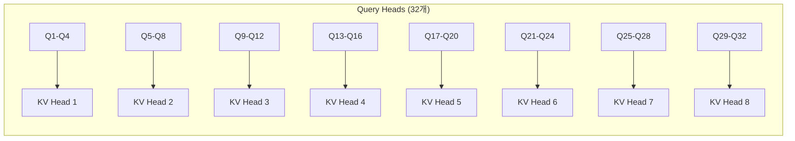
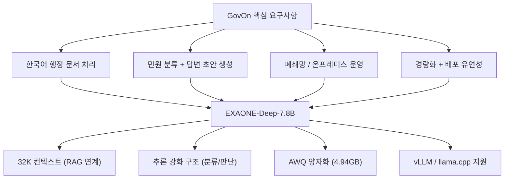
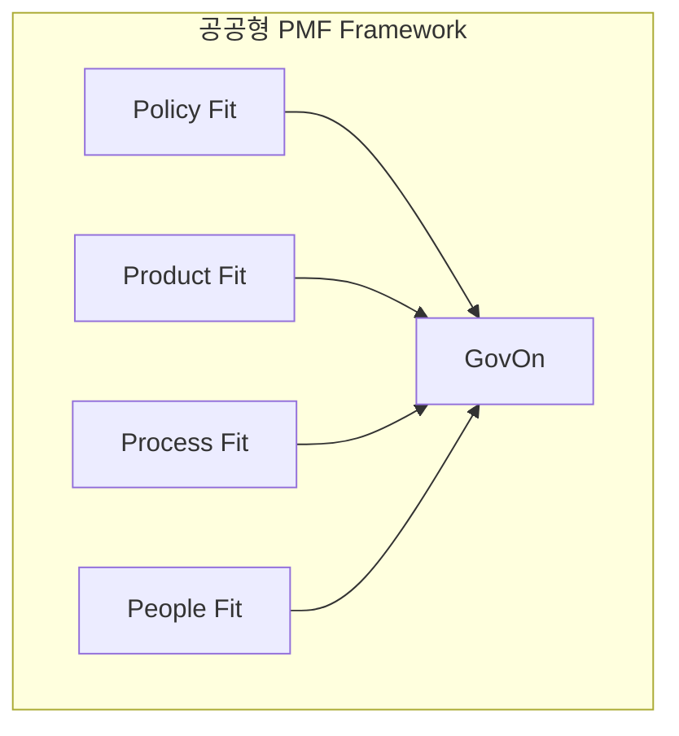

# 모델 분석: EXAONE-Deep-7.8B

GovOn의 핵심 추론 엔진인 EXAONE-Deep-7.8B의 아키텍처, 선정 근거, 공공 AI 정책 맥락을 분석한다.

---

## 모델 개요

| 항목 | 값 |
|------|-----|
| **개발사** | LG AI Research |
| **모델 계열** | EXAONE Deep (추론 강화형 언어모델) |
| **총 파라미터** | 7.8B (임베딩 제외 6.98B) |
| **출시일** | 2025-03-18 |
| **기반 모델** | EXAONE-3.5-7.8B-Instruct |
| **라이선스** | EXAONE AI Model License 1.1 - NC |

EXAONE-Deep-7.8B는 LG AI Research가 개발한 추론 강화형 언어모델이다. 수학, 코딩, 지식 추론 태스크에서 동급 오픈 웨이트 모델뿐 아니라 OpenAI o1-mini를 능가하는 성능을 보인다.

!!! tip "GovOn이 EXAONE Deep을 선택한 이유"
    민원 시스템은 단순 대화형 챗봇과 다르다. 민원 본문을 읽고, 의도를 파악하고, 관련 규정과 사례를 고려해 처리 방향과 답변 초안을 도출해야 한다. EXAONE Deep의 추론 중심 구조는 이런 업무형 시나리오와 잘 맞는다.

---

## 아키텍처 상세 분석

### 핵심 아키텍처 스펙

| 구성 요소 | 값 | 설명 |
|---------|-----|------|
| **레이어 수** | 32 | Transformer 레이어 |
| **히든 차원** | 4,096 | Hidden size |
| **중간 차원** | 14,336 | FFN intermediate size |
| **어텐션 헤드** | 32 | Query heads (GQA) |
| **KV 헤드** | 8 | Key-Value heads |
| **헤드 차원** | 128 | Head dimension |
| **어휘 크기** | 102,400 | Vocabulary size |
| **컨텍스트 길이** | 32,768 | 최대 시퀀스 길이 (토큰) |
| **활성화 함수** | SiLU | Swish Linear Unit |
| **정규화** | Layer Norm | epsilon=1e-05 |

### GQA (Grouped-Query Attention)

EXAONE Deep은 **GQA**를 채택하여 추론 효율성을 높였다.



- **그룹화 비율**: 4:1 (32 Q-heads / 8 KV-heads)
- **메모리 효율성**: KV 캐시 크기 4배 감소 -- 긴 컨텍스트 처리에 유리
- **추론 속도**: 메모리 대역폭 요구사항 감소
- **품질 유지**: MQA 대비 더 나은 품질 유지

### RoPE Scaling (위치 인코딩)

```json
{
  "rope_type": "llama3",
  "rope_theta": 1000000.0,
  "factor": 8.0,
  "original_max_position_embeddings": 8192,
  "low_freq_factor": 1.0,
  "high_freq_factor": 4.0
}
```

| 항목 | 값 |
|------|-----|
| 기본 컨텍스트 | 8,192 토큰 |
| 확장 컨텍스트 | 32,768 토큰 (4배 확장) |
| RoPE 타입 | LLaMA 3 방식 |
| 스케일링 팩터 | 8.0 |

32K 컨텍스트 지원으로 민원 원문뿐 아니라 관련 규정, 내부 지침, 유사 사례를 함께 입력해 처리할 수 있다.

### EXAONE 채팅 템플릿

```text
[|system|]
당신은 지자체 민원 담당 공무원을 돕는 AI 어시스턴트입니다.
[|endofturn|]
[|user|]
{민원 내용}
[|endofturn|]
[|assistant|]
<thought>
{추론 과정}
</thought>
{답변}
[|endofturn|]
```

!!! warning "`<thought>` 태그 후처리 필요"
    EXAONE Deep은 `<thought>` 기반 추론 출력을 사용하므로, 최종 답변 추출 시 `<thought>` 블록을 분리하는 정교한 파서가 필요하다.

---

## 모델 변형 및 양자화 버전

LG AI Research는 다양한 사이즈와 양자화 버전을 제공한다.

| 모델 크기 | 정밀도 | 양자화 버전 |
|----------|-------|------------|
| 2.4B | BF16 | AWQ, GGUF |
| **7.8B** | **BF16** | **AWQ**, GGUF (Q8_0, Q6_K, Q5_K_M, Q4_K_M, IQ4_XS) |
| 32B | BF16 | AWQ, GGUF |

### 다른 양자화 방식과의 비교

| 양자화 방식 | 비트 폭 | 메모리 | 속도 | 품질 | 비고 |
|-----------|--------|-------|------|------|------|
| **AWQ** | 4-bit | 매우 좋음 | 매우 빠름 | 우수 | GovOn 채택 |
| GPTQ | 4-bit | 매우 좋음 | 빠름 | 좋음 | 광범위 지원 |
| GGUF Q4_K_M | 4-bit | 매우 좋음 | 보통 | 보통 | CPU/GPU |
| bitsandbytes | 4/8-bit | 좋음 | 보통 | 좋음 | NVIDIA 전용 |

---

## GovOn 적용 이유

### 4대 적합 조건



1. **긴 문맥 처리**: 32K 컨텍스트로 민원 원문 + 관련 규정 + 유사 사례를 함께 입력
2. **추론 성능**: 분류 판단, 근거 연결, 단계적 추론에 최적화
3. **배포 유연성**: vLLM, TensorRT-LLM, SGLang, llama.cpp, Ollama 등 다양한 프레임워크 지원
4. **파인튜닝 호환성**: QLoRA + AWQ 파이프라인 검증 완료

### 라이선스 주의사항

!!! warning "라이선스 검토 필요"
    EXAONE-Deep-7.8B는 `EXAONE AI Model License 1.1 - NC`가 적용된다. 연구, 개발, 프로토타입, 온프레미스 검증에는 적합하지만, 상용 서비스 배포 시에는 별도 라이선스 검토가 필요하다.

---

## 공공 AI 정책 맥락

### 정부 AI 행동계획과의 연결

2026년 2월 확정된 **대한민국 인공지능 행동계획(2026~2028)**은 공공부문 AI 활용을 국가 전략으로 제시한다. GovOn과 직접 연결되는 정책축은 다음과 같다.

| 정책축 | GovOn 연결 지점 |
|-------|---------------|
| 공공 AX (AI Transformation) | 민원 처리 업무의 AI 내재화 |
| 독자 AI 파운데이션 모델 확보 | EXAONE 계열 한국형 모델 활용 |
| 국가데이터 통합플랫폼 | AI Hub 민원 데이터 + RAG 연계 |
| 공공 AI 보안 생태계 | 폐쇄망 온프레미스 운영 |

### 범정부 AI 공통기반

행정안전부와 과학기술정보통신부가 추진하는 **범정부 AI 공통기반** 서비스는 GovOn의 목적과 직접 연결된다.

- 중앙/지방정부가 AI 모델, 학습데이터, GPU를 공동 활용하는 기반
- 활용 데이터 예시: **법령 정보, 지침/안내서, 민원 상담내역, 종합계획/전략**
- 기관별 특화 AI 서비스 도입 지원 (정부24+ 지능검색 등)

### 국민권익위원회 민원 AI 추진

권익위는 2026년 주요업무 추진계획에서 다음을 제시하였다.

- 연간 약 **1,300만 건**의 민원 데이터를 AI 자동 분석으로 전환
- 국민신문고에 **AI 챗봇 기능** 도입 (실시간 민원상담)
- 중복 민원 자동 병합, 긴급 민원 우선 배정

!!! success "GovOn의 정책 정합성"
    GovOn은 "민원 분야에 AI를 적용해도 되는가?"를 묻는 단계가 아니라, "민원 분야에서 어떤 형태의 AI가 실제로 유용한가?"를 구체화하는 프로젝트다.

---

## 공공형 PMF (Product-Market Fit) 분석

GovOn은 일반적인 민간형 PMF가 아니라 **공공형 PMF** 관점에서 검토되어야 한다.

### 4대 Fit Framework



| Fit 축 | 설명 | GovOn 평가 |
|--------|------|-----------|
| **Policy Fit** | 정책 방향 정합성 | 행동계획, 범정부 AI 공통기반과 직접 연결 |
| **Product Fit** | 제품 유용성 | 민원 이해, 유사 사례 연결, 답변 초안 생성 |
| **Process Fit** | 업무 흐름 적합성 | 공무원 민원 처리 과정의 반복 업무 감소 |
| **People Fit** | 조직 수용성 | 직무별 맞춤형 AI 활용 역량 체계화 |

### 일반 PMF vs 공공형 PMF

| 기준 | 일반 PMF | 공공형 PMF (GovOn) |
|------|---------|-------------------|
| 시장 역할 | 민간 고객 | 정부/공공기관 |
| 의사결정 | 단일 구매자 | 정책결정자 + 실무자 + 정보화담당 + 감사법제 |
| 평가 기준 | 매출, NPS | 정책 적합성, 행정 효율, 국민 체감효과 |
| 성과지표 | 재구매율 | 처리시간 단축, 민원 품질 향상 |
| 검증 방법 | 사용량 | 시범 실증, 공공지표 기반 검증 |

---

## K-EXAONE 참고

K-EXAONE은 GovOn이 직접 사용하는 모델은 아니지만, EXAONE 계열의 발전 방향을 보여주는 참고 사례다.

| 항목 | K-EXAONE | EXAONE-Deep-7.8B (GovOn) |
|------|----------|--------------------------|
| 파라미터 | 236B total / 23B active | 7.8B |
| 아키텍처 | MoE (Mixture-of-Experts) | Dense |
| 컨텍스트 | 256K | 32K |
| 언어 지원 | 6개 언어 | 한국어/영어 중심 |
| 독자 AI 평가 | 총 90.2점 (1위) | 파인튜닝 기반 활용 |

---

## 참고 자료

- [EXAONE-Deep-7.8B (HuggingFace)](https://huggingface.co/LGAI-EXAONE/EXAONE-Deep-7.8B)
- [EXAONE-Deep-7.8B-AWQ (HuggingFace)](https://huggingface.co/LGAI-EXAONE/EXAONE-Deep-7.8B-AWQ)
- [대한민국 인공지능 행동계획 (2026~2028)](https://www.korea.kr/briefing/pressReleaseView.do?newsId=156743967)
- [범정부 AI 공통기반 보도자료](https://www.korea.kr/briefing/pressReleaseView.do?newsId=156731023)
- [국민권익위원회 2026년 주요업무 추진계획](https://www.korea.kr/briefing/pressReleaseView.do?newsId=156743141)
- [독자 AI 파운데이션 모델 프로젝트 1차 평가 결과](https://www.korea.kr/news/policyNewsView.do?newsId=156740468)
