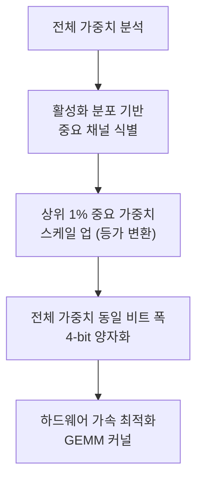
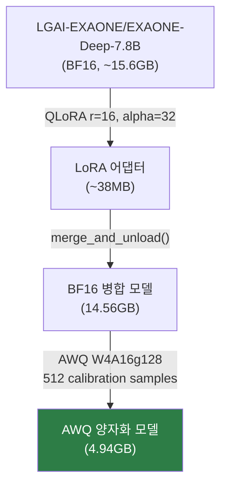
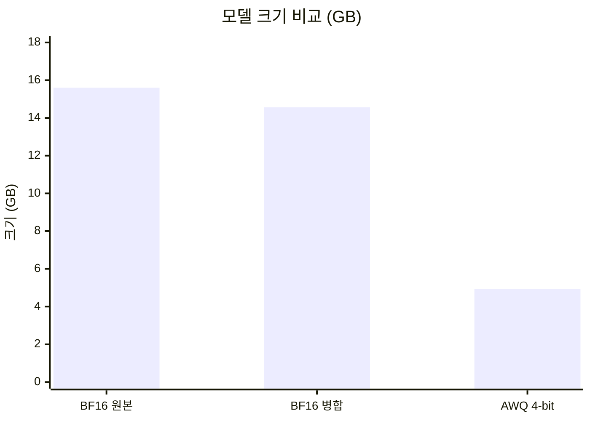
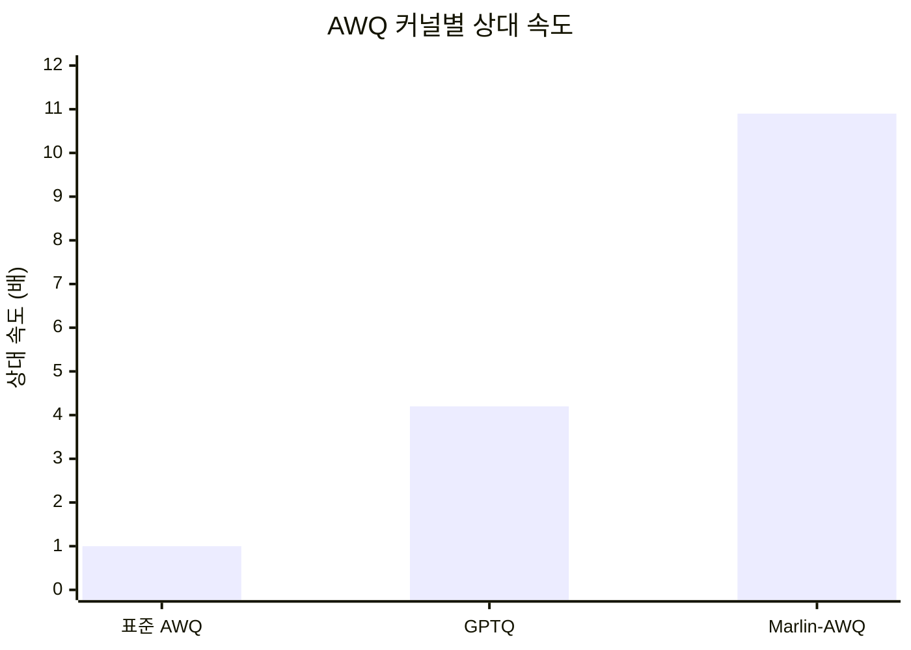

# 양자화: AWQ W4A16g128

EXAONE-Deep-7.8B 파인튜닝 모델의 AWQ 양자화 과정, 설정, 성능 비교 결과를 정리합니다.

---

## AWQ 양자화 개요

**AWQ (Activation-aware Weight Quantization)**는 MIT Han Lab에서 개발한 4비트 가중치 전용 양자화 기법입니다. MLSys 2024 Best Paper Award를 수상하였습니다.

### 핵심 원리



1. **Activation-aware**: 활성화 분포를 기반으로 중요한 가중치 채널을 식별합니다
2. **선택적 보호**: 상위 1%의 중요 가중치만 보호해도 양자화 오류가 크게 감소합니다
3. **등가 변환**: 혼합 정밀도 대신, 중요 채널을 스케일 업하는 수학적 등가 변환을 사용합니다
4. **하드웨어 친화적**: 전체 가중치를 동일 비트 폭으로 양자화하여 하드웨어 가속을 최적화합니다

### 기존 양자화와의 차이

| 방식 | 접근법 | 장점 | 단점 |
|------|--------|------|------|
| Round-to-Nearest (RTN) | 모든 가중치 균등 양자화 | 단순 | 정밀도 손실 큼 |
| GPTQ | Hessian 기반 보정 | 정밀도 양호 | 느린 양자화 |
| **AWQ** | **활성화 분포 기반 스케일링** | **빠르고 정밀** | **캘리브레이션 데이터 필요** |

---

## 양자화 설정 (W4A16g128)

### 약어 설명

| 구성 요소 | 의미 | 설명 |
|-----------|------|------|
| **W4** | Weight 4-bit | 가중치를 4비트로 양자화 |
| **A16** | Activation 16-bit | 활성화(중간 계산값)는 16비트 유지 |
| **g128** | Group size 128 | 128개 가중치마다 양자화 파라미터 공유 |

### 설정 파라미터

| 파라미터 | 값 | 설명 |
|---------|-----|------|
| `w_bit` | 4 | 4비트 가중치 양자화 |
| `q_group_size` | 128 | 128개 가중치마다 스케일 팩터 적용 |
| `version` | `GEMM` | GEMM 최적화 커널 사용 |
| `zero_point` | `True` | 비대칭 양자화 (Zero-point 활성화) |
| `modules_to_not_convert` | `lm_head` | 출력 헤드는 전체 정밀도 유지 |

```python
quant_config = {
    "zero_point": True,
    "q_group_size": 128,
    "w_bit": 4,
    "version": "GEMM",
}
```

!!! info "그룹 크기 선택 근거"
    그룹 크기 128은 정밀도와 메모리 효율의 균형점입니다. 더 작은 그룹(64)은 정밀도가 높지만 오버헤드가 증가하고, 더 큰 그룹(256)은 메모리 효율적이지만 정밀도가 떨어집니다.

---

## 양자화 파이프라인

### 전체 흐름



### Stage 1: LoRA 병합 (`merge_lora.py`)

LoRA 어댑터를 베이스 모델에 병합하여 하나의 완전한 BF16 모델을 생성합니다.

```bash
python src/quantization/merge_lora.py
```

**수행 절차**:

1. 베이스 모델(EXAONE-Deep-7.8B) BF16 로드
2. LoRA 어댑터(`umyunsang/civil-complaint-exaone-lora`) 부착
3. `merge_and_unload()` 실행으로 가중치 병합
4. 파라미터 수 일치 검증 (병합 후 == 베이스 모델)
5. LoRA 모듈 잔존 여부 검증
6. Sanity check: 테스트 민원에 대한 추론 실행

```python
# 핵심 검증 코드
merged_param_count = sum(p.numel() for p in model.parameters())
assert merged_param_count == base_param_count  # 파라미터 수 일치
has_lora = any("lora" in name.lower() for name, _ in model.named_parameters())
assert not has_lora  # LoRA 모듈 잔존 없음
```

### Stage 2: AWQ 양자화 (`quantize_awq.py`)

병합된 BF16 모델에 AWQ 양자화를 적용합니다.

```bash
python src/quantization/quantize_awq.py
```

**캘리브레이션 데이터 준비**:

도메인 특화 캘리브레이션을 위해 학습 데이터에서 512개 샘플을 추출합니다. 일반 텍스트 대신 민원 도메인 데이터를 사용하여 활성화 분포를 더 정확하게 캡처합니다.

```python
def prepare_calibration_data(tokenizer, data_path, n_samples=512, max_length=2048):
    """도메인 특화 캘리브레이션 데이터를 학습 데이터에서 추출합니다."""
    samples = []
    for item in data[:n_samples * 2]:
        messages = [
            {"role": "user", "content": f"{item['instruction']}\n\n{item['input']}"},
            {"role": "assistant", "content": item["output"]},
        ]
        text = tokenizer.apply_chat_template(messages, tokenize=False)
        if len(text) > 100:  # 너무 짧은 샘플 제외
            samples.append(text)
    return samples[:n_samples]
```

| 항목 | 값 |
|------|-----|
| 캘리브레이션 데이터 | 민원 도메인 훈련 데이터 512 샘플 |
| 소요 시간 | ~20-40분 (A100 80GB 환경) |
| AutoAWQ 라이브러리 | `awq.AutoAWQForCausalLM` |

!!! tip "캘리브레이션 데이터의 중요성"
    캘리브레이션 데이터는 학습 도메인과 동일한 민원 데이터를 사용하여, 양자화 시 민원 도메인에 중요한 가중치 채널이 보호되도록 합니다. 일반 텍스트(WikiText 등)를 사용하면 도메인 특화 성능이 저하될 수 있습니다.

---

## 양자화 결과

### 모델 크기 비교

| 모델 | 크기 | 원본 대비 |
|------|------|----------|
| BF16 원본 | ~15.6 GB | 기준 |
| BF16 병합 (LoRA merged) | 14.56 GB | -6.7% |
| **AWQ 4-bit** | **4.94 GB** | **-68.3%** |



!!! success "핵심 성과: 68.3% 크기 감소"
    AWQ 4-bit 양자화로 15.6GB에서 4.94GB로 약 3.16배 압축에 성공하였습니다. 이는 소비자급 GPU(RTX 3060 12GB 이상)에서 실행 가능한 수준입니다.

### VRAM 사용량

| 환경 | VRAM | 비고 |
|------|------|------|
| BF16 추론 | ~20 GB | A100 필요 |
| AWQ 4-bit 추론 | 4.95 GB | RTX 3060 이상 실행 가능 |
| AWQ + vLLM | 4.17 GB | vLLM 최적화 적용 |
| AWQ + vLLM (서빙) | ~29 GB | KV 캐시, CUDA Graph, 스케줄러 버퍼 포함 |

!!! note "VRAM 목표 재정의"
    5.0GB 목표는 모델 파일 크기 기준으로 설정되었습니다. vLLM 서빙 시에는 KV 캐시 할당, CUDA Graph, AWQ Dequantization 버퍼 등으로 인해 크게 증가합니다. on-device 추론(llama.cpp 등) 기준으로는 5GB 이하 달성이 가능하나, vLLM 서빙 기준으로는 A100 40GB급이 필수적입니다.

---

## AWQ 양자화 영향 상세 분석

M3 평가에서 LoRA v2(FP16/BF16) 대비 AWQ INT4 양자화 후 품질 변화를 측정하였습니다.

### 메트릭별 양자화 영향

| 메트릭 | LoRA v2 (FP) | AWQ v2 (INT4) | 변화 | 해석 |
|--------|-------------|---------------|------|------|
| SacreBLEU | 11.45 | 7.74 | **-3.71** | n-gram precision 하락 |
| ROUGE-L | 25.14 | 18.76 | **-6.38** | 구조적 유사도 유의미 감소 |
| BERTScore | 72.34 | 71.04 | **-1.30** | 의미적 유사도 거의 보존 |
| EOS 종료율 | 91.3% | 88.6% | **-2.7%p** | 경미한 하락 |

```mermaid
xychart-beta
    title "양자화 전후 품질 메트릭 비교"
    x-axis ["SacreBLEU", "ROUGE-L", "BERTScore"]
    y-axis "점수" 0 --> 80
    bar "LoRA v2 (FP)" [11.45, 25.14, 72.34]
    bar "AWQ v2 (INT4)" [7.74, 18.76, 71.04]
```



!!! info "양자화 품질 손실 패턴"
    INT4 양자화 시 토큰 단위의 미세한 확률 분포 변화가 lexical overlap 메트릭(BLEU, ROUGE-L)에 민감하게 반영됩니다. 반면 BERTScore(-1.30)는 거의 보존되어, **의미적 품질은 유지되고 있습니다**.

### 비트 단위 분석

| 정밀도 | 비트 수 | 파라미터당 메모리 | 7.8B 파라미터 예상 크기 |
|--------|---------|-------------------|----------------------|
| FP32 | 32 bit | 4 bytes | ~31.2 GB |
| BF16 | 16 bit | 2 bytes | ~15.6 GB |
| INT8 | 8 bit | 1 byte | ~7.8 GB |
| **INT4 (AWQ)** | **4 bit** | **0.5 bytes** | **~4.9 GB** |

---

## 다른 양자화 방식과의 비교

| 양자화 방식 | 비트 폭 | 메모리 | 속도 | 품질 | vLLM 호환 | 채택 |
|-----------|--------|-------|------|------|----------|------|
| **AWQ** | **4-bit** | **매우 좋음** | **매우 빠름** | **우수** | **지원** | **채택** |
| GPTQ | 4-bit | 매우 좋음 | 빠름 | 좋음 | 지원 | 비교 대상 |
| GGUF Q4_K_M | 4-bit | 매우 좋음 | 보통 | 보통 | 미지원 | 미채택 |
| bitsandbytes | 4/8-bit | 좋음 | 보통 | 좋음 | 부분 지원 | 학습용만 |

### AWQ 선택 이유

- **vLLM 공식 지원**: Marlin 커널을 통한 고성능 추론
- **GPTQ 대비 2.6배 속도 향상** (Marlin 커널 기준)
- **표준 AWQ 대비 10.9배 속도 향상** (Marlin-AWQ 조합)
- **하드웨어 범용성**: CUDA, ROCm 모두 지원
- **도메인 캘리브레이션**: 민원 데이터 기반 캘리브레이션으로 정밀도 보존 우수

상세 선정 근거는 [ADR-002](../architecture/adr/index.md#adr-002-awq-w4a16g128-양자화-방식-선정)를 참고하세요.

---

## vLLM 서빙 성능

### AWQ + vLLM 조합 결과 (M3)

| 지표 | 측정값 | 목표 | 판정 |
|------|--------|------|------|
| 평균 추론 속도 | 2.43s | < 2s | 근접 |
| p50 레이턴시 | 1.559s | - | - |
| p95 레이턴시 | 2.849s | < 3.0s | **달성** |
| 처리량 | 178.4 tok/s | - | - |
| GPU VRAM (모델) | 4.17 GB | < 8GB | **달성** |
| 분류 정확도 | 90.0% | >= 85% | **달성** |

### Marlin 커널 효과

vLLM은 AWQ 모델에 대해 `awq_marlin` 커널을 활용한 고성능 추론을 지원합니다.



- `enforce_eager=False` (CUDA Graph 활성화)와 결합하여 커널 launch 오버헤드 최소화
- Ampere 아키텍처(SM 8.0)에서 최적화된 GEMM 제공

---

## 하드웨어 요구사항

### 양자화 실행 환경

| 항목 | 권장 사양 | 비고 |
|------|----------|------|
| GPU | NVIDIA A100 40GB+ | BF16 모델 로드 필요 |
| RAM | 32GB+ | |
| 디스크 | 30GB+ | BF16 + AWQ 모델 동시 저장 |
| 소요 시간 | 20~40분 | |

### 추론 서빙 환경

| 항목 | 최소 사양 | 권장 사양 |
|------|----------|----------|
| GPU | RTX 3060 (12GB) | A100 (40GB) |
| GPU VRAM | ~5GB (on-device) | ~30GB (vLLM 서빙) |
| RAM | 16GB | 32GB |
| 디스크 | 10GB | 20GB |

---

## 발견된 문제점 및 해결

### Merged 모델 손상 (Critical)

M2 단계에서 생성한 `civil-complaint-exaone-merged` 모델에 손상이 발견되었습니다.

| 항목 | 내용 |
|------|------|
| **증상** | AWQ 모델에서 의미 없는 출력 생성 |
| **원인** | transformers v5 환경에서 merge_and_unload() 수행 시 EXAONE 모델 코드 불일치 |
| **조치** | HuggingFace에서 merged 모델 삭제, AWQ 모델도 무효화 판정 |
| **재양자화** | M3 평가 결과 확인 후 올바른 버전 조합으로 재수행 |

### 올바른 양자화를 위한 필수 조건

!!! danger "양자화 전 반드시 확인할 사항"
    1. **transformers 4.44~4.49** 사용 (LoRA 학습 시점 버전)
    2. **EXAONE revision `17b70148e344`** 고정 (학습 호환 코드)
    3. `merge_and_unload()` 후 **sanity check 필수** (정상 출력 확인)
    4. 캘리브레이션 데이터는 학습 도메인과 동일한 **민원 데이터** 사용

---

## W&B 양자화 로그

양자화 과정의 모든 메트릭은 W&B에 자동 기록됩니다.

### 기록되는 메트릭

| 메트릭 | 설명 |
|--------|------|
| `calibration_samples` | 캘리브레이션에 사용된 샘플 수 |
| `quantization_time_seconds` | 양자화 소요 시간 |
| `gpu_mem_before_quant_gb` | 양자화 전 GPU 메모리 |
| `awq_model_size_gb` | AWQ 모델 크기 |
| `merged_model_size_gb` | 병합 모델 크기 |
| `compression_ratio` | 압축 비율 |
| `size_reduction_pct` | 크기 감소율 (%) |

### 양자화 결과 로그 파일

양자화 완료 시 `quantization_log.json`이 모델 디렉토리에 저장됩니다.

```json
{
  "stage": "2_awq_quantization",
  "quant_config": {
    "zero_point": true,
    "q_group_size": 128,
    "w_bit": 4,
    "version": "GEMM"
  },
  "calibration_samples": 512,
  "awq_model_size_gb": 4.94,
  "merged_model_size_gb": 14.56,
  "compression_ratio": 2.95,
  "size_reduction_pct": 66.1,
  "quantization_time_seconds": 1800
}
```

---

## 재현 방법

### 1. 환경 설정

```bash
pip install autoawq transformers torch safetensors wandb loguru peft
```

### 2. LoRA 병합

```bash
python src/quantization/merge_lora.py
```

### 3. AWQ 양자화

```bash
python src/quantization/quantize_awq.py
```

### 4. 양자화된 모델 검증

```python
from awq import AutoAWQForCausalLM
from transformers import AutoTokenizer

model = AutoAWQForCausalLM.from_quantized(
    "models/awq_quantized_model",
    fuse_layers=False,
    trust_remote_code=True,
)
tokenizer = AutoTokenizer.from_pretrained(
    "models/awq_quantized_model",
    trust_remote_code=True,
)

# Sanity check
messages = [{"role": "user", "content": "도로 포트홀 신고합니다."}]
input_ids = tokenizer.apply_chat_template(
    messages, tokenize=True, add_generation_prompt=True, return_tensors="pt"
).to(model.model.device)

output = model.model.generate(input_ids, max_new_tokens=200)
print(tokenizer.decode(output[0][input_ids.shape[1]:], skip_special_tokens=True))
```

---

## 참고 자료

- [AWQ 논문 (arXiv)](https://arxiv.org/abs/2306.00978)
- [AutoAWQ GitHub](https://github.com/casper-hansen/AutoAWQ)
- [vLLM AWQ 지원 문서](https://docs.vllm.ai/en/latest/quantization/awq.html)
- [EXAONE-Deep-7.8B-AWQ (공식)](https://huggingface.co/LGAI-EXAONE/EXAONE-Deep-7.8B-AWQ)
- [GovOn AWQ v2 모델](https://huggingface.co/umyunsang/GovOn-EXAONE-AWQ-v2)
- [ADR-002: AWQ 양자화 방식 선정](../architecture/adr/index.md#adr-002-awq-w4a16g128-양자화-방식-선정)
