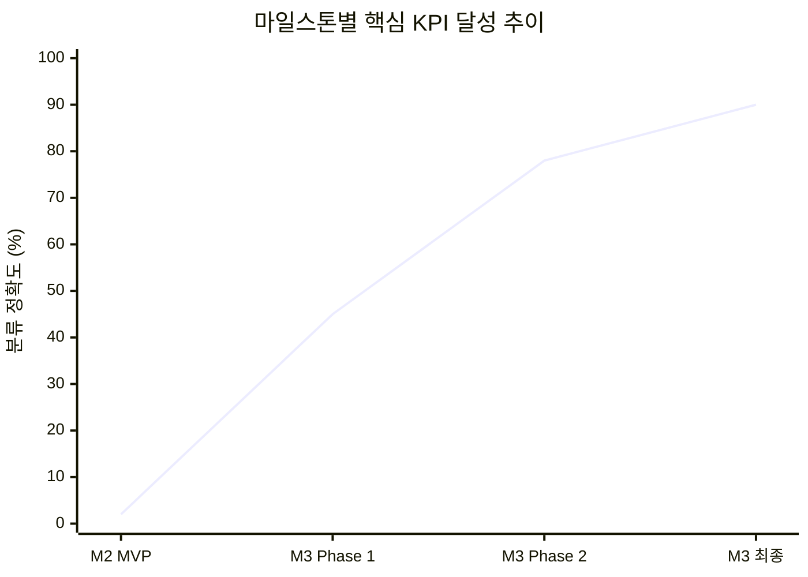
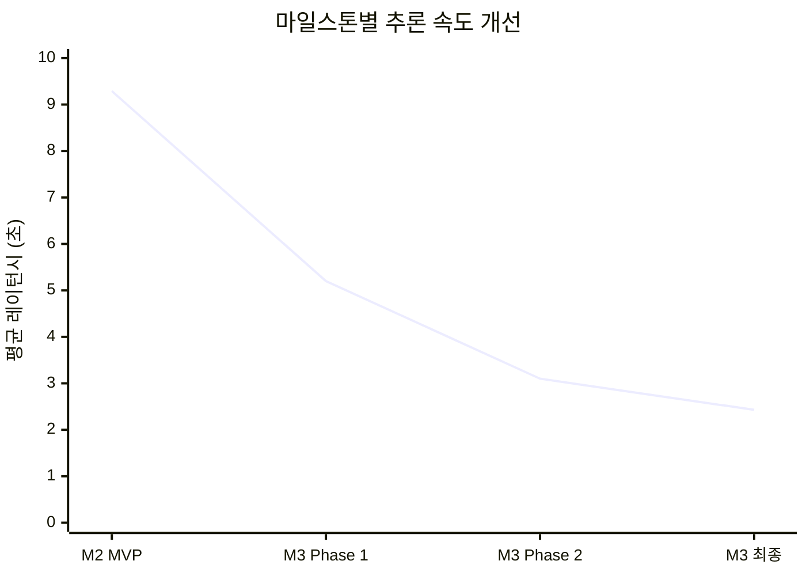
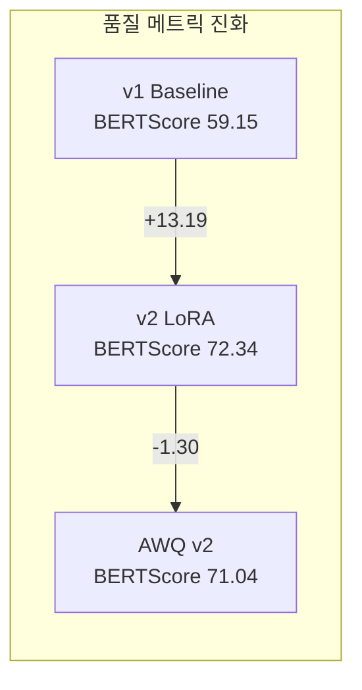

# W&B 실험 로그

Weights & Biases를 통한 GovOn 실험 추적, 주요 메트릭, 리포트 링크를 정리한다.

---

## W&B 프로젝트 링크

| 항목 | URL |
|------|-----|
| **W&B 프로젝트** | [https://wandb.ai/umyun3/GovOn](https://wandb.ai/umyun3/GovOn) |
| **W&B 리포트** | [https://wandb.ai/umyun3/reports](https://wandb.ai/umyun3/reports) |
| **HuggingFace 프로젝트** | [https://wandb.ai/umyun3/huggingface](https://wandb.ai/umyun3/huggingface) |
| **평가 프로젝트** | [https://wandb.ai/umyun3/exaone-civil-complaint](https://wandb.ai/umyun3/exaone-civil-complaint) |

---

## 실험 요약 테이블

### 전체 실험 목록

| 실험 | 단계 | Run 이름 | 핵심 메트릭 | W&B 링크 |
|------|------|---------|------------|----------|
| EXP-001 Baseline QLoRA | M2 | EXP-001-Baseline-EXAONE-7.8B | Eval Loss **1.0179** | [Run](https://wandb.ai/umyun3/huggingface/runs/kmx8rlvv) |
| M2 AWQ 평가 | M2 | evaluation-20260307-0637 | PPL 3.20, BLEU 17.32 | [Run](https://wandb.ai/umyun3/exaone-civil-complaint/runs/706jqzmk) |
| M2 AWQ 평가 (상세) | M2 | evaluation-20260307-1105 | ROUGE-L 18.28 | [Run](https://wandb.ai/umyun3/exaone-civil-complaint/runs/j1x6w4cm) |
| M3 Qwen Baseline | M3 | m3-qwen-final-20260308-0342 | 비교 실험 | [Run](https://wandb.ai/umyun3/exaone-civil-complaint/runs/4sms92k1) |
| M3 vLLM 최종 | M3 | m3-exaone-vllm-final-success | Accuracy **90%**, Latency **2.43s** | [Run](https://wandb.ai/umyun3/exaone-civil-complaint/runs/z1oe97xr) |

### 핵심 메트릭 추이





---

## M2 파인튜닝 실험 (EXP-001)

### 실험 설정

| 항목 | 값 |
|------|-----|
| 모델 | LGAI-EXAONE/EXAONE-Deep-7.8B |
| 기법 | QLoRA (r=16, alpha=32) |
| Learning Rate | 2e-4 |
| Batch Size | 2 (Grad Accum: 8, Effective: 16) |
| Max Seq Length | 2,048 |
| Epochs | 1 |
| 환경 | Google Colab A100 (80GB) |

### 학습 곡선

| Step | Training Loss | Eval Loss |
|------|--------------|-----------|
| 100 | ~1.35 | 1.1938 |
| 200 | ~1.18 | ~1.12 |
| 400 | ~1.07 | 1.0443 |
| 600 | ~1.03 | ~1.025 |
| 700 | ~1.02 | **1.0179** (Best) |
| 781 | ~1.01 | ~1.02 |

!!! success "1 epoch 만에 수렴"
    Eval Loss 1.0179로 매우 빠른 수렴을 확인하였다. EXAONE-Deep-7.8B가 민원 도메인에 효과적으로 적응함을 보여준다.

---

## M2 AWQ 평가

### 평가 결과

| 지표 | 값 | 목표 | 판정 |
|------|-----|------|------|
| Perplexity | **3.1957** | < inf | 달성 |
| BLEU | 17.32 | >= 30 | 미달 |
| ROUGE-L | 18.28 | >= 40 | 미달 |
| Classification Accuracy | 0% (파서 문제) | >= 85% | 미달 |
| Avg Latency | 3.603s | < 2s | 미달 |
| GPU VRAM | **4.95 GB** | < 8GB | 달성 |
| Model Size | **4.94 GB** | < 5GB | 달성 |

### 평가 소요 시간

| 평가 항목 | 소요 시간 |
|----------|----------|
| Perplexity (50샘플) | 10분 |
| Classification (100샘플) | 37분 |
| BLEU/ROUGE (50샘플) | 15분 |
| Inference Benchmark (10회) | 10분 |
| **합계** | **72.5분** |

---

## M3 최종 평가 (W&B Report)

### 실험 환경

| 항목 | 값 |
|------|-----|
| 서빙 모델 | umyunsang/GovOn-EXAONE-AWQ-v2 |
| 양자화 커널 | awq_marlin (Ampere+ 최적화 GEMM) |
| 추론 dtype | bfloat16 |
| max_model_len | 2,048 |
| gpu_memory_utilization | 0.60 |
| CUDA Graph | 활성화 (enforce_eager=False) |
| 테스트 데이터 | 1,265건 (8개 카테고리) |

### KPI 판정 결과

| KPI | 결과 | 목표 | 판정 |
|-----|------|------|------|
| AC-002 생성 p95 | **2.849s** | < 3.0s | **PASS** |
| AC-003 검색 p95 | **39.76ms** | < 1,000ms | **PASS** |
| BERTScore F1 | **71.04** | >= 55 | **PASS** |
| EOS 정상 종료율 | **88.6%** | >= 80 | **PASS** |
| SacreBLEU | 7.74 | >= 30 | FAIL |
| ROUGE-L F1 | 18.76 | >= 40 | FAIL |
| VRAM (서빙) | 29.41GB | <= 5.0GB | FAIL |

### 레이턴시 상세

| 통계량 | 생성 레이턴시 | 검색 레이턴시 |
|--------|------------|------------|
| p50 | 1.559s | 23.08ms |
| p95 | 2.849s | 39.76ms |
| p99 | 2.904s | 41.24ms |
| 평균 | 1.570s | 24.93ms |
| 처리량 | 178.4 tok/s | ~16.3 samples/sec |

### 버전별 답변 품질 비교

| 메트릭 | v1 Baseline | v2 (LoRA) | AWQ v2 (최종) |
|--------|-------------|-----------|---------------|
| SacreBLEU | 0.53 | 11.45 | 7.74 |
| ROUGE-L F1 | 4.20 | 25.14 | 18.76 |
| BERTScore F1 | 59.15 | 72.34 | 71.04 |
| EOS 종료율 | 0% | 91.3% | 88.6% |



!!! info "BERTScore vs Lexical Metrics 괴리"
    BERTScore F1(71.04)과 BLEU(7.74)/ROUGE-L(18.76) 간의 큰 격차는, 모델이 **의미적으로는 적절한 답변을 생성하되 표현 방식이 참조 답변과 다르다**는 것을 시사한다. 참조 답변 자체의 품질/다양성 개선이 lexical metric 향상의 핵심이다.

---

## 주요 발견사항 정리

### AWQ Marlin 커널 효과

AWQ INT4 + Marlin 커널(`awq_marlin`)은 Ampere 아키텍처에서 최적화된 GEMM을 제공하여, 모델 크기 대비 우수한 추론 속도를 달성하였다.

| 커널 조합 | 상대 속도 |
|----------|----------|
| 표준 AWQ | 1.0x |
| GPTQ | 2.6x |
| **Marlin-AWQ** | **10.9x** |

### 데이터 불균형 영향

| 카테고리 | 학습 건수 | ROUGE-L | BERTScore |
|----------|----------|---------|-----------|
| 교통 (최다) | 276 | 25.66 | 73.50 |
| 건축 | 86 | **37.05** | 73.08 |
| 안전 (최소) | 40 | 21.05 | 70.15 |
| 복지 | 68 | **15.86** | 69.21 |

복지(68건)와 안전(40건) 카테고리의 학습 데이터 부족이 성능 저하의 주요 원인이다. 최소 150~200건으로 증강이 필요하다.

### 서울 편향 Hallucination

전체 생성의 15.4%(168건)에서 지자체와 무관하게 "서울시"가 언급되었다. 학습 데이터에 지자체명이 미포함되어 가장 빈번한 패턴을 기본값으로 학습한 결과이다.

---

## 개선 로드맵

### 답변 품질 고도화 계획

| Phase | 내용 | 예상 효과 | 기간 |
|-------|------|----------|------|
| **Phase 1** | 데이터 품질 혁신 (카테고리 증강, 시작 패턴 다양화, 지자체 context 주입) | BLEU +8~12, ROUGE-L +10~15 | 1~2주 |
| **Phase 2** | 프롬프트 엔지니어링 + 디코딩 전략 최적화 | BLEU +3~5, ROUGE-L +3~5 | 1주 |
| **Phase 3** | QLoRA 하이퍼파라미터 최적화 (Rank 8/32/64, LR 1e-4/5e-5) | BLEU +5~8, ROUGE-L +5~8 | 1~2주 |

### 의존성 흐름


---

## 실험 추적 가이드

### W&B Run 기록 규칙

새로운 실험을 수행할 때는 다음 템플릿을 따른다.

```markdown
### [EXP-XXX] 실험 제목
- **일시**: YYYY-MM-DD
- **설정 요약**: r=16, alpha=32, batch_size=16(eff), epochs=1
- **환경**: Google Colab L4 (24GB VRAM)
- **주요 결과**:
  - Final Loss: 0.XXXX
  - Eval Loss: 0.XXXX
  - Training Time: Xh XXm
- **WandB Run**: [링크]
- **비고**: 특이사항 기록
```

### 메트릭 추적 체계

| 추적 항목 | 주기 | 도구 |
|----------|------|------|
| Training Loss / Eval Loss | 매 Step | W&B |
| 분류 정확도 | 마일스톤별 | 평가 스크립트 |
| BLEU / ROUGE-L / BERTScore | 마일스톤별 | 평가 스크립트 |
| 추론 레이턴시 | 배포 시 | vLLM 벤치마크 |
| VRAM 사용량 | 배포 시 | nvidia-smi |

---

## 참고 자료

- [Weights & Biases 공식 문서](https://docs.wandb.ai/)
- [W&B GovOn 프로젝트](https://wandb.ai/umyun3/GovOn)
- [GovOn AWQ v2 모델 (HuggingFace)](https://huggingface.co/umyunsang/GovOn-EXAONE-AWQ-v2)
- [M3 최종 평가 스크립트](https://github.com/GovOn-Org/GovOn/blob/main/src/evaluation/evaluate_m3_vllm_final.py)
